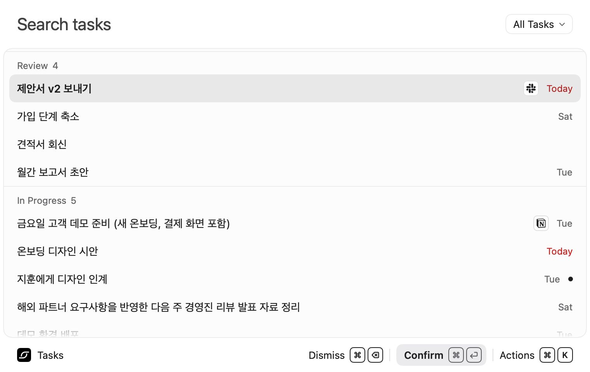
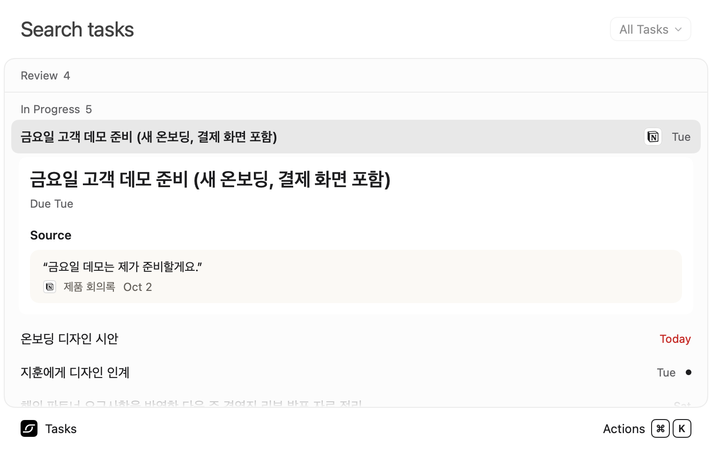
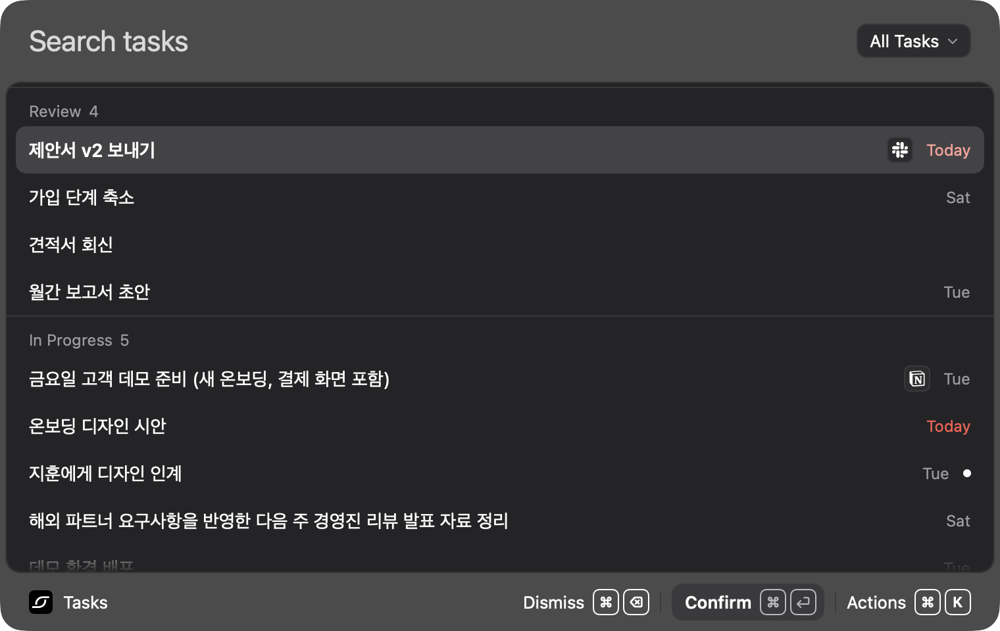

  

<h1 align="center">Taskforce</h1>

<strong>약속한 일을 놓치지 않도록.</strong> AI project manager for founders.

  <a href="https://www.taskforcelabs.dev">웹사이트</a> ·
  <a href="#다운로드와-설치">다운로드 안내</a> ·
  <a href="docs/DEVELOPMENT.md">개발 시작하기</a> ·
  <a href="https://github.com/songch9511/taskforce-new/issues">피드백</a>

Taskforce는 회의록·메시지·메일에서 내가 맡은 일을 찾아 정리하고 관리하는 AI 프로젝트 매니저입니다. 미팅이 많은 창업자와 컨설턴트가 직접 목록을 관리하는 부담을 줄이고, 약속한 일을 맥락과 함께 확인하도록 돕습니다.

**macOS 베타.** 연결 서비스는 베타 계정과 서비스별 승인 상태에 따라 달라집니다.

  

*현재 앱의 SwiftUI 화면에 예시 데이터를 넣어 생성한 이미지입니다. 실제 사용자 계정이나 업무 내용은 포함하지 않습니다.*

## 할 일과 그 이유를 함께

- **원문을 바로 확인합니다.** AI가 찾은 할 일에는 인용 구절과 출처가 붙어, 어디서 약속했는지 되짚을 수 있습니다.
- **변경을 이어서 추적합니다.** 새 원문의 기한·상태 변경을 기존 할 일과 연결해 갱신하고 중복을 줄입니다.
- **애매한 항목은 확인합니다.** 담당자나 기한이 불확실한 항목은 `Review`에서 확인하거나 제외합니다.
- **Mac에서 빠르게 엽니다.** `⌥ Space`로 런처를 열고 검색, 상태 변경, 원문 확인을 이어갑니다. 직접 할 일을 추가할 수도 있습니다.

## 화면 둘러보기

### 원문과 출처

할 일을 펼치면 약속한 문장과 출처를 함께 볼 수 있습니다.

### 다크 모드

모든 이미지는 예시 데이터를 사용한 앱 화면 렌더입니다. [생성 방법과 기준 커밋](docs/screenshots/README.md)을 함께 기록했습니다.

## 이렇게 사용합니다

1. **로그인하고 연결하기** — 베타 앱에서 Google로 로그인한 뒤 `Settings → Connections`에서 사용할 수 있는 서비스를 연결합니다. AI 처리 동의와 접근 범위를 확인합니다.
2. **내 할 일 확인하기** — `⌥ Space`로 런처를 엽니다. `Review`, `In Progress`, `To Do`, `Done Today`로 상태를 구분합니다.
3. **원문 보고 정리하기** — 항목을 펼쳐 근거를 확인하고, 필요한 항목을 확정하거나 상태를 바꿉니다.

저장소에는 Notion, Slack, Gmail, Google Calendar·Meet 연동 구현이 있습니다. 모든 연동이 공개 베타에서 활성화된 상태라는 뜻은 아닙니다. Google 로그인과 Gmail·Calendar 연결은 별도입니다.

## 다운로드와 설치

**[Mac 베타 다운로드 · 0.1.0 (23)](https://github.com/songch9511/taskforce-new/releases/download/v0.1.0-beta.23/Taskforce-0.1.0-23.dmg)**

macOS 15 이상에서 사용할 수 있는 베타입니다. [릴리스 노트와 체크섬](https://github.com/songch9511/taskforce-new/releases/tag/v0.1.0-beta.23)을 확인해 주세요.

| 확인할 내용 | 안내 |
|---|---|
| 제품 소개·출시 안내 | [taskforcelabs.dev](https://www.taskforcelabs.dev) |
| GitHub 공개 릴리스 | [Releases](https://github.com/songch9511/taskforce-new/releases) |
| 현재 앱 대상 | macOS 15 이상 · Google 로그인 |
| iPhone | 현재 공개 베타 배포 대상에 포함되지 않음 |
| 소스에서 빌드 | [Mac 개발 안내](apple/README.md) — Xcode와 별도 서비스 설정 필요 |

다음 순서로 설치합니다.

1. 다운로드한 `Taskforce-0.1.0-23.dmg`를 엽니다.
2. `Taskforce.app`을 `Applications` 폴더로 옮깁니다.
3. `Applications`에서 Taskforce를 실행하고 Google로 로그인합니다.
4. `Settings → Connections`에서 사용할 수 있는 서비스를 연결한 뒤 `⌥ Space`로 할 일을 확인합니다.

`Settings → About`에서 설치된 버전·빌드 번호, 소스 커밋, 빌드 시각을 확인하고 복사할 수 있습니다. GitHub의 **Code → Download ZIP**은 설치 앱이 아닌 소스 코드입니다.

## 개인정보와 피드백

연결하는 데이터와 AI 처리 방식은 [개인정보 처리방침](https://www.taskforcelabs.dev/en/privacy), 이용 조건은 [이용약관](https://www.taskforcelabs.dev/en/terms)에서 확인할 수 있습니다.

버그나 사용성 의견은 [GitHub Issues](https://github.com/songch9511/taskforce-new/issues)에 남겨 주세요. 재현 단계, macOS·앱 버전, 기대한 동작을 적어 주시면 도움이 됩니다. 스크린샷에는 개인 업무 원문, 이메일 주소, 계정 정보가 드러나지 않도록 해 주세요.

## 개발자를 위한 안내

이 저장소는 **SwiftUI macOS 앱**, **공유 Swift 패키지**, **Next.js 서버 API와 내부 도구**를 포함합니다. 웹사이트와 사용자용 웹 앱을 담은 저장소는 아닙니다.

| 문서 | 내용 |
|---|---|
| [개발 시작하기](docs/DEVELOPMENT.md) | 로컬 서버, 환경 설정, 검사 명령어, 저장소 구조 |
| [Mac 앱](apple/README.md) | Xcode 설정, 빌드, 테스트, 데모 화면 |
| [제품 요구사항](docs/PRD.md) | 해결하려는 문제와 주요 흐름 |
| [아키텍처](docs/ARCHITECTURE.md) | 앱·서버·데이터 처리 구조 |
| [담당자·기한 판정 규칙](docs/TRUTH_RULES.md) | 근거에 따른 판정과 오탐 방지 |
| [연동](docs/INTEGRATIONS.md) | 서비스별 연결과 수집 방식 |
| [피처맵](docs/FEATURE_MAP.md) | 기능별 구현 위치와 테스트 |
| [플랫폼 전략](docs/PLATFORMS.md) · [개발 계획](docs/VIBE_CODING_PLAN.md) | 플랫폼 경계와 단계별 계획 |
| [기여 작업 규칙](CLAUDE.md) · [인계 기록](docs/HANDOFF.md) | 저장소 규칙과 날짜별 작업 기록 |

Node.js 22+ · Next.js · TypeScript · Supabase · SwiftUI
