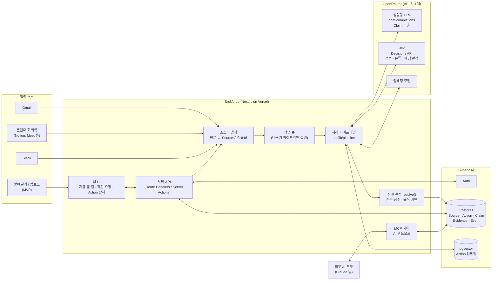
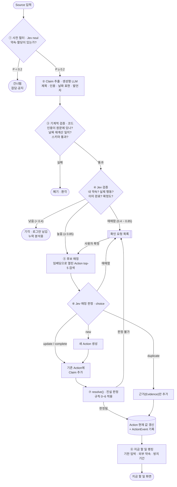
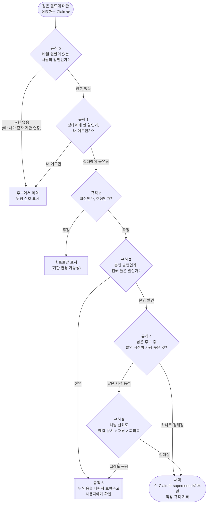
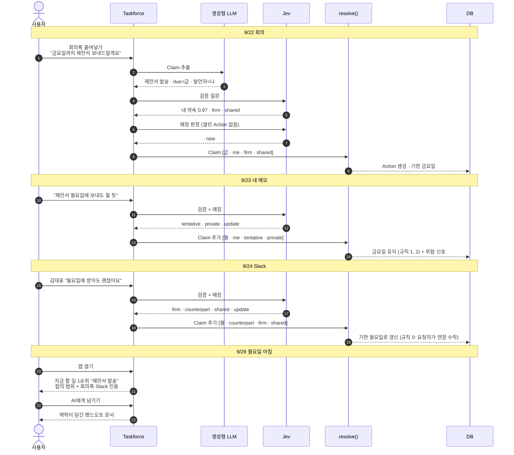
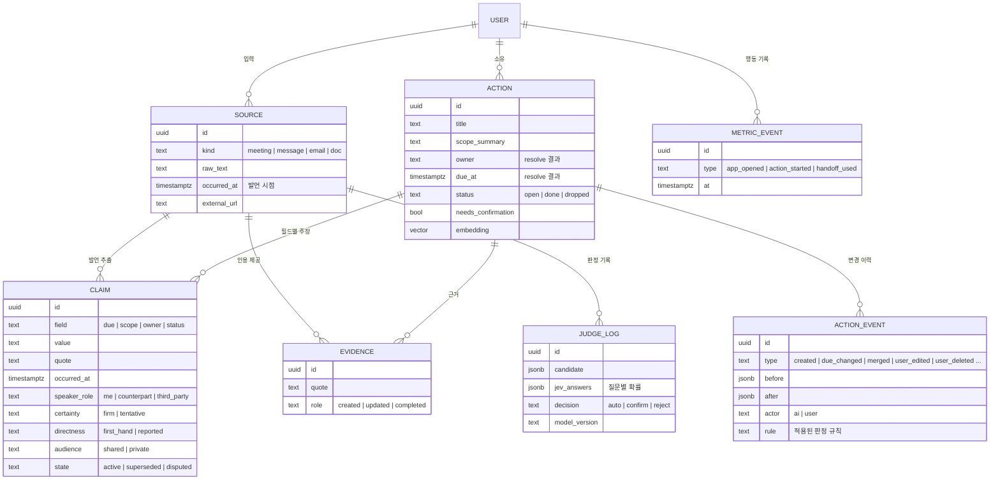
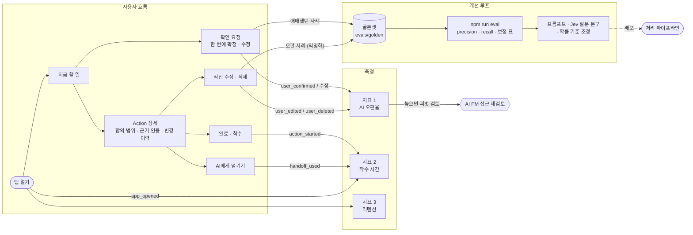

# Taskforce 시스템 아키텍처

관련 문서: [PRD](PRD.md) · [오탐 방지와 진실 판정 기준](TRUTH_RULES.md) · [바이브코딩 플랜](VIBE_CODING_PLAN.md)

1. [전체 구성도](#1-전체-구성도)
2. [처리 파이프라인](#2-처리-파이프라인)
3. [진실 판정 흐름](#3-진실-판정-흐름)
4. [핵심 시나리오: 금요일 → 월요일](#4-핵심-시나리오-금요일--월요일)
5. [데이터 모델](#5-데이터-모델)
6. [사용자 흐름과 학습 루프](#6-사용자-흐름과-학습-루프)

---

## 1. 전체 구성도

| 구성 요소 | 역할 | 비고 |
|---|---|---|
| 소스 어댑터 | 채널별 원문을 공통 `Source`(원문, 발언 시점, 출처 링크)로 변환 | 연동이 늘어도 파이프라인은 그대로 |
| 작업 큐 | 입력을 받자마자 응답하고, 추출은 백그라운드에서 실행 | 예: Inngest, Supabase Queues |
| 처리 파이프라인 | 추출 → 검증 → 매칭 → Claim 저장 | UI·DB와 분리된 순수 함수라 eval에서 그대로 실행 |
| resolve() | Claim들로부터 Action의 현재 값을 계산 | LLM 없음, 단위 테스트로 고정 |
| MCP 서버 | 외부 AI가 "내 Action과 맥락"을 조회 | 4단계 이후 |

---

## 2. 처리 파이프라인

원문 하나가 들어와서 "지금 할 일"에 반영되기까지의 흐름입니다.

| 단계 | 누가 | 입력 → 출력 |
|---|---|---|
| ① 사전 필터 | Jev `noul` | 메시지 조각 → 약속이 있을 확률. 낮으면 비싼 추출을 건너뜀 |
| ② 추출 | 생성형 LLM | 원문 → Claim 후보 목록 (구조화 출력) |
| ③ 기계적 검증 | 코드 | 인용 실재·날짜·스키마 확인. 환각 제거 |
| ④ 검증 | Jev `noul` + `choice` | 후보 → 확률 + Claim 속성(확정도, 발언자, 직접성, 공개 여부) |
| ⑤ 매칭 | pgvector | 후보 → 비슷한 열린 Action top-5 |
| ⑥ 매칭 판정 | Jev `choice` | 후보 + 기존 Action → new / update / duplicate / complete |
| ⑦ 진실 판정 | 코드 `resolve()` | Claim 목록 → 필드 값 + 적용 규칙 |
| ⑧ 랭킹 | 코드 (+ Jev `score` 보조) | 열린 Action → 지금 할 일 순서 |

확률 기준(0.2, 0.4, 0.85)은 출발값입니다. 한국어 골든셋으로 측정한 뒤 조정합니다.

---

## 3. 진실 판정 흐름

같은 Action의 같은 필드(예: 기한)에 대해 서로 다른 Claim이 있을 때 `resolve()`가 따르는 순서입니다.
규칙 상세는 [TRUTH_RULES.md 2장](TRUTH_RULES.md#2-진실-판정-기준)을 보세요.

---

## 4. 핵심 시나리오: 금요일 → 월요일

---

## 5. 데이터 모델

`JUDGE_LOG`는 PRD 초안에 없던 테이블입니다. 기각한 후보도 남겨야 "Jev가 버렸는데 사실은 맞던 것"(누락)을 나중에 분석할 수 있어서 추가했습니다.

---

## 6. 사용자 흐름과 학습 루프

사용자가 무언가를 고칠 때마다 그 기록이 지표와 골든셋으로 돌아가서 판정 품질을 개선합니다.

