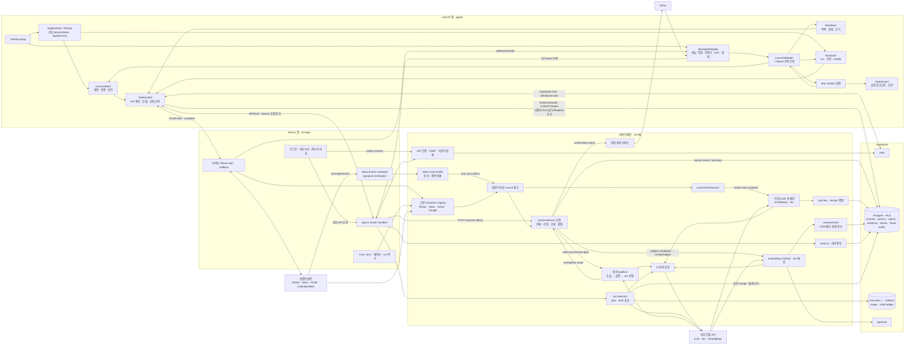

# Taskforce 코드베이스 구조 지도

이 문서는 활성 Mac MVP 코드의 현재 호출 흐름과 경계를 설명한다. 기준은 2026-10-05의 작업 트리, 브랜치 codex/taskforce-mac-beta-active-20261005, HEAD 64bdb480b04cb538fd57b728dd0fdf7443004b7d다. 구조도는 소스 코드 지도이며 OAuth 실서비스, 배포, 기기 E2E가 성공했다는 증거가 아니다.

상위 제품·플랫폼 경계는 [플랫폼 전략](PLATFORMS.md), 재사용 범위와 확인된 출시 한계는 [Mac 재사용 베이스](REUSE_BASE.md), 실행 상태 머신은 [실행 설계](EXECUTION.md), 저장소 명령과 보안 규칙은 [CLAUDE.md](../CLAUDE.md)를 함께 본다.

## 전체 구성도

```mermaid
flowchart LR
  subgraph MAC["macOS 앱 · apple/"]
    Entry["TaskforceApp"]
    Runtime["AppRuntime / Startup<br/>공유 SessionStore · AppServices"]
    Delegate["MacAppDelegate<br/>메뉴 막대 · 단축키 · URL · 알림"]
    Launcher["LauncherModel<br/>⌥Space 런처 흐름"]
    Account["AccountStore<br/>계정 · 연결 · 동의"]
    Now["NowStore<br/>목록 · 상태 · 근거"]
    Runs["RunStore<br/>run · 초안 · credits"]
    Views["Mac SwiftUI 화면"]
    Kit["TaskforceKit<br/>API 계약 · 모델 · 상태 규칙"]
    UI["TaskforceUI<br/>공용 컴포넌트 · 토큰"]
    Entry --> Runtime
    Entry --> Delegate
    Delegate --> Launcher
    Runtime --> Account
    Runtime --> Runs
    Launcher --> Account
    Launcher --> Now
    Launcher --> Runs
    Launcher --> Views
    Views --> Launcher
    Account --> Kit
    Now --> Kit
    Runs --> Kit
    Views --> UI
  end

  subgraph WEB["Next.js 앱 · src/app/"]
    WebPages["로그인 · 내부 /lab · 관리자 지표"]
    Api["/api/v1 Route Handlers"]
    OAuth["커넥터 OAuth start · callback"]
    SlackEvents["Slack Events webhook<br/>signature verification"]
    Cron["Cron: sync · 재처리 · run 복구"]
  end

  subgraph DOMAIN["서버 도메인 · src/lib/"]
    Auth["API 인증 · CSRF · 사용자 경계"]
    Registry["고정 Connector registry<br/>Notion · Slack · Gmail · Google"]
    SlackBuffer["Slack event buffer<br/>동의 · 중복 억제"]
    Ingest["원문/구조화 source 접수"]
    SourceProcess["processSource 조정<br/>상태 · 저장 · 오류 · 알림"]
    TaskProcess["processTaskSource"]
    Pipeline["원문 pipeline<br/>추출 → 검증 → Jev 판정"]
    Merge["embedding shortlist · Jev 매칭"]
    TaskMatch["구조화 task 첫 매칭<br/>embedding · Jev"]
    TaskMerge["task key · version 병합"]
    Truth["resolveAction<br/>Claim에서 상태 계산"]
    NowApi["nowList · 서버 랭킹"]
    Execution["run executor<br/>plan · draft 효과"]
    Consent["AI 동의 관문"]
    Notify["알림 발송 서비스"]
  end

  subgraph DATA["Supabase"]
    AuthDb["Auth"]
    Pg[("Postgres · RLS<br/>sources · actions · claims · evidence · events · Slack buffer")]
    ExecDb[("execution_* · artifacts<br/>usage · credit ledger")]
    Vector["pgvector"]
  end

  Sources["연결된 원본<br/>Notion · Slack · Gmail · Calendar/Meet"]
  Models["외부 모델 API<br/>LLM · Jev · embeddings"]
  Push["APNs"]

  WebPages -->|"cookie session"| Auth
  WebPages -->|"내부 API 요청"| Api
  Kit <-->|"Supabase Auth · identity/session"| AuthDb
  Kit <-->|"APIClient · Bearer 요청/응답"| Api
  Kit -->|"TaskforceReads · ActionChanges<br/>사용자 RLS 읽기/Realtime 신호"| Pg
  Api --> Auth
  Auth --> AuthDb
  Kit <-->|"OAuth start · complete"| OAuth
  OAuth <--> Sources
  OAuth -->|"callback/handoff"| Delegate
  OAuth --> Registry
  Sources -->|"message/events"| SlackEvents
  SlackEvents --> SlackBuffer
  SlackBuffer -->|"cron sync drains"| Ingest
  Cron --> Registry
  Registry --> Ingest
  Sources --> Registry
  Api -->|"POST /sources after()"| SourceProcess
  Ingest --> SourceProcess
  SourceProcess -->|"withConsentGate deps"| Pipeline
  Pipeline -->|"runPipeline result"| SourceProcess
  SourceProcess -->|"judged candidates → mergeJudged"| Merge
  SourceProcess -->|"source status / summary"| Pg
  SourceProcess -->|"confirmation alerts"| Notify
  Ingest --> TaskProcess
  TaskProcess -->|"Notion task snapshot"| TaskMatch
  TaskMatch --> TaskMerge
  TaskMatch --> Consent
  Models --> TaskMatch
  TaskMerge --> Pg
  Pipeline --> Consent
  Merge --> Consent
  Consent --> Models
  Models --> Pipeline
  Models --> Merge
  Merge --> Truth
  Truth --> Pg
  NowApi --> Pg
  Api --> NowApi
  Api --> Execution
  Execution --> Consent
  Execution --> Models
  Execution --> ExecDb
  Execution -->|"초안 receipt · 원문/근거"| Pg
  Merge --> Vector
  Delegate -->|"기기 token 등록"| Api
  Notify --> Push
  Push --> Delegate
```

그림의 API와 DB 화살표는 런타임 호출을 뜻한다. Supabase 읽기와 서버 쓰기는 서로 다른 경로다. TaskforceKit의 직접 DB 접근은 사용자 세션 아래 읽기 전용으로 쓰고, 서버의 service-role 쓰기는 대상 사용자 ID를 명시해 범위를 좁힌다.

## 실제 호출 흐름

### 로그인, 계정, 기기 로컬 상태

| 흐름 | 코드 위치와 실제 역할 |
|---|---|
| 앱 시작 | [TaskforceApp.swift](../apple/Taskforce/TaskforceApp.swift#L5)가 메뉴 막대 앱을 만들고, AppRuntime/Startup에서 Supabase client 한 개, SessionStore, AppServices를 공유한다. 설정 창과 런처도 같은 AccountStore·RunStore를 쓴다. |
| Mac 진입 | [MacAppDelegate.swift](../apple/Taskforce/Mac/MacAppDelegate.swift#L21)가 세션과 런처를 시작하고 전역 단축키, push, taskforce:// URL을 연결한다. 로그인 화면은 [SignIn.swift](../apple/Taskforce/Shared/SignIn.swift), Google identity 흐름은 [GoogleSignIn.swift](../apple/Taskforce/Shared/GoogleSignIn.swift)다. Google 계정 로그인은 Gmail 원문 권한 연결과 별도 동작이다. |
| 계정·연결 | [AccountStore.swift](../apple/Taskforce/Shared/AccountStore.swift#L10)가 프로필, 연결, 동의, 브라우저 OAuth, 계정 변경 중 늦게 도착하는 응답을 관리한다. 연결 토큰 자체는 클라이언트가 읽지 않는다. |
| 이 기기 로그아웃 | [SessionStore.swift](../apple/Packages/TaskforceKit/Sources/TaskforceKit/SessionStore.swift#L186)는 현재 기기의 Supabase 세션을 .local 범위로 종료한다. signed-out 관찰자가 목록·실행·계정 상태를 reset하고 저장본을 정리한다. 이 코드 확인은 실제 Apple/Google 로그인 뒤 다른 기기의 세션까지 시험했다는 뜻은 아니다. |
| 계정 삭제 | [AccountDeletion.swift](../apple/Taskforce/Shared/AccountDeletion.swift#L18)는 현재 신원 재확인 후 서버 삭제를 요청하고, 외부 연결 해제와 로컬 세션/저장본 정리로 이어진다. 서버 삭제 경로는 [account.ts](../src/lib/api/account.ts)다. |

### 커넥터 OAuth, 수집, 할 일 반영

1. 앱의 연결 동작은 [AccountStore.connect](../apple/Taskforce/Shared/AccountStore.swift#L230)에서 서버 start URL을 요청하고 ASWebAuthenticationSession을 연다.
2. 서버의 provider별 start/callback Route Handler는 **src/app/api/connectors/{provider}/{start,callback}/route.ts**에 있다. [oauth-state.ts](../src/lib/connectors/oauth-state.ts#L7)는 짧게 사는 HMAC 서명 state와 nonce를 확인한다. callback만으로 계정을 연결하지 않고, 원래 로그인한 앱이 handoff ID로 /complete를 호출해야 연결이 완료된다.
3. [registry.ts](../src/lib/connectors/registry.ts#L18)는 Notion, Slack, Gmail, Google(Calendar/Meet)의 고정 구현을 common Connector 계약에 연결한다. 주기 실행은 /api/cron/sync; 연결 직후와 수동 Sync Now도 같은 동기화 서비스를 사용한다. Slack Events는 [events route](../src/app/api/connectors/slack/events/route.ts#L18)에서 signature를 확인해 버퍼에 넣고, cron이 메시지를 원문으로 처리한다.
4. 일반 원문은 [process.ts](../src/lib/sources/process.ts#L226)의 processSource로 들어간다. AI 동의를 확인하고 [run.ts](../src/lib/pipeline/run.ts#L40)의 추출·기계 검증·판정을 거친 뒤, [merge.ts](../src/lib/pipeline/merge.ts#L243)가 유사 Action 후보와 관계를 구하고 Claim·Evidence를 저장한다. Notion 같은 구조화 작업은 별도의 processTaskSource 경로로 원문 재추출 없이 변경 스냅샷을 반영한다.
5. [resolve.ts](../src/lib/pipeline/resolve.ts#L3)는 누적 Claim에서 할 일의 현재 필드를 결정하는 규칙 코드다. AI가 직접 현재 상태를 덮어쓰지 않는다. DB 쓰기는 버전 조건과 원자적 write_action을 사용한다. processSource는 완료/실패와 요약을 기록하고, 확인 알림 실패는 원문 반영을 되돌리지 않는다. 실패 또는 중단된 원문은 retry-sources cron이 재시도한다.
6. Mac의 [NowStore.swift](../apple/Taskforce/Shared/NowStore.swift#L5)는 GET /api/v1/now로 서버가 순위를 정한 목록을 받고, TaskforceReads로 본인 할 일의 근거/상세를 RLS 아래 읽는다. Realtime은 데이터 전송이 아닌 “변경됨” 신호로 쓰며, 도착하면 목록을 다시 읽는다. 완료 등 UI 쓰기는 API를 통해 서버에 반영하고 실패하면 낙관적 변경을 되돌린다.

### Run과 AI 초안

1. 런처의 Run with AI가 [RunStore.swift](../apple/Taskforce/Shared/RunStore.swift#L15)를 거쳐 POST /api/v1/runs를 호출한다.
2. [runs.ts](../src/lib/api/runs.ts#L59)는 기능 플래그, 로그인, 허용 actor, 전체 차단, AI 동의, 사용자 소유의 열린 Action, rate limit을 순서대로 검사한다.
3. run과 첫 계획 단계를 저장한 뒤 after()가 [executor.ts](../src/lib/execution/executor.ts#L53)를 깨운다. 단계마다 DB lease와 동시성/credit 관문을 통과하고, [plan effect](../src/lib/execution/effects/plan.ts#L16)는 다음 단계 또는 초안 필요 여부를 정한다. [draft effect](../src/lib/execution/effects/draft.ts#L10)는 초안 artifact를 저장하지만 외부로 보내지 않는다.
4. plan/draft 모델 호출 직전에도 동의를 재확인한다. 완료된 초안은 receipt로 Action의 근거 기록에 붙으며, 자동으로 Action을 완료시키지 않는다. 놓친 wake, lease 만료, 미확정 usage/receipt는 execution-advance와 execution-sweep이 복구한다.

## 저장소별 책임

| 경로 | 책임 |
|---|---|
| **apple/Taskforce/Mac** | 메뉴 막대/런처 UI, 키보드 흐름, 화면별 표현. LauncherModel은 오케스트레이션과 많은 화면 상태를 함께 가진다. |
| **apple/Taskforce/Shared** | 현재 Mac 앱의 AccountStore, NowStore, RunStore, 계정 삭제, 로그인, 알림 등 앱 상태와 조정 |
| **apple/Packages/TaskforceKit** | API 계약과 네트워크 client, RLS reads, 세션, 모델, 상태/정렬/실행 규칙 및 순수 helper |
| **apple/Packages/TaskforceUI** | TaskforceUI 컴포넌트와 접근성/시각 토큰 |
| **src/app** | Next.js 페이지, API Route Handler, OAuth callback, cron 엔트리 |
| **src/lib/api** | 요청 인증·검증·응답 경계. 세부 업무는 actions, connectors, sources, runs 같은 domain 코드에 위임 |
| **src/lib/connectors** | 공통 Connector registry와 provider별 OAuth·API·sync·ingest 구현 |
| **src/lib/sources, src/lib/pipeline** | 원문 처리와 순수 후보 추출/검증/판정/병합/resolve 경계 |
| **src/lib/actions** | Action 조회·랭킹·수정, 사용자 Claim과 이벤트 투영, DB 저장 어댑터 |
| **src/lib/execution** | run/step 상태 머신, plan/draft, 재시도·wake/sweep, artifact·receipt·usage/credit 원장 |
| **src/lib/ai, src/lib/eval, evals/** | 모델/provider 설정, 프롬프트, 평가 함수와 골든셋. 프롬프트나 판정 변경은 CLAUDE.md에 따라 eval 결과 비교가 필요하다. |
| **supabase/migrations, tests/** | DB 스키마/RLS/RPC, 통합·회귀 테스트. macOS 앱 검사는 apple project/scheme에서 수행한다. |

## 보안과 데이터 경계

- [authenticateRequest](../src/lib/api/auth.ts#L11)는 앱 Bearer token과 웹 cookie session을 모두 검증된 claims로 바꾼다. cookie 기반 쓰기는 [CSRF 검사](../src/lib/api/csrf.ts#L1)를 거친다. 사용자의 일반 DB 읽기는 RLS client다.
- service-role client는 서버 전용이다. connector token, ingestion과 API 쓰기에서 쓰는 경우 user_id 또는 user-scoped lookup으로 행을 제한한다. 연결 비밀은 서버의 encrypted secret 저장 경로에 둔다.
- AI 동의는 UI의 버튼 상태만으로 보장하지 않는다. [서버 consent gate](../src/lib/consent/gate.ts#L4)는 source 처리, 동기화, 누락 신고, Ask, plan/draft 호출에 적용되고 모델 호출 직전에 다시 읽는다. 동의를 철회하면 뒤이은 모델 호출을 중단한다.
- OAuth callback은 서명·만료·nonce 검증과 handoff 완료를 분리한다. callback을 완료한 브라우저만으로 다른 사용자 계정에 연결할 수 있는 흐름이 아니다.
- Action의 판정 필드는 Claim, Evidence, Event 이력으로 계산한다. 사용자 작성 Markdown 메모는 그 판정 이력과 별도인 실행 맥락이며 `save_action_notes`가 독립 revision과 `user_notes_updated` metadata event만 원자적으로 저장한다. 메모는 핸드오프 AI의 사용자 선호·제약 맥락으로 전달하지만 source-backed agreement가 아니다.
- 외부 AI 처리 비용의 계량은 아직 모든 경로를 덮지 않는다. pipeline summary는 추출·판정 비용을 계산하지만, [processDepsFromEnv](../src/lib/sources/process.ts#L63)는 embedding 비용을 버리고, merge의 matching Jev 비용도 summary에 합산하지 않는다. 실행 usage/credit 원장과 이 수집 비용은 다른 회계 경로다. 사용자당 누적 $10 한도 정책은 정해져 있으나 모든 AI 비용을 포함한 집행 방식과 집계는 이 문서에서 완료로 간주하지 않는다. 제품/계량 작업으로 분리한다.

## 현재 타깃과 미구현 경계

- [apple/project.yml](../apple/project.yml#L7)은 macOS 15 이상만 앱 destination으로 선언한다. 현재 작업 트리에는 **apple/Taskforce/iOS/TaskDetailView.swift**와 TaskforceKit의 PhoneHome helper/test가 남아 있지만, iOS 앱 target은 없다. 파일 이름만 보고 전체 iOS 코드가 제거됐거나 해당 helper가 죽은 코드라고 단정하지 않는다.
- Connector provider는 코드에 고정된 네 가지다. 사용자 임의 MCP/source 등록 UI와 runtime은 없다. Connector protocol은 이미 구현된 provider의 OAuth/sync/revoke 경로를 공유한다.
- Next.js 홈은 로그인 사용자를 보여주는 고정 안내 화면이다. Mac의 동기화 할 일 목록을 보여주는 사용자용 웹 앱은 아니다. /lab은 내부 시험 화면, /admin/metrics는 운영 지표 도구다.
- 실행 계층의 현재 효과는 내부 plan과 draft다. 일반 외부 도구/서비스 호출, 이메일 발송, 자동 수정은 구현되지 않았다. DB의 tool/approval 형태를 보고 사용자가 MCP를 붙일 수 있다고 추론하지 않는다.
- 코드와 로컬 테스트는 실제 provider OAuth, 연결 후 수집, APNs 수신, Developer ID 서명·공증, 웹사이트 다운로드, 깨끗한 기기 설치/로그인 E2E를 입증하지 않는다. 출시 확인 자료는 [Mac DMG 준비 문서](go-live/mac-dmg.md)를 따른다.

## 추상화와 fallback 검토

### 유지할 경계

| 현재 구조 | 판단 |
|---|---|
| APIClient 쓰기 + TaskforceReads RLS 읽기 + ActionChanges 무효화 신호 | 인증/권한 경계가 다르므로 하나의 “repository”로 합칠 이점이 없다. |
| Connector interface + 고정 registry | 각 provider의 반복 start/callback/sync/revoke 연결을 줄이는 실제 공통점이다. plugin UI가 없어도 유효하다. |
| 추출/검증/판정, 후보 병합, 결정론적 resolve, DB 저장 어댑터 분리 | AI 결과와 사용자 데이터 상태 변경을 격리한다. 단순 파일 수 감소를 위해 합치지 않는다. |
| 원문 ingest와 구조화 task snapshot 경로 분리 | 원문에서는 AI 추출이 필요하고 tracker task는 기존 속성/식별자로 업데이트해야 한다. 두 경로는 의미가 다르다. |
| RunStore/ExecutionStore와 plan/draft effect | 클라이언트 표시 상태, 서버 상태 머신, 실제 내부 효과의 역할이 다르다. 외부 효과가 없는 상태를 유지한다. |

### 정리 후보와 fallback 분류

| 우선순위 · 신뢰도 | 발견 사항 | 분류와 안전한 다음 단계 |
|---|---|---|
| 완료 · 높음(호출 경로와 계약 확인, 실데이터 우회는 미확인) | 기존 [AccountStore.giveConsent](../apple/Taskforce/Shared/AccountStore.swift#L389)는 consent 저장 API의 400/404를 연결 시작의 “coming soon”으로 분류하고 성공처럼 진행했다. 로컬 동의를 true로 두고 기다리던 provider/handoff를 재개할 수 있었다. | consent API는 저장 성공 시 204를 반환하고 동의 시각을 저장한다([계약](PLATFORMS.md#L145)). 테스트를 먼저 추가해 구 동작의 400/404 오인을 재현한 뒤 이 catch만 제거했다. 실패는 화면에 남고 provider/handoff는 재개되지 않는다. 서버에 별도 동의 gate가 있어 무동의 AI 전송은 입증되지 않았으며, provider start의 400/404 “coming soon” 분류는 그대로 유지했다. |
| 2 · 중간 | [AccountStore.read](../apple/Taskforce/Shared/AccountStore.swift#L114)는 프로필·연결·요청 읽기 실패를 각각 try?로 삼키고 loaded를 true로 둔다. 기존 값을 성공한 응답만 덮으므로 잘못된 계정 데이터가 섞이지는 않지만, 첫 읽기 실패가 빈 상태처럼 보일 수 있다. | 비호환 서버와 곁가지 읽기 실패를 허용하는 fail-soft 경로. 새 오류 화면이나 광범위한 오류 추상화를 만들지 않는다. 향후 편집 시 “빈 결과”와 “읽기 실패”가 사용자에게 혼동을 준다는 재현 증거가 있으면 단일 화면/상태에 한정해 테스트 후 고친다. |
| 3 · 높음(구조 확인) | LauncherModel은 2천 줄이 넘고 검색·계정 흐름·수집·실행·화면 상태를 조정한다. AccountStore도 프로필·연결·동의 책임을 한 객체에서 수행한다. | 큰 파일/복수 책임 후보지만 파일 크기만으로 불필요한 추상화임을 증명하지 않는다. 먼저 동작을 나누지 말고, 다른 문제 수정에 꼭 필요한 작은 순수 규칙만 기존 TaskforceKit 패턴을 재사용해 추출한다. coordinator/view model 계층 추가는 근거가 없다. |
| 4 · 낮음 | Mac 전용 타깃인데 iOS 조건부 파일/helper가 남아 있다. | 소스 잔재 후보이나 PhoneHome은 독립 helper와 테스트가 있고, TaskDetailView도 미래 작업 의도를 담은 코드다. 이번 정리에서 디렉터리 단위 삭제나 테스트 제거를 하지 않는다. target/caller/보존 의도를 확인한 별도 정리만 고려한다. |
| 보호 | [RunStore](../apple/Taskforce/Shared/RunStore.swift#L167), [NowStore.reset](../apple/Taskforce/Shared/NowStore.swift#L115), SessionStore의 .local 세션 종료, 계정별 saved copy 삭제와 generation token | 계정 전환 뒤 늦은 API 응답이 새 사용자 상태에 섞이지 않게 하는 fail-closed 경계다. 비동기 취소·중복 방지 코드를 단순화하지 않는다. |
| 보호 | [TaskforceReads](../apple/Packages/TaskforceKit/Sources/TaskforceKit/TaskforceReads.swift#L20)의 오래된 stopped_at 열 호환 처리, [APIClient](../apple/Packages/TaskforceKit/Sources/TaskforceKit/APIClient.swift)의 실행 기능 404 처리 | 스키마 배포 순서와 실행 기능 비활성 상태를 위한 호환 처리다. 404를 credit/기능 성공으로 바꾸지 않는다. migration 적용 기준을 정리하지 않은 채 삭제하지 않는다. |
| 보호 | [now route](../src/app/api/v1/now/route.ts#L26)의 주간 질문/실패 원문 수 fail-soft 조회 | 부가 정보를 읽지 못해도 핵심 목록은 보이는 의도된 fail-safe다. 주 목록 조회 실패까지 성공으로 위장하지 않으며, optional query의 오류를 전체 응답 실패로 바꾸지 않는다. |
| 별도 제품/계량 항목 | source ingestion의 누락된 model cost 합산과 누적 원가 한도 집행 | 단순화나 리팩터링이 아니다. 수집·Ask·생성의 원가를 어디까지 포함할지 정책/계량 결정이 필요하므로 cleaner 범위에서 추측 구현하지 않는다. |

## 안전한 정리 계획

이번 작업은 현재 Mac MVP의 구조를 기록하고, 근거가 확인된 consent 오류 처리 한 곳만 고쳤다. 큰 파일 분할, 읽기 오류 처리 재설계, iOS 잔재 삭제는 별도 근거 없이는 시작하지 않는다.

1. **회귀 테스트 우선:** 기존 ShellRouter HTTP test seam을 사용해 consent 204 성공, 400/404 실패, 늦은 결과와 로그아웃/계정 전환, handoff 재시도 방지, provider start 오류 분류를 추가했다. 새 production protocol이나 공용 추상화는 만들지 않았다.
2. **한 경계만 수정:** consent 저장 실패를 성공처럼 처리하던 catch만 제거했다. `ConnectionStartFailure`의 provider start 호환 동작과 backend consent gate는 변경하지 않았다.
3. **검증:** 테스트를 먼저 실행해 기존 구현의 실패를 확인했다. 수정 후 macOS scheme 테스트 80개/8 suites, unsigned universal Release build(x86_64·arm64), `npm run lint`, `npm run typecheck`, `npm run test`(2,196개)를 통과했다. 이 pass는 추출·판정·프롬프트를 바꾸지 않아 eval은 범위 밖이다. Swift Release build에는 기존 `TaskRow.swift` 동시성 경고가 남는다.
4. **후속 후보:** `AccountStore.read`의 선택적 조회 오류, 큰 `LauncherModel`, Mac target 밖의 iOS 조건부 파일/helper는 서로 다른 원인과 계약을 갖는다. 현 자료로 제거·분할의 순이익이 입증되지 않아 유지한다.
5. **명시적 비목표:** 원가 계량 정책, 임의 connector/MCP, 외부 서비스 실행은 별도 요구와 검증 없이 넓히지 않는다.

### 이 경계를 잠그는 기존 검사

| 회귀 영역 | 기존 근거 |
|---|---|
| 세션 삭제/401/계정 경쟁 | **apple/Packages/TaskforceKit/Tests/TaskforceKitTests/AuthSessionRaceTests.swift**, **SessionStoreTests.swift**, **apple/TaskforceTests/LauncherModelSessionTests.swift** |
| 연결 상태와 API 응답 분류 | **ConnectionsTests.swift**, **APIClientGoLiveTests.swift**, **apple/TaskforceTests/LauncherShellModelTests.swift** |
| 원문 동의·실패·재처리 | **src/lib/consent/gate.test.ts**, **src/lib/sources/process.test.ts**, **src/lib/connectors/sync-all.test.ts**, **src/lib/sources/retry.test.ts** |
| OAuth state 및 account 경계 | **src/lib/connectors/oauth-state.test.ts**, provider별 start/callback route 테스트 |
| 판정/병합/상태 변경 | **src/lib/pipeline/merge.test.ts**, **resolve.test.ts**, **src/lib/actions/service.test.ts**, database RPC/RLS 테스트 |
| plan/draft와 실패 복구 | **src/lib/execution/executor.test.ts**, **wake.test.ts**, **sweep.test.ts**, **tests/db/execution-*.test.ts** |

이번에 추가한 동의 회귀 검사는 [LauncherShellModelTests.swift](../apple/TaskforceTests/LauncherShellModelTests.swift)에서 실행된다. 초기 실패는 API 오류를 잘못 분류해 화면 상태와 재시도 흐름을 성공처럼 바꾸는 동작을 입증했고, 이는 잠재적인 앱 상태 오류이지 실제 사용자의 데이터 손실이나 consent gate 우회 증거는 아니다.
