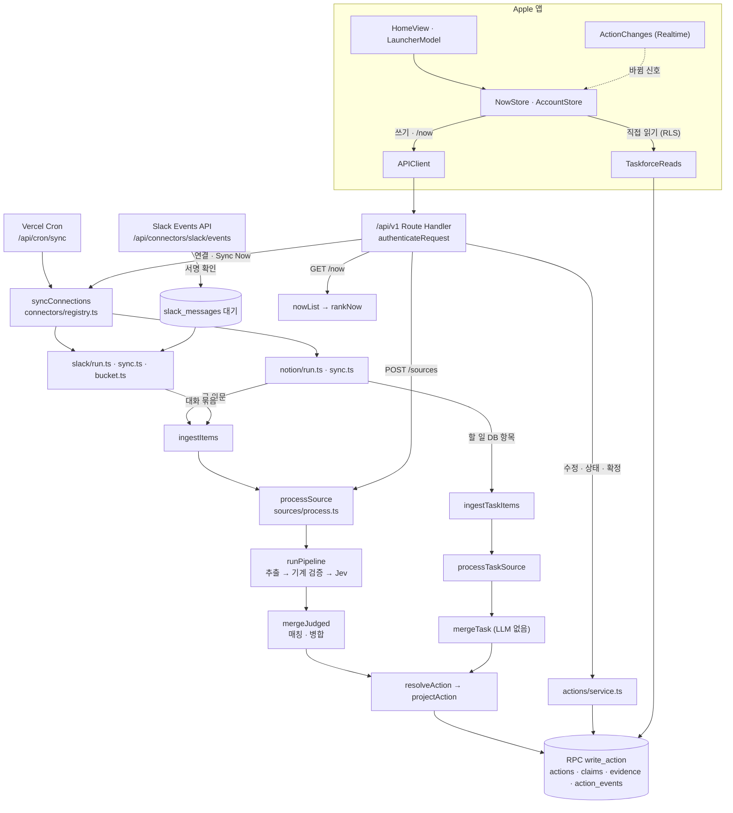

# 피처맵: 기능 → 코드

관련 문서: [PRD](PRD.md) · [아키텍처](ARCHITECTURE.md) · [진실 판정](TRUTH_RULES.md) · [연동](INTEGRATIONS.md) · [Slack 연동](go-live/slack-integration.md) · [플랫폼](PLATFORMS.md) · [go live](GO_LIVE.md) · [Apple 앱](../apple/README.md)

기능마다 실제 코드 위치, 거쳐야 하는 정식 구현, 호출자, 테스트를 적는다. 왜 그렇게 만들었는지는 위 문서에 있고, 이 문서는 **어디에 있고 무엇을 거쳐야 하는지**만 다룬다.

- 마지막 확인: 2026-09-29, `main` (커밋 `5f3efa1`).
- 확인 범위: 서버(`src/` · `scripts/` · `supabase/` · `tests/`)와 Apple 앱(`apple/`)을 진입점 → 핵심 구현 → 저장까지 코드로 따라갔다. 적은 파일과 심볼은 모두 실제로 있다. 테스트는 이름만 적었고 이번에 돌리지 않았다.
- 줄 번호는 적지 않는다(금방 낡는다). 파일과 심볼 이름으로 찾는다.
- 줄임: `v1/` = `src/app/api/v1/`, `lib/` = `src/lib/`, `App/` = `apple/Taskforce/`, `Kit/` = `apple/Packages/TaskforceKit/Sources/TaskforceKit/`.

## 1. 한눈에 보는 흐름

## 2. 우회하면 안 되는 경로 (SSOT)

새 코드는 아래 정식 구현을 거친다. 같은 책임을 두 번째로 만들지 않는다.

| 책임 | 정식 구현 | 지킬 것 |
|---|---|---|
| API 인증 | `lib/api/auth.ts` `authenticateRequest` (Bearer 또는 쿠키, 쿠키 쓰기는 `lib/api/csrf.ts` `isCrossSiteWrite` 확인) | `/api/v1`은 모두 이것을 쓴다. `lib/auth.ts` `requireUser`는 화면(`src/app/page.tsx` · `lab` · `admin/metrics`) 전용이다 (쿠키만, `/login`으로 보냄) |
| Slack 요청 확인 | `lib/connectors/slack/verify.ts` `verifySlackSignature` + `lib/env.ts` `slackSigningSecret` | Slack events route는 로그인 없이 이 서명만 믿는다 |
| 요청 · 응답 모양 | `lib/api/contract.ts` (zod) | Swift `Kit/Models.swift` · `AccountModels.swift` · `Connections.swift`가 이 파일을 따른다 |
| AI 호출 | `lib/ai/llm.ts` `completeJson` · `lib/ai/jev.ts` `decide` · `lib/ai/embed.ts` `embed`, 공급자 고정 `lib/ai/providers.ts` `providerRouting` | OpenRouter 주소는 이 세 파일에만 있다. 모델을 부르기 전 동의 확인은 원문 처리 · 빠진 할 일 · 물어보기가 `lib/consent/gate.ts` `withConsentGate`, 직접 추가의 임베딩은 `handleCreateAction`이 한 번 확인한다 |
| 원문 → 후보 | `lib/pipeline/run.ts` `runPipeline` (추출 → 기계 검증 → Jev) | API · eval · 재처리 스크립트가 같은 함수를 쓴다 |
| 원문 속 화자 · 언급 | `lib/pipeline/identity.ts` `quoteSpeaker` · `speakerRole` · `addressedToUser` | 인용 줄 이름표를 확실히 읽고 역할을 가를 수 있으면 화자 역할은 코드가 정한다 (제품 원칙 5). 아니면 Jev 답을 쓴다. 새 연동은 원문을 머리줄 `[…]` + `이름: 글` 형식으로 만든다 (`evals/golden/README.md` "Slack 케이스") |
| 원문 처리 (DB) | `lib/sources/process.ts` `processSource` · `processTaskSource` · `reportMissing` | 연동 · API · 스크립트 모두 여기로 들어온다. 병합 단계(임베딩 채우기 + 매칭 · 병합)만 사용자마다 `withUserLock`으로 한 번에 하나씩 돈다 (한 서버 인스턴스 안에서만 보장). 추출 · 판정은 잠금 밖이다 |
| Action 필드 값 | `lib/pipeline/resolve.ts` `resolveAction` → `lib/actions/project.ts` `projectAction` | 필드 값은 이 둘로만 계산한다 (제품 원칙 5). 예외는 임베딩만 쓰는 `lib/actions/db-store.ts` `saveEmbedding` |
| Action 쓰기 | `lib/actions/service.ts` → `lib/actions/db-store.ts` `writeAction` · `writeProgress` → RPC `write_action` · `set_action_progress` · `start_action` | 앱 역할의 직접 쓰기는 DB가 막는다 (`20260929000000_actions_server_writes.sql`). `v1/actions/[id]/**`는 `lib/api/action-routes.ts` `actionWriteRoute`를 거친다. 예외: Slack 연결 끊기 · 앱 제거는 SQL `purge_slack_sources`가 인용을 자리 표시로 바꾸고 Claim의 글자(`quote` · `value_text` · `speaker`)만 비운다. 판정 칸은 남아 필드 값은 그대로다 |
| 지운 원문 · 인용 | `lib/retention.ts` `purgedSourceMessage` · `SLACK_DISCONNECTED_QUOTE` | 같은 자리 표시 글자가 SQL `purge_slack_sources`와 Swift `Kit/EvidenceDigest.swift` `RemovedQuote`에도 있어 셋이 같아야 한다. 인용을 모델 · 클립보드로 보내는 곳은 자리 표시를 뺀다 (`handoffAction` · `retrieveAskContext` · 매칭의 `SupabaseActionStore` `shortlist` · `unembedded`) |
| 지금 할 일 순서 | `lib/actions/rank.ts` `rankNow` (`GET /api/v1/now`) | 앱은 받은 순서를 그대로 보여 준다 |
| 속도 제한 | `lib/api/rate-limit-store.ts` `takeRateLimit` → RPC `take_rate_limit`. 한도 값은 `lib/api/rate-limit.ts` | 직접 추가 10분 30번 · 물어보기 20번 · 빠진 할 일 10번 · 연결 시작 10번 |
| 연동 틀 · 동기화 | `lib/connectors/registry.ts` `syncConnections` · `connectorFor` · `tokenRevokerFor` · `revokeConnectorTokens` | cron · Sync Now · 첫 동기화가 모두 `syncConnections`를 쓴다. 연동은 `CONNECTORS`에 등록한다. 앱 시작 · 완료는 `connectorFor`, 동기화는 같은 `opened` 조건으로 연다 (Slack은 `SLACK_CONNECT_ENABLED`, 웹은 `slackWebConnector`). 토큰 폐기는 열지 않은 연동도 한다. 동기화 결과는 `lib/connectors/store.ts` `recordSync`로 남긴다: 권한이 끊기면 `revoked`, 갱신 토큰이 만료 · 거절되면 `reauth` (둘 다 다시 연결할 때까지 동기화하지 않는다) |
| 연결 끊기 | `lib/api/connections.ts` `handleConnectionDelete` → RPC `disconnect_connection` | 앱 역할은 `connections`를 지울 수 없다 (`20261014000000_connections_server_delete.sql`). 서비스 쪽 토큰 폐기 → (Slack이면) 글자 지우기 → 행 삭제 순서다. 글자 지우기는 행을 지우기 전에 한다 (지우면 `sources.connection_id`가 null이 된다) |
| OAuth state · 토큰 | `lib/connectors/oauth-state.ts` (HMAC, 10분) · `lib/connectors/crypto.ts` (AES-256-GCM) | 토큰은 `connection_secrets`에 암호화해서만 저장한다. 웹(lab) 시작은 provider마다 쿠키 state(`oauthCookie`), callback은 provider별 route가 `handleOAuthCallback` 하나를 부른다 |
| 앱의 쓰기 · 읽기 | `Kit/APIClient.swift` (모든 쓰기) · `Kit/TaskforceReads.swift` (직접 읽기) | 앱 코드의 `supabase.from(...)`은 `TaskforceReads`에만 있고 읽기뿐이다 |
| 앱 목록 구역 · 상태 | `Kit/TaskSections.swift` `TaskBoard` · `WorkState` · `TaskUndo` · `UndoOffer` | 내 변경을 먼저 보여 줄 뿐 순서를 다시 매기지 않는다 |

## 3. 피처맵

### 3-1. 원문 처리 · 추출 (서버)

| 기능 | 진입점 | 정식 구현 → 저장 | 호출자 | 테스트 |
|---|---|---|---|---|
| 원문 넣기 → 할 일 | `v1/sources/route.ts` POST → `lib/api/sources.ts` `handleCreateSource` | 동의 없으면 409 → `sources` 저장 → 202 → `after()`에서 `processSource` → `runPipeline` → `judge_logs`(`jev_answers`에 `rule` · `quote_speaker`) → `backfillEmbeddings` → `mergeJudged` → `write_action` → 확인 요청 알림 `notifyConfirmations` | Mac 런처 "원문 보내기", lab 시험대, 연동 동기화(Notion, Slack `lib/connectors/slack/sync.ts` `syncSlack`. Slack은 처리 뒤 RPC `slack_repurge_if_disconnected`), `scripts/reprocess-sources.ts`, `scripts/create-review-account.ts` | `lib/api/sources.test.ts`, `lib/pipeline/{run,extract,verify,judge,dates,text,identity}.test.ts`, `tests/db/source-processing.test.ts` |
| 인용 줄 화자 · @언급 읽기 | `lib/pipeline/identity.ts` `quoteSpeaker` · `addressedToUser` · `speakerRole` (줄 찾기 `lib/pipeline/text.ts` `quoteLineIndexes`) | `judgeCandidate`가 이름표를 Jev 입력(`quote_speaker`)으로 넣고 판정 결과의 `speaker`로 넘긴다. 사용자를 `@이름`으로 부른 요청이면 `decideOutcome` 규칙 `addressed_request` → `mergeJudged` `withSpeakerFromLabel`이 화자 역할을 정한다 → `judge_logs.jev_answers` | `processSource`, `reportMissing`, eval | `lib/pipeline/{identity,judge,merge,text}.test.ts`, 골든셋 `slack-namesake-other-person` · `seq-slack-relayed-extension` |
| Notion 할 일 DB 항목 반영 (LLM 없음) | `lib/sources/process.ts` `processTaskSource` | `lib/pipeline/merge-task.ts` `mergeTask`. 이미 연결된 항목은 `lib/pipeline/structured.ts` `snapshotChanges` · `taskClaims`로 바뀐 필드만 Claim으로 만든다 (사용자가 고쳤으면 origin `tracker`, 다른 사람이 고쳤으면 `source` · counterpart) → `action_links` | Notion 동기화 `ingestTaskItems` | `lib/pipeline/{merge-task,structured}.test.ts`, `lib/connectors/tasks-ingest.test.ts`, `tests/db/structured-tasks.test.ts` |
| 빠진 할 일 신고 | `v1/sources/[id]/missing/route.ts` POST → `reportMissing` | 지운 원문이면 400(`purgedSourceMessage`: 90일 · Slack 끊기) → 인용이 원문에 있는지 확인 → 이미 근거면 `trackedActionSummary`로 바로 답함(모델 안 부름) → 속도 제한 → `lib/pipeline/missing.ts` `classifyMiss`(놓친 단계) → 추출 · 판정 → `mergeJudged` → `user_reported_missing` | Mac 런처 "빠진 할 일 신고", lab | `lib/pipeline/missing.test.ts`, `tests/db/missing-weekly.test.ts`, `tests/db/rate-limits.test.ts` |
| 물어보기 | `v1/ask/route.ts` POST → `lib/api/ask.ts` `handleAsk` | 동의 → 속도 제한 → `lib/pipeline/ask.ts` `answerQuestion`: 임베딩 → `lib/api/ask-store.ts` `retrieveAskContext`(RPC `match_actions_for_ask`, Slack 끊기 자리 표시 인용은 뺀다) → LLM → 인용을 원문에서 기계로 확인. 남는 인용이 없으면 "모른다" | Mac 런처 Ask, eval | `lib/pipeline/ask.test.ts`, `lib/api/ask.test.ts`, `lib/eval/ask-golden.test.ts`, `tests/db/ask.test.ts` |
| 매칭 · 병합 | `lib/pipeline/merge.ts` `mergeJudged` · `lib/pipeline/match.ts` `matchCandidate` | 임베딩 → RPC `match_open_actions`(열린 Action 최대 5개) → Jev 관계 판정 → 인용 줄 이름표로 화자 역할을 정한다(`withSpeakerFromLabel`) → 새로 만들기 또는 Claim 붙이기. 임계값 `MATCH_THRESHOLDS` | `processSource`, `reportMissing`, `mergeTask`, eval | `lib/pipeline/merge.test.ts`, `tests/db/{actions-server-writes,write-action}.test.ts` |
| 진실 판정 | `lib/pipeline/resolve.ts` `resolveField` · `resolveAction` | 규칙 0~6 ([TRUTH_RULES.md](TRUTH_RULES.md) 2장) → `projectAction` → `write_action` | 병합, eval | `lib/pipeline/resolve.test.ts`, `lib/actions/project.test.ts` |
| Jev 판정 임계값 | `lib/pipeline/judge.config.ts` `JUDGE_THRESHOLDS` (자동 반영 0.8 · 기각 0.4) | `lib/pipeline/judge.ts` `judgeCandidate` → `decideOutcome`. 코드 규칙 `addressed_request`: `@이름`으로 부른 요청은 '내 약속 아님' 하나로 기각하지 않고 확인 요청으로 보낸다 | 원문 처리, eval | `lib/pipeline/judge.test.ts`, `lib/eval/judge-metrics.test.ts` |
| 임베딩 채우기 | `lib/pipeline/backfill-embeddings.ts` `backfillEmbeddings` (20개씩) | `SupabaseActionStore` → `embed` → 임베딩만 저장 | 병합 직전마다 (`withUserLock` 안) | `lib/pipeline/backfill-embeddings.test.ts`, `tests/db/user-created-actions.test.ts` |
| 추출 품질 eval | `scripts/eval.ts` (`npm run eval`, `--tag slack`) | `evals/golden`(케이스 `tags`) → 운영과 같은 함수(`runPipeline` · `judgeCandidate` · `mergeJudged`) → `lib/eval/score.ts` · `sequence-score.ts` · `judge-metrics.ts`. 태그마다 채점 줄이 따로 나온다. `evals/ask` → `lib/eval/ask-golden.ts` (`--tag`를 주면 건너뜀). 결과는 `evals/results/`(커밋 안 함) | 운영자, CI(라벨 검사만) | `lib/eval/*.test.ts` (케이스 파일 형식은 `npm run test`에서도 검사) |
| 원문 다시 처리 | `scripts/reprocess-sources.ts` | 근거가 없는 원문을 오래된 것부터 `processSource`로 다시 돌린다 | 운영자 | 없음 |

### 3-2. 할 일 쓰기 · 지금 할 일 (서버)

| 기능 | 진입점 | 정식 구현 → 저장 (이벤트 · 지표) | 호출자 | 테스트 |
|---|---|---|---|---|
| 직접 추가 | `v1/actions/route.ts` POST → `lib/api/create-action.ts` `handleCreateAction` | 원문 확인(지운 원문이면 400 `purgedSourceMessage`) → 이미 근거면 `already_tracked` → 속도 제한 → `lib/actions/service.ts` `createUserAction` → `lib/actions/user-claims.ts` → `write_action`. `user_created`. 동의했으면 임베딩 | iPhone +, Mac 런처 Add | `lib/api/create-action.test.ts`, `lib/actions/user-claims.test.ts`, `tests/db/user-created-actions.test.ts` |
| 수정 · 삭제 | `v1/actions/[id]/route.ts` PATCH · DELETE → `actionWriteRoute` | `service.ts` `editAction` · `deleteAction` → 동시 수정이 겹치면 3번 다시 시도한 뒤 409. `user_edited` · `user_deleted`(status `dropped`) | 앱(기한 수정, Review 넘기기, 지우기 · 되돌리기), lab | `lib/actions/{user-claims,project}.test.ts`, `tests/db/write-action.test.ts` |
| 확인 요청 확정 | `v1/actions/[id]/confirm/route.ts` | `service.ts` `confirmAction` → `user_confirmed` | 앱 Review 카드, lab | 위와 같음 |
| 착수 | `v1/actions/[id]/start/route.ts` | RPC `start_action` → `user_started` + 지표 `action_started` | lab (앱은 작업 상태 API를 쓴다) | `tests/db/write-action.test.ts` |
| 작업 상태 | `v1/actions/[id]/progress/route.ts` | `service.ts` `setActionProgress` → `lib/actions/progress.ts` `progressPlan` → RPC `set_action_progress` | 앱 상태 바꾸기 | `lib/actions/progress.test.ts`, `v1/actions/[id]/progress/route.test.ts`, `tests/db/action-progress.test.ts` |
| AI에게 넘기기 | `v1/actions/[id]/handoff/route.ts` | `service.ts` `handoffAction` → `lib/actions/handoff.ts` `buildHandoff`(원문이 지워졌으면 인용만. Slack 끊기 자리 표시 인용은 `handoffAction`이 뺀다) → 지표 `handoff_used` | Mac 런처 Hand off, lab | `lib/actions/handoff.test.ts` |
| 지금 할 일 | `v1/now/route.ts` GET | `service.ts` `nowList` → `rankNow`. 주간 질문 여부 `lib/metrics/weekly-check.ts` `weeklyCheckDue` | 앱 `APIClient.now`, lab(`nowList` 직접) | `lib/actions/rank.test.ts`, `lib/metrics/weekly-check.test.ts` |
| 주간 질문 답 | `v1/weekly-check/route.ts` POST | route 안에서 `weekly_checks` upsert (지표 5) | iPhone | `lib/metrics/weekly-check.test.ts`, `tests/db/missing-weekly.test.ts` |
| app_opened | `v1/metric-events/route.ts` POST | 사용자 권한(RLS)으로 `metric_events`에 저장 (정책 `owner_insert_app_opened`) | iPhone 앱 열기, Mac 런처 열기 | `tests/db/write-action.test.ts` |

### 3-3. 연동 (서버)

`v1/connections/[id]/start` · `complete`의 `[id]`는 **provider 이름**이고, `v1/connections/[id]` DELETE와 `data-sources`의 `[id]`는 **연결 UUID**다.

| 기능 | 진입점 | 정식 구현 → 저장 | 호출자 | 테스트 |
|---|---|---|---|---|
| 앱에서 연결 | `v1/connections/[id]/start/route.ts` → `lib/api/connections.ts` `handleConnectionStart` | 연결을 열지 않은 서비스면 400 → 동의 없으면 409 → 속도 제한 → `newOAuthState` + `oauth_nonces` → `{ url }` → 권한 화면 → `src/app/api/connectors/{notion,slack}/callback/route.ts` → `lib/connectors/callback.ts` `handleOAuthCallback`: 서명 확인 → code를 암호화해 `oauth_handoffs`(2분) → `taskforce://connections/{provider}?handoff=` → `v1/connections/[id]/complete/route.ts` `handleConnectionComplete` → `connector.connect` → `saveConnection` → `after()`에서 `afterConnected`(첫 동기화. Slack은 연결 뒤 메시지만 받아 첫 동기화에 넣을 것이 없다) | 앱 `AccountStore.connect` · `handleCallback` | `lib/connectors/{oauth-state,callback,registry}.test.ts`, `lib/api/connections.test.ts`, `tests/db/go-live-connections.test.ts`, `tests/db/rate-limits.test.ts` |
| 웹(lab) Notion 연결 | `src/app/api/connectors/notion/start/route.ts` · `callback/route.ts` GET | 쿠키 state → `handleOAuthCallback`의 웹 분기 → `/lab?notion=` (첫 동기화 없음, 지표만) | `src/app/lab/connections-panel.tsx` | `lib/connectors/callback.test.ts` |
| Slack 연결 열기 | `lib/env.ts` `slackConnectEnabled` (`SLACK_CONNECT_ENABLED`, 비우면 개발 서버만) | 닫혀 있으면 `connectorFor`가 null → 앱 start · complete 400("아직 연결할 수 없어요"), 동기화도 하지 않는다. 토큰 폐기 · 이벤트 받기는 닫혀 있어도 한다 | 앱 연결 · 동기화 · lab | `lib/connectors/registry.test.ts`, `lib/env.test.ts` |
| 웹(lab) Slack 연결 | `src/app/api/connectors/slack/start/route.ts` · `callback/route.ts` GET | `slackWebConnector`(앱에 열었거나 `ADMIN_EMAILS` 운영자, 아니면 `/lab?slack=unavailable`) → 동의 → 쿠키 state → `handleOAuthCallback` → `slackConnector.connect`: `exchangeSlackCode`(사용자 토큰만) → `slackAuthTest` → `saveConnection` → `saveSlackSettings` | `src/app/lab/connections-panel.tsx` | `lib/connectors/{registry,slack/client}.test.ts` |
| Slack 이벤트 받기 (Events API) | `src/app/api/connectors/slack/events/route.ts` POST (로그인 없음) | 서명 헤더가 없으면 401, 1MB를 넘으면 413 → `verifySlackSignature`(5분) → `lib/connectors/slack/events.ts` `slackEnvelopeSchema`(challenge 응답) → `lib/connectors/slack/receive.ts` `receiveSlackEvent`: 앱 제거 · 토큰 회수 이벤트면 연결을 revoked로. 메시지는 같은 팀 연결 · 동의 확인 → `classifySlackMessage`(남김 · 고침 · 지움 · 버림) → `lib/connectors/slack/store.ts` `slackReceiveDeps` → `slack_messages` · `slack_threads`. 서명 키가 없거나 처리에 실패하면 500 | Slack | `src/app/api/connectors/slack/events/route.test.ts`, `lib/connectors/slack/{verify,events,receive}.test.ts`, `tests/db/slack.test.ts` |
| Slack 메시지 → 원문 | `lib/connectors/slack/run.ts` `syncSlackConnection` | `claimConnection` → `lib/connectors/slack/sync.ts` `syncSlack`: 대기 행 → 이름(`slack_people` 캐시) → `lib/connectors/slack/bucket.ts` `bucketSlackMessages`(대화 묶기) → `ingestItems`(30분 안정화 · 20건 · 1자 이상) → RPC `slack_ingest_source` → `processSource` → RPC `slack_repurge_if_disconnected` → `recordSync`. 토큰 오류면 `revokeSlackConnections`. 연결 전 메시지는 가져오지 않는다 | `syncConnections` | `lib/connectors/slack/{sync,bucket,client}.test.ts`, `tests/db/slack-sync.test.ts` |
| Slack 글자 지우기 | RPC `disconnect_connection`(연결 끊기) · `revoke_slack_connections`(앱 제거 이벤트 · 동기화 토큰 오류 · 매일 토큰 확인) | `purge_slack_data` → `purge_slack_sources`: 원문 본문 · 관련자를 비우고(`sources.raw_text_purge_reason` = `disconnected`), 인용은 자리 표시로, Claim은 글자만 비우고, `judge_logs`와 대기 표를 지운다 | 연결 끊기, Slack 이벤트, 동기화, retention cron | `tests/db/{slack,slack-sync}.test.ts` |
| Slack 토큰 매일 확인 | `src/app/api/cron/retention/route.ts` (정리가 끝난 뒤) | `lib/connectors/slack/run.ts` `checkSlackConnectionTokens` → `lib/connectors/slack/health.ts` `checkSlackTokens`: 연결마다 `slackAuthTest`. 토큰을 못 쓰면 `revokeSlackConnections` | Vercel Cron 매일 03:30 KST | `lib/connectors/slack/health.test.ts` |
| Sync Now | `v1/connections/sync/route.ts` POST | 동의 → `syncConnections`(240초, 연결마다 1분 간격) → 모든 연결이 동기화 중이거나 1분 안에 다시 요청했으면 429 | 앱, lab | `lib/connectors/sync-all.test.ts` |
| 자동 동기화 | `src/app/api/cron/sync/route.ts` (15분마다, `vercel.json`) | `CRON_SECRET` 확인 → 만료된 nonce · handoff 정리 → `syncConnections` → RPC `syncable_connections`(동의한 사용자, 오래 안 한 순) | Vercel Cron | `tests/db/go-live-connections.test.ts` |
| Notion 회의록 가져오기 | `lib/connectors/notion/run.ts` `syncNotionConnection` | `claimConnection`(10분 잠금, `sync_started_at` = 앱의 "Syncing…" 근거) → `lib/connectors/notion/sync.ts` `syncNotion`(최근 14일) → `lib/connectors/ingest.ts` `ingestItems`(30분 안정화 · 한 번에 20건 · 30자 미만 제외) → `processSource` → `recordSync`. 토큰이 만료되면(401) `withNotionClient`가 한 번 갱신하고, 갱신 토큰이 거절되면(`invalid_grant`) 연결을 `reauth`로 남긴다 (다른 요청이 먼저 갱신했으면 저장된 새 토큰으로 이어 간다) | `syncConnections` | `lib/connectors/notion/{sync,map,markdown,api,run}.test.ts`, `lib/connectors/ingest.test.ts` |
| Notion 할 일 DB 설정 | `v1/connections/[id]/data-sources/route.ts` GET · `[dataSourceId]/route.ts` PUT | `lib/connectors/notion/data-sources.ts` `listDataSources` · `saveDataSource` → `connections.settings`. 자동 확인은 동기화 중 `notion/sync.ts`가 한다 → `ingestTaskItems` → `processTaskSource` | lab만 (앱에는 아직 없다) | `lib/connectors/notion/tasks.test.ts`, `lib/connectors/{tasks-ingest,store}.test.ts`, `tests/db/structured-tasks.test.ts` |
| 연결 끊기 | `v1/connections/[id]/route.ts` DELETE → `handleConnectionDelete` | UUID가 아니거나 남의 연결이면 404 → 서버 권한으로 토큰을 풀어 서비스 쪽 폐기 `tokenRevokerFor`(Notion · Slack, 실패해도 계속) → RPC `disconnect_connection`(한 트랜잭션: Slack이면 `purge_slack_data` → `connections` 삭제, `connection_secrets` 연쇄 삭제). Notion 원문은 남는다 | 앱(다시 연결이 필요한 연결 포함), lab | `lib/api/connections.test.ts`, `tests/db/{connections,slack-sync}.test.ts` |
| 2단계 연동 "원해요" | `v1/connection-requests/route.ts` POST | `handleConnectionRequest` → `connection_requests` | 앱 연결 화면 | `lib/api/connections.test.ts`, `tests/db/go-live-connections.test.ts` |

### 3-4. 계정 · 동의 · 알림 · 운영 (서버)

| 기능 | 진입점 | 정식 구현 → 저장 | 호출자 | 테스트 |
|---|---|---|---|---|
| 계정 삭제 | `v1/account/route.ts` DELETE → `lib/api/account.ts` `handleDeleteAccount` | 연동 토큰 폐기 `revokeConnectorTokens`(Notion · Slack)와 Apple 토큰 폐기 `lib/apple/sign-in.ts` `revokeAppleSignIn`을 동시에(20초 한도) → `auth.admin.deleteUser` → 연쇄 삭제 (Slack 표 포함) | 앱 `AccountDeletion` | `lib/api/account.test.ts`, `lib/apple/sign-in.test.ts`, `tests/db/account-deletion.test.ts` |
| AI 처리 동의 | `v1/consent/route.ts` POST · DELETE → `lib/api/consent.ts` | `lib/api/profile-store.ts` `saveAiConsent` → `profiles.ai_consent_at`. 적용하는 곳: API 409, `withConsentGate`, `lib/consent/store.ts` `hasConsentFor` | 앱, lab | `lib/api/connections.test.ts`, `lib/consent/gate.test.ts` |
| 프로필 · 별칭 | `v1/profile/route.ts` GET · PUT → `lib/api/profile.ts` | `lib/api/profile-store.ts` (RLS). 원문 속 "나" 찾기는 `resolveIdentity` | 앱, lab | `lib/api/profile.test.ts`, `tests/db/profiles.test.ts` |
| 알림 기기 등록 | `v1/devices/route.ts` POST · DELETE | route 안에서 `devices` upsert (사용자당 10대) | 앱 `PushCenter` | `tests/db/actions-server-writes.test.ts` |
| 알림 발송 | 확인 요청: `lib/notify/service.ts` `notifyConfirmations`(원문 처리 뒤). 기한: `src/app/api/cron/reminders/route.ts` → `notifyDueSoon` | `lib/notify/apns.ts` `sendPush` (410 · 400 `BadDeviceToken`이면 기기 삭제). 할 일 제목 없이 `mutable-content`로 보낸다 | 원문 처리, Vercel Cron 매일 09:00 KST | `lib/notify/apns.test.ts` |
| 원문 보존기간 | `src/app/api/cron/retention/route.ts` | `lib/retention.ts` `retentionCutoff`(90일) → RPC `purge_expired_source_text` 5000건씩 → RPC `purge_slack_buffers`(대기 메시지 받은 지 `SLACK_PENDING_RETENTION_DAYS`일, 추적 스레드 마지막 활동 뒤 `SLACK_THREAD_RETENTION_DAYS`일, 끊어 지운 원문에 남은 글자 다시 지우기) → Slack 토큰 매일 확인. 지운 이유는 `sources.raw_text_purge_reason`, 안내 문구는 `purgedSourceMessage` | Vercel Cron 매일 03:30 KST | `lib/retention.test.ts`, `tests/db/{retention,slack-sync}.test.ts`, `lib/connectors/slack/health.test.ts` |
| 지표 대시보드 | `src/app/admin/metrics/page.tsx` | `requireUser` + `lib/metrics/load.ts` `isAdmin`(`ADMIN_EMAILS`) → `loadMetrics` → `lib/metrics/compute.ts` 지표 1~5 · 연결 | 운영자 웹 | `lib/metrics/compute.test.ts` |
| 시험대 | `src/app/lab/page.tsx` | 원문 붙여넣기 · 빠진 할 일 신고 · 연결(Notion · Slack) · 동의 · 할 일 DB 설정 · 프로필 · 할 일 목록. 지운 원문은 이유별로 안내한다 | 개발자 웹 | 없음 |
| 보안 헤더 | `next.config.ts` `headers()` | 공통 헤더 + 화면 CSP, `/api/**`는 API용 CSP | 모든 응답 | `tests/next-config-headers.test.ts` |
| 심사용 데모 계정 | `scripts/create-review-account.ts` | `review_accounts` → 계정 생성 · 동의 · 샘플 원문 `processSource`. 허용 목록 밖 이메일 가입은 DB 훅이 막는다 (`20261007000000_review_account_signup_hook.sql`, 대시보드에서 훅을 켜야 한다) | 운영자 (`--yes`) | `tests/db/review-accounts.test.ts` |
| 웹 로그인 | `src/app/login/actions.ts` `sendMagicLink` · `src/app/auth/confirm/route.ts` | Supabase 이메일 링크 (PKCE: 요청한 브라우저에서 열어야 한다) | 내부 웹 | `src/app/login/errors.test.ts` |

### 3-5. Apple 앱

테스트는 `apple/Packages/TaskforceKit/Tests/TaskforceKitTests/`의 스위트 이름이다.

| 기능 | 화면 | 상태 · 규칙 | 서버 API · 읽기 | 플랫폼 | 테스트 |
|---|---|---|---|---|---|
| 로그인 | `App/Shared/SignIn.swift` `SignInView`, Mac 런처 로그인 행 | `Kit/SessionStore.swift` `SessionStore` (Apple `signInWithIdToken`, 심사 계정용 이메일 · 비밀번호) | Supabase Auth | 둘 다 | `SessionStoreTests`, `AppleSignInNonceTests` |
| 세션 저장 | — | `Kit/TaskforceClient.swift` → `Kit/SharedKeychainStorage.swift` (App Group Keychain) | — | 둘 다 | `SessionStoreTests` |
| 한 화면 목록 | `App/iOS/HomeView.swift` | `App/Shared/NowStore.swift` `load` → `TaskBoard` | `GET /now`. Done Today는 `TaskforceReads.doneToday` | iOS (Mac은 런처 목록) | `TaskSectionsTests`, `ModelDecodingTests` |
| Review 확정 · 넘기기 | HomeView Review 카드, Mac ↩ · ⌘K | `NowStore.confirm` · `dismiss` | `POST /actions/:id/confirm`, `DELETE /actions/:id` | 둘 다 | `APIClientTests` |
| 상태 바꾸기 | HomeView 상태 표시 · 밀기 · 길게 누르기, Mac ⌘K | `NowStore.move` (먼저 보여 주기) | `POST /actions/:id/progress` | 둘 다 | `TaskSectionsTests`, `APIClientTests` |
| 지우기 · 되돌리기 | HomeView 되돌리기 막대(5초), Mac ⌘⌫ · ⌘Z | `NowStore.delete` · `restore`, `TaskUndo` · `UndoOffer` | `DELETE /actions/:id`, `PATCH /actions/:id` | 둘 다 | `TaskSectionsTests` |
| 기한 수정 | Mac ⌘K Edit due | `NowStore.setDue` | `PATCH /actions/:id` | Mac | `APIClientTests` |
| 직접 추가 | `App/iOS/NewTaskSheet.swift`, Mac 런처 Add | iPhone `NowStore.add`, Mac `App/Mac/LauncherModel.swift`(원문 구절 고르기 포함). 이미 있는 할 일 찾기는 `Kit/Launcher.swift` | `POST /actions` (Mac은 `source_id` · `quote`도 보낸다) | 둘 다 | `LauncherTests` |
| Mac 런처 | `App/Mac/LauncherView.swift` · `LauncherModel.swift`, 단축키 `App/Mac/HotKeyCenter.swift` | 거르기만 하는 `Kit/Launcher.swift` `LauncherContent`, 원문 줄 고르기 `Kit/SourceText.swift`, 붙여 넣은 원문 `PastedSource` | Ask `POST /ask`, 원문 보내기 `POST /sources`, 빠진 할 일 `POST /sources/:id/missing` | Mac | `LauncherTests`, `SourceTextTests`, `APIClientGoLiveTests` (단축키 테스트는 `ConnectionsTests` 안에 있다) |
| 근거 보기 | HomeView 행 펼치기, Mac 펼치기 · Open source | `NowStore.loadEvidence` → `Kit/EvidenceDigest.swift` (`RemovedQuote`: 맨 앞 근거로는 지운 Slack 인용보다 남은 인용을 먼저 고르고, `TaskforceUI/Evidence.swift`가 지운 인용을 앱 문구로 보인다) | `TaskforceReads.actionDetail` (`actions` · `evidence` · `action_events` · `sources`) | 둘 다 | `SourceStackTests`, `ConnectionsTests` |
| AI에게 넘기기 | Mac 런처 Hand off | `NowStore.handoff` → 클립보드 | `POST /actions/:id/handoff` | Mac | `APIClientTests` |
| 연결 · 첫 동기화 · Sync Now | `App/Shared/AccountViews.swift` `ConnectionsView` (iPhone 계정 시트, Mac 설정) | `App/Shared/AccountStore.swift` `connect` · `handleCallback` · `sync`, `Kit/Connections.swift` `ConnectionSync` · `ConnectionCallback` · `SyncNowFailure`. 연결 전 안내 `readsBeforeConnecting`(Google · Slack), 끊기 안내 `disconnectNote`(Slack은 글이 지워진다고 알린다), 다시 연결이 필요한 연결도 끊을 수 있다 | `POST /connections/{provider}/start` · `complete`, `POST /connections/sync`, `DELETE /connections/:id`, `POST /connection-requests`. 읽기 `connections` · `connection_requests` | 둘 다 | `ConnectionsTests`, `APIClientGoLiveTests` |
| AI 처리 동의 | `AccountViews.swift` `ConsentPrompt`, HomeView 배너, Mac 런처 행 | `AccountStore.giveConsent` | `POST` · `DELETE /consent` (409가 오면 동의 화면) | 둘 다 | `AccountModelsTests`, `APIClientGoLiveTests` |
| 프로필 | `AccountViews.swift` `ProfileForm`, iPhone 첫 실행 질문 | `AccountStore.saveProfile` | `GET` · `PUT /profile` | 둘 다 | `AccountModelsTests` |
| 알림 | `App/Shared/PushCenter.swift` | `Kit/PushNotifications.swift` (토큰 · 환경 · 누른 알림) | `POST` · `DELETE /devices` | 둘 다 | `PushNotificationsTests`, `APIClientGoLiveTests` |
| 계정 삭제 | `App/iOS/AccountSheet.swift`, `App/Mac/MacSettingsView.swift` | `App/Shared/AccountDeletion.swift` (Apple 재인증 code) | `DELETE /account` | 둘 다 | `APIClientTests` |
| app_opened | iPhone `App/iOS/RootView.swift`, Mac `App/Mac/LauncherPanel.swift` | `Kit/AppOpenTracker.swift`, `LauncherOpenThrottle`(30분) | `POST /metric-events` | 둘 다 | `AppOpenTrackerTests`, `LauncherTests` |
| 변경 구독 | `App/Shared/AppEnvironment.swift` `ActionChangeFeed` | `Kit/ActionChanges.swift`. 바뀜 신호로만 쓰고 `/now`를 다시 읽는다 | Realtime `actions` | 둘 다 | 없음 |
| 주간 질문 | HomeView 카드 | `NowStore.answerWeekly` | `POST /weekly-check` | iOS | `APIClientTests` |

## 4. 실행과 검증

| 항목 | 명령 | 참고 |
|---|---|---|
| 서버 필수 검사 (CI와 같은 순서) | `npm run lint`, `npm run typecheck`, `npm run test`, `npm run eval`, `npm run build` | `.github/workflows/ci.yml`의 `check` |
| 단위 · DB 테스트 | `npm run test`, 파일 하나는 `npx vitest run <파일>` | `src/**/*.test.ts` · `tests/**/*.test.ts`. DB 테스트는 PGlite + pgvector(`tests/db/local-supabase.ts`)라 Supabase가 필요 없다 |
| 추출 품질 | `npm run eval` (`--case <id>` · `--tag <태그>` · `--no-judge` · `--labels`) | `.env.local`에 `OPENROUTER_API_KEY` · `LLM_MODEL` · `JEV_MODEL`이 있어야 채점한다. **CI에는 키가 없어 라벨 검사만 한다.** 추출 품질 숫자는 로컬에서만 나온다. `--tag`를 주면 물어보기는 건너뛴다. 결과는 `evals/results/` |
| 로컬 서버 | `npm run dev` | 준비는 [README.md](../README.md) "로컬 실행" |
| Apple 패키지 테스트 | `cd apple/Packages/TaskforceKit && swift test` (`--filter <스위트>`) | CI `apple` job (macos-26 · Xcode 26.6) |
| Apple 빌드 | `xcodebuild build -project apple/Taskforce.xcodeproj -scheme Taskforce -configuration Debug -destination 'generic/platform=macOS' CODE_SIGNING_ALLOWED=NO` (iOS는 `'generic/platform=iOS Simulator'`) | `apple/Config/Base.xcconfig`가 `Secrets.xcconfig`를 선택적으로 읽는다. 없어도 빌드는 되지만 Supabase 값이 빈다 (CI는 예제 파일을 복사한다) |
| 화면 견본 | 실행 인자 `-TFSampleData` · `-TFSampleSyncing`, Mac `--show-launcher -TFSampleData -TFSnapshot <폴더>` | [apple/README.md](../apple/README.md) |
| 운영 DB 마이그레이션 | `npx supabase db query --linked -f supabase/migrations/<파일>` | `db push`는 쓰지 않는다 (원격에 마이그레이션 기록이 없다). [런북](go-live/runbook.md) |

**테스트가 없는 곳 (2026-09-29, `main`).**
- 서버:
  - `lib/sources/process.ts`: `processSource` · `processTaskSource` · `reportMissing`을 직접 부르는 테스트가 없다.
  - `lib/api/ask-store.ts` `retrieveAskContext`, `lib/actions/service.ts` `handoffAction`: 인용을 자리 표시로 바꾸는 SQL만 `tests/db/slack-sync.test.ts`가 보고, 이 둘이 자리 표시를 빼는 것은 테스트가 없다.
  - `lib/pipeline/match.ts`: 단독 테스트가 없고 `merge.test.ts`가 일부만 덮는다.
  - `lib/connectors/registry.ts`의 `syncConnections` · `afterConnected` · `revokeConnectorTokens` (`registry.test.ts`는 Slack 열기와 `tokenRevokerFor`만 본다).
  - `lib/connectors/notion/data-sources.ts`, `lib/connectors/slack/run.ts` · `store.ts` (SQL 함수는 `tests/db/slack*.test.ts`가 본다).
  - 연결 route들 (끊기는 `handleConnectionDelete`를 `lib/api/connections.test.ts`가, Slack events route는 `route.test.ts`가 본다), Slack start · callback route.
  - `v1/now` · `metric-events` · `weekly-check` · `devices` route, cron route들, `lib/notify/service.ts`, `lib/api/auth.ts` `authenticateRequest`, `scripts/reprocess-sources.ts`.
- 앱: `TaskforceReads`, `ActionChanges`, `SharedKeychainStorage`, `TaskforceUI` 전체, 앱 타깃(`NowStore` · `AccountStore` · `LauncherModel` · `PushCenter`). CI는 앱 타깃을 빌드만 한다.

## 5. 새 연동(Google 등)을 붙이는 자리

Slack이 이 순서로 붙었다 (`lib/connectors/slack/`).

1. `lib/connectors/types.ts`의 `Connector`를 구현한다.
   - `authorizeUrl`
   - `connect`: `saveConnection`을 불러 토큰을 암호화해 저장한다.
   - `sync`: `claimConnection` · `recordSync`를 스스로 부른다(Notion은 `notion/run.ts`, Slack은 `slack/run.ts`). 글 원문은 `IngestItem` → `ingestItems`, 할 일 항목은 `TaskItem` → `ingestTaskItems`로 넘긴다. 갱신 토큰이 거절되면(OAuth `invalid_grant`, Google 테스트 상태 7일 만료 등) `recordSync(…, { reauth: true })`로 남긴다.
   - (있으면) `revokeToken`: 연결 끊기 · 계정 삭제 때 부른다.
2. `lib/connectors/registry.ts`의 `CONNECTORS`에 등록한다. 단계적으로 열려면 `opened`에 조건을 더한다 (Slack은 `SLACK_CONNECT_ENABLED`).
3. callback route를 provider마다 추가한다: `src/app/api/connectors/{notion,slack}/callback/route.ts`처럼 공통 callback은 아직 없다. 앱 흐름의 시작은 공통 `v1/connections/[id]/start/route.ts`가 맡는다. lab 웹 시작이 필요하면 start route도 더한다 (Slack 웹 시작은 `slackWebConnector`).
4. 환경변수와 설정 함수를 더한다: `lib/env.ts`, `.env.example`. Notion은 `notion/run.ts` `notionOAuthConfig`, Slack은 `slack/run.ts` `slackOAuthConfig`가 OAuth 값을 읽고, Slack 서명 키 · 앱 토큰 · 열기 플래그만 `lib/env.ts`에 둔다.
5. provider 이름으로 갈라지는 곳을 고친다.
   - `lib/api/contract.ts` `connectProviderSchema` · `connectionSummarySchema` · `connectedStatusSchema`(Notion 전용 값이 있다)
   - `lib/connectors/types.ts`
   - 마이그레이션 `20261003000000_go_live_connections_consent.sql`의 provider 검사 (google · gmail · slack은 이미 있다)
   - `src/app/lab/connections-panel.tsx`
   - Swift `Kit/Connections.swift` (서버가 400을 주면 "Coming soon"으로 보인다. 연결 전 · 끊기 안내 문구도 여기에 있다)
   - `scripts/reprocess-sources.ts` (`--notion-authors`는 Notion 연결만 읽는다)
6. 그 원문 종류의 골든셋과 eval(`tags`), 개인정보 처리방침 3장을 함께 고친다 ([GO_LIVE.md](GO_LIVE.md) 1단계 조건).
7. 서비스가 이벤트를 보내 주거나 삭제 의무가 있으면 Slack처럼 더한다: 이벤트 route + 서명 확인, 대기 표(앱 역할 접근 없음), 삭제 RPC(`purge_*` · `revoke_*`, `disconnect_connection` 안에서 부름), `sources.raw_text_purge_reason`, `/api/cron/retention`의 정리 · 토큰 확인, 새 표를 `tests/db/{account-deletion,migrations}.test.ts`의 표 목록에, 자리 표시 인용을 넘기기 · 물어보기 · 매칭에서 빼기, Swift 연결 문구 · `RemovedQuote`.

## 6. 문서와 코드가 다른 곳 (2026-09-29, `main` 기준)

이번에 고친 것:
- `README.md` "구조": 초기 상태에 머물러 있었다. 지금 구조로 바꾸고 이 문서를 연결했다.
- `docs/PLATFORMS.md` 5장 저장소 구조: 없는 폴더 `TaskforceiOS/` · `TaskforceMac/` · `ShareExtension/`을 실제 구조(`Taskforce/` 안의 `Shared/` · `iOS/` · `Mac/`, 타깃 하나)로 바꿨다.
- `CLAUDE.md` 문서 목록에 이 문서를 더했다.

남은 것. 설계 의도를 적은 문서라, 문서를 코드에 맞출지 코드를 문서에 맞출지 정해야 한다.

| # | 문서 | 문서 내용 | 코드 |
|---|---|---|---|
| 1 | `CLAUDE.md` 기술 스택, `PLATFORMS.md` 3장 | 서버에서 사용자를 확인할 때는 `requireUser()` | `/api/v1`은 `authenticateRequest`. `requireUser`는 화면 전용 |
| 2 | `PLATFORMS.md` 3장 API 표 | 엔드포인트 목록 | `/ask` · `/account` · `/consent` · `/connection-requests` · `/connections/*` 등 10개가 표에 없다 (계약은 `contract.ts`에 있다) |
| 3 | `PLATFORMS.md` 2장 "읽기와 쓰기의 경로" | 지금 할 일은 앱이 Supabase에서 직접 읽는다 | `GET /api/v1/now` (순서 계산은 서버에서만) |
| 4 | `PLATFORMS.md` 4장, `CLAUDE.md` | 보조 로그인은 이메일 6자리 코드 | 앱에는 심사 계정용 이메일 · 비밀번호만 있다. 허용 목록 밖 이메일 가입은 DB 훅이 막는다 (Supabase 대시보드에서 훅을 켠 경우) |
| 5 | `PLATFORMS.md` 3장, `lib/notify/apns.ts` 주석 | 알림 확장(Notification Service Extension)이 제목을 채운다 | 확장 타깃이 없다. 서버 문구(한국어)가 그대로 보인다 (앱 화면은 영어) |
| 6 | `PLATFORMS.md` 1장, `apple/README.md` 구조, `Kit/SharedKeychainStorage.swift` 주석 | 공통 기능에 Action 상세 · 변경 이력 · AI에게 넘기기. 공유 확장이 세션을 함께 읽는다 | iPhone에는 상세 · 넘기기가 없다. 공유 확장 · 위젯 타깃이 없다. 1장은 공유 확장을 7장으로 미룬다지만 7장에 그 항목이 없다 |
| 7 | `PLATFORMS.md` 1장 웹(내부용) | eval 결과 화면, 지표 세 개 | eval은 CLI뿐이다. 대시보드는 지표 5개 + 연결 |
| 8 | `ARCHITECTURE.md` 2장, `INTEGRATIONS.md` 다음 연동 표(Slack) | ① 사전 필터(Jev, P < 0.2면 건너뜀). Slack은 글이 짧아 사전 필터가 필요 | `runPipeline`은 추출 → 검증 → 판정뿐이다. 사전 필터가 없고, Slack 원문은 1자부터 받는다 (`TRUTH_RULES.md`는 "더 쓸 수 있는 곳"으로만 적었다) |
| 9 | `ARCHITECTURE.md` 2장 | 자동 반영 0.85 | `JUDGE_THRESHOLDS.accept` 0.8 (이유는 파일 주석. `TRUTH_RULES.md` 1장은 이미 바뀐 값을 적었다) |
| 10 | `ARCHITECTURE.md` 2장 | 애매한 후보는 사용자가 확정한 뒤 매칭, duplicate는 근거만 더함 | 바로 병합하고 "판정 확인"으로 표시한다. duplicate도 기한 Claim을 붙인다. `cancel` · `unmatched` 관계가 더 있다 |
| 11 | `ARCHITECTURE.md` 2장 (② 추출 · ④ 검증) | 추출이 발언자를 내고, 발언자는 Jev가 정한다 | 추출 스키마에 발언자가 없다. 인용 줄 이름표를 알면 코드가 정하고(`quoteSpeaker` → 병합 `withSpeakerFromLabel`), 모르면 Jev가 정한다 |
| 12 | `ARCHITECTURE.md` 1장 | 작업 큐는 Inngest나 Supabase Queues | Next.js `after()` |
| 13 | `TRUTH_RULES.md` 1장 | zod를 통과하지 못한 후보는 버린다 | 응답 전체를 검증하고 한 번 다시 시도한다. 그래도 실패하면 원문을 `failed`로 둔다 |
| 14 | `TRUTH_RULES.md` 1장 "후보 검증 요청" | 이름표가 판정 기록(`jev_answers.quote_speaker`)에 남아 병합이 쓴다 | 병합은 메모리의 판정 결과(`speaker`)를 쓴다. `quote_speaker`는 쓰기만 하고 읽는 코드가 없다 |
| 15 | `TRUTH_RULES.md` 2장 | Claim `state`(active · superseded · disputed) | 컬럼은 있지만 쓰는 코드가 없다. superseded는 판정할 때 계산한다 |
| 16 | `INTEGRATIONS.md` Notion "남은 일" | 연결을 끊으면 우리 쪽 토큰만 지운다, 폐기 API는 나중에 | 연결 끊기 · 계정 삭제 모두 서비스 쪽 토큰을 폐기한다 (Notion · Slack, `tokenRevokerFor`) |
| 17 | `INTEGRATIONS.md` 머리말 · "가져오는 방법" | GitHub를 서버 OAuth 원문으로 | 2단계 "원해요"만 있다 |
| 18 | `GO_LIVE.md` 1장 계획 본문 | state에 `return: "app"`, 바로 `status=`로 복귀 | state에 `provider`, handoff 흐름 (같은 장 "구현 결과"가 맞다) |
| 19 | `GO_LIVE.md` "직접 써 보며 드러난 것" | 첫 동기화 진행 표시 없음, CI는 서버만 | 둘 다 끝났다 (런북 C11 · C12 ✅) |
| 20 | `GO_LIVE.md` 8장 | "원해요"를 `metric_events`의 `connection_requested`로 | `connection_requests` 표 |
| 21 | `evals/golden/README.md` | `slack-*` · `seq-slack-*` 17건 | 파일은 19개다 (원문 하나 11 + 시퀀스 8) |
| 22 | `docs/go-live/slack-integration.md` 2-2 파일 표 · 2-6 데이터 표 | 대기 메시지는 넣은 지 3일 뒤 지운다 | 넣었는지와 관계없이 받은 시각(`received_at`)으로 3일 뒤 지운다 (`purge_slack_buffers`) |
| 23 | 코드 주석 | `lib/pipeline/run.ts` "④ 매칭 · ⑤ 진실 판정은 Phase 2", `lib/pipeline/merge.ts` "Phase 3에서 DB 저장소를 붙인다" | 둘 다 이미 있다 |

## 7. 코드에서 본 확인 필요 사항

코드는 고치지 않았다. "확인"은 코드를 직접 읽어 확인한 것이고, "추정"은 코드로 추론했지만 실행해 보지 않은 것이다. 커밋 `6a80ab5` 기준으로 적었던 "연결을 끊어도 토큰을 폐기하지 않는다"와 "연결 끊기에 UUID 검사가 없다"는 `main`에서 고쳐져 뺐다.

| # | 내용 | 근거 | 상태 |
|---|---|---|---|
| 1 | 끊었다가 다시 연결하면 최근 14일 Notion 원문이 다시 들어올 수 있다 (Slack은 과거를 가져오지 않는다) | "한 번만 넣기"를 `connection_id`로 보는데, `disconnect_connection`이 행을 지우면 Notion 원문의 `sources.connection_id`가 null이 된다 | 추정 |
| 2 | 웹(lab) callback은 연결 전에 동의를 다시 보지 않는다 (Notion · Slack 모두 시작 때만 본다) | `lib/connectors/callback.ts` 웹 분기 | 확인 |
| 3 | 원문을 다시 처리하면 `judge_logs`가 쌓이고, 빠진 할 일 분류가 옛 기록까지 읽는다 | `processSource`는 `judge_logs`를 지우지 않고 추가만 한다 | 추정 |
| 4 | `DELETE /api/v1/devices`는 DB 오류가 나도 204를 준다 | `v1/devices/route.ts` | 확인 |
| 5 | 앱 계약 `connectionSummarySchema`에 `sync_started_at`이 없다 (앱은 이 값을 직접 읽는다) | `lib/api/contract.ts`, `Kit/Connections.swift` | 확인 |
| 6 | 앱이 서버의 판단을 일부 흉내 낸다: 급함 표시 `DueText.isUrgent`, Done Today 조건 `TaskforceReads.doneToday` | 판정은 서버에만 둔다는 규칙 (`CLAUDE.md` 플랫폼) | 확인 (의도인지 정해야 함) |
| 7 | 앱에서 쓰지 않는 코드: `APIClient.startAction`, `ActionHistory`, `ConfirmReasonText`(그래서 Review 카드에 확인 이유가 안 보인다), `src/lib/supabase/client.ts` | 호출하는 곳이 없다 | 확인 |
| 8 | 같은 일을 하는 코드가 둘 이상이다: 인용 겹침 비교 두 가지(`lib/eval/score.ts` · `lib/pipeline/missing.ts`), 확신이 낮은 병합 처리 세 가지(`merge.ts` 붙이고 확인 · `merge-task.ts` 따로 만들고 확인 · `missing.ts` 새로 만듦), `lib/api/profile.ts`의 본문 파싱 · 오류 응답(`lib/api/respond.ts`와 중복), cron route 세 곳의 `CRON_SECRET` 확인, `identity.ts`의 관련자 이름 펼치기 세 번, 자리 표시 글자 세 곳(`lib/retention.ts` · SQL · Swift) | 각 파일 | 확인 (의도된 차이인지 정해야 함) |
| 9 | Slack 토큰 매일 확인은 정리가 끝난 뒤 남은 시간(한도 + 5초)만 쓴다. 정리가 밀리면 그날은 일부만 확인한다 | `src/app/api/cron/retention/route.ts`의 `deadline + 5_000`, `lib/connectors/slack/health.ts` | 확인 |

## 8. 기록 위치와 갱신 기준

- 진행 상태와 남은 일: [GO_LIVE.md](GO_LIVE.md) "현재 상태와 진행 순서", 체크리스트는 [런북](go-live/runbook.md).
- 결정: 각 설계 문서의 날짜가 붙은 문단.
- 기능 위치 · 정식 구현 · 호출자 · 테스트가 바뀌면 같은 PR에서 이 문서를 고친다. 6 · 7장 항목을 처리하면 그 줄을 지운다.
- "마지막 확인"은 실제로 코드와 대조한 날짜와 커밋으로만 바꾼다.
