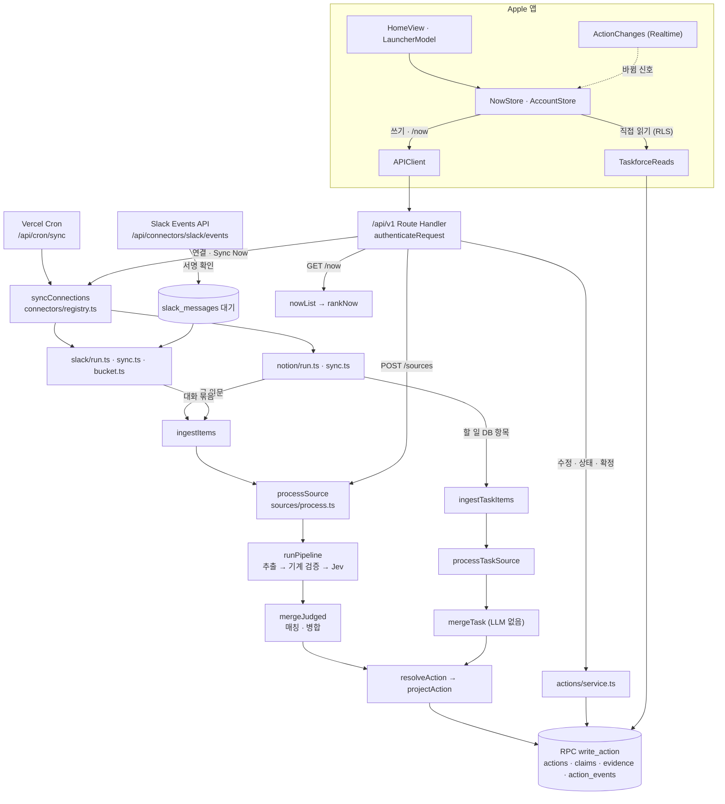

# 피처맵: 기능 → 코드

관련 문서: [PRD](PRD.md) · [아키텍처](ARCHITECTURE.md) · [진실 판정](TRUTH_RULES.md) · [연동](INTEGRATIONS.md) · [Slack 연동](go-live/slack-integration.md) · [플랫폼](PLATFORMS.md) · [go live](GO_LIVE.md) · [Apple 앱](../apple/README.md)

기능마다 실제 코드 위치, 거쳐야 하는 정식 구현, 호출자, 테스트를 적는다. 왜 그렇게 만들었는지는 위 문서에 있고, 이 문서는 **어디에 있고 무엇을 거쳐야 하는지**만 다룬다.

- 마지막 확인: 2026-09-29, `main`(`c11ee26`)에 이 문서의 PR들(#12 · #14 · #16 · #17 · 결함 정리)을 더한 코드.
- 확인 범위: 서버(`src/` · `scripts/` · `supabase/` · `tests/`)와 Apple 앱(`apple/`)을 진입점 → 핵심 구현 → 저장까지 코드로 따라갔다. 적은 파일과 심볼은 모두 실제로 있다. 테스트는 이름만 적었고 이번에 돌리지 않았다.
- 줄 번호는 적지 않는다(금방 낡는다). 파일과 심볼 이름으로 찾는다.
- 줄임: `v1/` = `src/app/api/v1/`, `lib/` = `src/lib/`, `App/` = `apple/Taskforce/`, `Kit/` = `apple/Packages/TaskforceKit/Sources/TaskforceKit/`.

## 1. 한눈에 보는 흐름

## 2. 우회하면 안 되는 경로 (SSOT)

새 코드는 아래 정식 구현을 거친다. 같은 책임을 두 번째로 만들지 않는다.

| 책임 | 정식 구현 | 지킬 것 |
|---|---|---|
| API 인증 | `lib/api/auth.ts` `authenticateRequest` (Bearer 또는 쿠키, 쿠키 쓰기는 `lib/api/csrf.ts` `isCrossSiteWrite` 확인) | `/api/v1`은 모두 이것을 쓴다. `lib/auth.ts` `requireUser`는 화면(`src/app/page.tsx` · `lab` · `admin/metrics`) 전용이다 (쿠키만, `/login`으로 보냄) |
| Slack 요청 확인 | `lib/connectors/slack/verify.ts` `verifySlackSignature` + `lib/env.ts` `slackSigningSecret` | Slack events route는 로그인 없이 이 서명만 믿는다 |
| 요청 · 응답 모양 | `lib/api/contract.ts` (zod) | Swift `Kit/Models.swift` · `AccountModels.swift` · `Connections.swift`가 이 파일을 따른다 |
| AI 호출 | `lib/ai/llm.ts` `completeJson` · `lib/ai/jev.ts` `decide` · `lib/ai/embed.ts` `embed`, 공급자 고정 `lib/ai/providers.ts` `providerRouting` | OpenRouter 주소는 이 세 파일에만 있다. LLM은 형식이 깨지거나 한도를 넘기면 한 번 다시 묻고, 출력 한도(`finish_reason: length`) · 90초를 넘긴 호출을 다시 물을 때만 추론량을 제한한다(`OVERRUN_RETRY_REASONING`). 사용자가 기다리는 빠진 할 일 신고 · 물어보기는 마감(`lib/ai/deadline.ts` `interactiveDeadline`: 요청 시작 + 실행 한도 60초(`INTERACTIVE_MAX_DURATION_S`, route의 `maxDuration`과 같은지 route 테스트가 본다) − 8초)을 준다: LLM은 첫 호출부터 추론량을 제한하고(그래도 한도를 넘기면 `low`로 다시 묻는다, 추론 옵션을 받는 공급자가 없다는 404면 한 번 옵션 없이 다시 묻는다) 시도마다 남은 시간으로 시간 한도를 정하며(`attemptTimeoutMs`, 5초가 안 남으면 다시 묻지 않는다), Jev(첫 요청은 남은 시간의 절반 · 10초 중 짧은 쪽, `jevTimeoutMs`) · 임베딩도 마감을 넘기지 않고 1초가 안 남으면 부르지 않는다. 마감 안에 끝내지 못하면 `DeadlineExceededError` → 500과 로그 한 줄 `deadline_exceeded`(route · 단계 · 걸린 시간, `logDeadlineExceeded`. 단계는 `llm` · `jev` · `embed`(응답 본문을 읽다 넘긴 것 포함) · `lock`(같은 사용자의 앞선 병합을 기다림) · `merge`(기다리지 않았는데 앞 단계가 시간을 다 씀)). 모델을 부르기 전 동의 확인은 원문 처리 · 빠진 할 일 · 물어보기가 `lib/consent/gate.ts` `withConsentGate`, 직접 추가의 임베딩은 `handleCreateAction`이 한 번 확인한다 |
| 원문 → 후보 | `lib/pipeline/run.ts` `runPipeline` (추출 → 기계 검증 → Jev) | API · eval · 재처리 스크립트가 같은 함수를 쓴다 |
| 메일에 인용된 옛 메일 | `lib/pipeline/text.ts` `quotedHistoryStart` → `lib/pipeline/verify.ts` `verifyCandidates` (`kind: "email"` + `fromConnector: true`) | 인용이 이 위치 뒤에만 있는 **연결로 가져온** 메일 후보는 버린다(`QUOTED_HISTORY`). 인용 구간을 찾는 곳을 새로 만들지 않는다: 기계 검증 · eval · 이후 Gmail 어댑터가 모두 이 함수 하나를 쓴다. 출처 표시 `ExtractInput.fromConnector`는 연결이 넘기고(`lib/connectors/store.ts` `ingestDeps.process`), 재처리 스크립트는 `sources.external_id` 유무로 정한다. 직접 넣은 원문(`v1/sources` · 런처)과 사용자가 고른 구절(누락 신고)에는 표시가 없어 쓰지 않는다. 골든셋은 `sources[].from_connector`로 같은 길을 탄다. 버린 후보는 처리 요약 `droppedByReason`과 `judge_logs`(`jev_answers.dropped`, `process.ts`)에 이유만 남고, 누락 신고 `classifyMiss`가 `quoted_history` 단계로 가른다(앱 응답은 `not_extracted`, 이벤트 · 지표에는 그대로) |
| 원문 속 화자 · 언급 | `lib/pipeline/identity.ts` `quoteSpeaker` · `speakerRole` · `addressedToUser` | 인용 줄 이름표를 확실히 읽고 역할을 가를 수 있으면 화자 역할은 코드가 정한다 (제품 원칙 5). 아니면 Jev 답을 쓴다. 새 연동은 원문을 머리줄 `[…]` + `이름: 글` 형식으로 만든다 (`evals/golden/README.md` "Slack 케이스") |
| 원문 처리 (DB) | `lib/sources/process.ts` `processSource` · `processTaskSource` · `reportMissing` | 연동 · API · 스크립트 모두 여기로 들어온다. 판정 기록(`judge_logs`)은 처리할 때마다 `replaceJudgeLogs`로 바꾼다(쌓지 않는다). 실패했거나 처리 중에 멈춘 글 원문은 `lib/sources/retry.ts`가 다시 처리한다 (첫 처리를 포함해 3번까지, 시도 번호 · 시각은 `processing_summary`). 하루가 지나서도 멈춘 원문은 다시 처리하지 않고 실패로 닫는다 (`processing_summary.closed: "expired"`). 실패하면 까닭 코드를 `sources.processing_error_code`에 남기고(`sourceFailureCode`: AI 402 · 403 `ai_quota`, 시간 초과 `ai_timeout`, 응답 형식 `ai_output`, 동의 철회 `consent`, 창 지남 `expired`, 그 밖 `internal`), 더 다시 하지 않기로 닫으면 지표 이벤트 `source_failed`(+ 연결의 `provider`, `recordSourceFailed`)를 한 줄 남긴다 (20261020000000). cron이 다시 처리할 때는 이 원문에서 이미 근거로 쓰인 구절과 겹치는 후보를 빼고 병합한다 (`lib/pipeline/missing.ts` `unappliedCandidates`, 뺀 수는 `merge.already_applied`). 병합 단계(임베딩 채우기 + 매칭 · 병합)만 사용자마다 `withUserLock`으로 한 번에 하나씩 돈다 (한 서버 인스턴스 안에서만 보장). 추출 · 판정은 잠금 밖이다. 사용자가 기다리는 누락 신고는 앞선 병합을 마감 전 5초(`MERGE_MIN_MS`)까지만 기다리고(넘기거나 차례가 와도 그만큼 남지 않았으면 병합하지 않고 `DeadlineExceededError`), 임베딩 채우기를 하지 않는다 |
| Action 필드 값 | `lib/pipeline/resolve.ts` `resolveAction` → `lib/actions/project.ts` `projectAction` | 필드 값은 이 둘로만 계산한다 (제품 원칙 5). 예외는 임베딩만 쓰는 `lib/actions/db-store.ts` `saveEmbedding` |
| Action 쓰기 | `lib/actions/service.ts` → `lib/actions/db-store.ts` `writeAction` · `writeProgress` → RPC `write_action` · `set_action_progress` · `start_action`; 사용자 메모는 `saveActionNotes` → `save_action_notes` | 앱 역할의 직접 쓰기는 DB가 막는다 (`20260929000000_actions_server_writes.sql`). `v1/actions/[id]/**`는 `lib/api/action-routes.ts` `actionWriteRoute`를 거친다. 메모는 별도 revision으로 비교 저장하고 `user_notes_updated` 이벤트에는 revision만 남긴다. Claim · 근거 · 판정 필드는 바꾸지 않는다. 예외: Slack 연결 끊기 · 앱 제거는 SQL `purge_slack_sources`가 인용을 자리 표시로 바꾸고 Claim의 글자(`quote` · `value_text` · `speaker`)만 비운다. 판정 칸은 남아 필드 값은 그대로다 |
| 지운 원문 · 인용 | `lib/retention.ts` `purgedSourceMessage` · `SLACK_DISCONNECTED_QUOTE` | 같은 자리 표시 글자가 SQL `purge_slack_sources`와 Swift `Kit/EvidenceDigest.swift` `RemovedQuote`에도 있어 셋이 같아야 한다. 인용을 모델 · 클립보드로 보내는 곳은 자리 표시를 뺀다 (`handoffAction` · `retrieveAskContext` · 매칭의 `SupabaseActionStore` `shortlist` · `unembedded`) |
| 지금 할 일 순서 | `lib/actions/rank.ts` `rankNow` (`GET /api/v1/now`) | 앱은 받은 순서를 그대로 보여 준다 |
| 속도 제한 | `lib/api/rate-limit-store.ts` `takeRateLimit` → RPC `take_rate_limit`. 한도 값은 `lib/api/rate-limit.ts` | 직접 추가 10분 30번 · 물어보기 20번 · 빠진 할 일 10번 · 연결 시작 10번 |
| cron 요청 확인 | `lib/api/cron.ts` `cronAuthorized` · `cronUnauthorized` | `/api/cron/*`는 모두 이것으로 `Authorization: Bearer $CRON_SECRET`만 받는다 |
| 연동 틀 · 동기화 | `lib/connectors/registry.ts` `syncConnections` · `connectorFor` · `tokenRevokerFor` · `revokeConnectorTokens` | cron · Sync Now · 첫 동기화가 모두 `syncConnections`를 쓴다. 연동은 `CONNECTORS`에 등록한다. 새 연결(앱 시작 · 완료)은 `connectorFor`가 연다 (Slack은 `SLACK_CONNECT_ENABLED`, Gmail은 `GMAIL_CONNECT_ENABLED`, Google은 `GOOGLE_CONNECT_ENABLED`, 웹은 `webConnector`). 동기화 · 토큰 폐기는 열지 않은 연동도 이미 있는 연결이면 한다 (#15). 동기화 결과는 `lib/connectors/store.ts` `recordSync`로 남긴다: 권한이 끊기면 `revoked`, 갱신 토큰이 만료 · 거절되면 `reauth` (둘 다 다시 연결할 때까지 동기화하지 않는다). 잠금을 잡은 시각(`claimedAt`)을 넘겨, 동기화 도중 다시 연결한 연결은 덮지 않는다. `recordSync`는 이 호출이 연결을 `reauth`로 **바꿨는지**(이미 `reauth`였거나 · 끊겼거나(`revoked`) · 그 사이 다시 연결했으면 false)를 돌려주고, 바꿨으면 지표 이벤트 `connection_reauth`(+ `provider`)를 남긴다(알림과 상관없이 만료를 센다). 커넥터는 true일 때만 `lib/notify/service.ts` `notifyReconnect`로 재연결 알림을 한 번 보낸다 (Notion · Gmail · Google). `reauth`가 아닌 기록이 `reauth` 연결을 덮지 않는 것은 `syncable_connections`가 `reauth`를 고르지 않고 동기화가 겹치지 않아서다 (`recordSync` 주석) |
| 연결 끊기 | `lib/api/connections.ts` `handleConnectionDelete` → RPC `disconnect_connection` | 앱 역할은 `connections`를 지울 수 없다 (`20261014000000_connections_server_delete.sql`). 서비스 쪽 토큰 폐기 → (Slack이면) 글자 지우기 → 행 삭제 순서다. 글자 지우기는 행을 지우기 전에 한다 (지우면 `sources.connection_id`가 null이 된다) |
| 연결 설정 쓰기 | `lib/connectors/store.ts` `mergeConnectionSettings` → RPC `merge_connection_settings` · `addConnectionStats` → RPC `add_connection_stats` (`20261017000000_connection_settings_atomic.sql`) | `connections.settings`를 읽어 통째로 다시 쓰지 않는다: 바꿀 키(`set` · `remove`)나 바꿀 Notion DB의 설정(`dataSources`)만 넘기면 DB가 지금 값에 합친다. 동기화 통계(`settings.stats`)는 `addConnectionStats`로만 더한다(연결 행을 잠근 채 더해 동시에 센 개수가 모두 남는다) |
| OAuth state · 토큰 | `lib/connectors/oauth-state.ts` (HMAC, 10분) · `lib/connectors/crypto.ts` (AES-256-GCM) | 토큰은 `connection_secrets`에 암호화해서만 저장한다. 웹(lab) 시작은 provider마다 쿠키 state(`oauthCookie`), callback은 provider별 route가 `handleOAuthCallback` 하나를 부른다 |
| 앱의 쓰기 · 읽기 | `Kit/APIClient.swift` (모든 쓰기) · `Kit/TaskforceReads.swift` (직접 읽기) | 앱 코드의 `supabase.from(...)`은 `TaskforceReads`에만 있고 읽기뿐이다 |
| 실행 (U2) | `lib/execution/executor.ts` `advance`(함수 호출 한 번 = 단계 하나) → RPC `prepare_step` · `begin_call` · `complete_internal_step` (`lib/execution/store.ts`, 교착이면 다시 부름 `deadlock.ts`) | route · 자기 호출 · sweep 모두 `advance`를 지나고, 부르기 전 판단(스위치 · 허용 목록 · 크레딧)은 `begin_call` 하나가 한다. 외부 단계는 부르지 않는다 ([EXECUTION.md](EXECUTION.md) 13장) |
| 앱 목록 구역 · 상태 | `Kit/TaskSections.swift` `TaskBoard` · `WorkState` · `TaskUndo` · `UndoOffer` | 내 변경을 먼저 보여 줄 뿐 순서를 다시 매기지 않는다 |

## 3. 피처맵

### 3-1. 원문 처리 · 추출 (서버)

| 기능 | 진입점 | 정식 구현 → 저장 | 호출자 | 테스트 |
|---|---|---|---|---|
| 원문 넣기 → 할 일 | `v1/sources/route.ts` POST → `lib/api/sources.ts` `handleCreateSource` | 동의 없으면 409 → `sources` 저장 → 202 → `after()`에서 `processSource`(route 실행 한도 300초, 끊기면 재처리 cron이 이어 한다) → `runPipeline` → `replaceJudgeLogs`(`judge_logs`를 이번 결과로 바꿈, `jev_answers`에 `rule` · `quote_speaker`) → `backfillEmbeddings` → `mergeJudged` → `write_action` → 확인 요청 알림 `notifyConfirmations` | Mac 런처 "원문 보내기", lab 시험대, 연동 동기화(Notion, Slack `lib/connectors/slack/sync.ts` `syncSlack`. Slack은 처리 뒤 RPC `slack_repurge_if_disconnected`), `scripts/reprocess-sources.ts`, `scripts/create-review-account.ts`, 재처리 cron(3-4) | `lib/api/sources.test.ts`, `lib/sources/{process,retry}.test.ts`, `lib/pipeline/{run,extract,verify,judge,dates,text,identity}.test.ts`, `tests/db/source-processing.test.ts` |
| 인용 줄 화자 · @언급 읽기 | `lib/pipeline/identity.ts` `quoteSpeaker` · `addressedToUser` · `speakerRole` (줄 찾기 `lib/pipeline/text.ts` `quoteLineIndexes`) | `judgeCandidate`가 이름표를 Jev 입력(`quote_speaker`)으로 넣고 판정 결과의 `speaker`로 넘긴다. 사용자를 `@이름`으로 부른 요청이면 `decideOutcome` 규칙 `addressed_request` → `mergeJudged` `withSpeakerFromLabel`이 화자 역할을 정한다 → `judge_logs.jev_answers` | `processSource`, `reportMissing`, eval | `lib/pipeline/{identity,judge,merge,text}.test.ts`, 골든셋 `slack-namesake-other-person` · `seq-slack-relayed-extension` |
| Notion 할 일 DB 항목 반영 (LLM 없음) | `lib/sources/process.ts` `processTaskSource` | `lib/pipeline/merge-task.ts` `mergeTask`. 이미 연결된 항목은 `lib/pipeline/structured.ts` `snapshotChanges` · `taskClaims`로 바뀐 필드만 Claim으로 만든다 (사용자가 고쳤으면 origin `tracker`, 다른 사람이 고쳤으면 `source` · counterpart) → `action_links` | Notion 동기화 `ingestTaskItems` | `lib/pipeline/{merge-task,structured}.test.ts`, `lib/connectors/tasks-ingest.test.ts`, `tests/db/structured-tasks.test.ts` |
| 빠진 할 일 신고 | `v1/sources/[id]/missing/route.ts` POST → `reportMissing` | 요청을 받자마자 마감(`interactiveDeadline`) → 지운 원문이면 400(`purgedSourceMessage`: 90일 · Slack 끊기) → 인용이 원문에 있는지 확인 → 이미 근거면 `trackedActionSummary`로 바로 답함(모델 안 부름) → 속도 제한 → `lib/pipeline/missing.ts` `classifyMiss`(놓친 단계: `processing_failed` · `not_extracted` · `quoted_history`(연결 메일의 인용된 옛 메일 속이라 기계 검증이 버림, API 응답에는 `not_extracted`: `RESPONSE_MISS_STAGES` · `responseMissStage`, 응답 계약 `missStageSchema`에는 없다) · `judge_rejected` · `merge_absorbed`) → 추출 · 판정 → `mergeJudged`(임베딩 채우기 없이, 같은 사용자의 병합은 마감 전 5초까지만 기다림 `withUserLock`) → `user_reported_missing`(`after.reasoning_limited`). `reportMissing(…, deadline, processDepsFromEnv(deadline))`은 마감과 deps를 반드시 받는다: 추출(LLM)은 첫 호출부터 추론량을 제한하고 뒤의 판정 · 병합에 15초(`AFTER_EXTRACT_MS`)를 남기며, Jev · 임베딩은 마감까지 | Mac 런처 "빠진 할 일 신고", lab | `lib/pipeline/missing.test.ts`, `lib/sources/process.test.ts`(`processDepsFromEnv` · `withUserLock` · `reportMissing`), `v1/sources/[id]/missing/route.test.ts`, `lib/ai/{deadline,llm,jev,embed}.test.ts`, `tests/db/missing-weekly.test.ts`, `tests/db/rate-limits.test.ts` |
| 물어보기 | `v1/ask/route.ts` POST → `lib/api/ask.ts` `handleAsk` | 요청을 받자마자 마감(`interactiveDeadline`) → 동의 → 속도 제한 → `lib/pipeline/ask.ts` `answerQuestion`: 임베딩 → `lib/api/ask-store.ts` `retrieveAskContext`(RPC `match_actions_for_ask`, Slack 끊기 자리 표시 인용은 뺀다) → LLM → 인용을 원문에서 기계로 확인. 남는 인용이 없으면 "모른다". 임베딩 · LLM은 `askDepsFromEnv(…, deadline)`로 마감 안에 부르고, LLM은 첫 호출부터 추론량을 제한한다(`summary.reasoningLimited`: 운영에서는 저장하지 않고 eval 결과에만 남는다) | Mac 런처 Ask, eval | `lib/pipeline/ask.test.ts`, `lib/api/{ask,ask-store}.test.ts`, `v1/ask/route.test.ts`, `lib/eval/ask-golden.test.ts`, `tests/db/ask.test.ts` |
| 매칭 · 병합 | `lib/pipeline/merge.ts` `mergeJudged` · `lib/pipeline/match.ts` `matchCandidate` | 임베딩 → RPC `match_open_actions`(열린 Action 최대 5개) → Jev 관계 판정 → 인용 줄 이름표로 화자 역할을 정한다(`withSpeakerFromLabel`) → 새로 만들기 또는 Claim 붙이기. 사용자의 확정 약속(나 · 확정 · 직접)이 확실한 병합으로 기존 Action에 붙으면(`settlingCommitment`) `candidateClaims`가 기한뿐 아니라 내용(지금 제목) · 담당 · 상태 Claim도 더하고, 저장소 `append`가 판정 단계의 "판정 확인" 이유를 푼다(`clearJudgeReasons`. `InMemoryActionStore`와 `SupabaseActionStore`가 같은 `withoutJudgeReasons`를 쓴다. 병합 확신 `MATCH_THRESHOLDS.settleAtLeast` 0.8 이상 · 그 발언이 판정 자동 반영일 때만. 푼 확인은 그 쓰기의 이벤트 before · after에 전후를 싣는다(값이 바뀐 이벤트가 있으면 그 이벤트, 없으면 `merged`): `project.ts` `withClearedConfirmation`, 지표 1은 자동 반영으로 센다). 임계값 `MATCH_THRESHOLDS` | `processSource`, `reportMissing`, `mergeTask`, eval | `lib/pipeline/merge.test.ts`, `lib/actions/{db-store,project}.test.ts`, `lib/metrics/compute.test.ts`, `tests/db/{actions-server-writes,write-action}.test.ts` |
| 진실 판정 | `lib/pipeline/resolve.ts` `resolveField` · `resolveAction` | 규칙 0~6 ([TRUTH_RULES.md](TRUTH_RULES.md) 2장) → `projectAction` → `write_action` | 병합, eval | `lib/pipeline/resolve.test.ts`, `lib/actions/project.test.ts` |
| Jev 판정 임계값 | `lib/pipeline/judge.config.ts` `JUDGE_THRESHOLDS` (자동 반영 0.8 · 기각 0.4) | `lib/pipeline/judge.ts` `judgeCandidate` → `decideOutcome`. 코드 규칙 `addressed_request`(`@이름`으로 부른 요청) · `sole_recipient_request`(사용자가 유일한 받는 사람인 메일의 요청, `is_my_commitment ≥ SOLE_RECIPIENT_MIN_MINE` 0.2): '내 약속 아님' 하나로 기각하지 않고 확인 요청으로 보낸다 | 원문 처리, eval | `lib/pipeline/judge.test.ts`, `lib/eval/judge-metrics.test.ts` |
| 임베딩 채우기 | `lib/pipeline/backfill-embeddings.ts` `backfillEmbeddings` (20개씩) | `SupabaseActionStore` → `embed` → 임베딩만 저장 | 병합 직전마다 (`withUserLock` 안). 사용자가 기다리는 누락 신고는 빼고 배경 처리가 채운다 | `lib/pipeline/backfill-embeddings.test.ts`, `tests/db/user-created-actions.test.ts` |
| 추출 품질 eval | `scripts/eval.ts` (`npm run eval`, `--tag slack`) | `evals/golden`(케이스 `tags`) → 운영과 같은 함수(`runPipeline` · `judgeCandidate` · `mergeJudged`) → `lib/eval/score.ts` · `sequence-score.ts` · `judge-metrics.ts`. 태그마다 채점 줄이 따로 나온다. `evals/ask` → `lib/eval/ask-golden.ts` (앱과 같은 마감 · 첫 호출부터 추론량 제한, `--tag`를 주면 건너뜀). 결과는 `evals/results/`(커밋 안 함) | 운영자, CI(라벨 검사만) | `lib/eval/*.test.ts` (케이스 파일 형식은 `npm run test`에서도 검사) |
| 원문 다시 처리 (수동) | `scripts/reprocess-sources.ts` | 근거가 없는 원문을 오래된 것부터 `processSource`로 다시 돌린다 (원문 속 "나"는 `lib/connectors/store.ts` `loadIdentity`) | 운영자 | 없음 |

### 3-2. 할 일 쓰기 · 지금 할 일 (서버)

| 기능 | 진입점 | 정식 구현 → 저장 (이벤트 · 지표) | 호출자 | 테스트 |
|---|---|---|---|---|
| 직접 추가 | `v1/actions/route.ts` POST → `lib/api/create-action.ts` `handleCreateAction` | 원문 확인(지운 원문이면 400 `purgedSourceMessage`) → 이미 근거면 `already_tracked` → 속도 제한 → `lib/actions/service.ts` `createUserAction` → `lib/actions/user-claims.ts` → `write_action`. `user_created`. 동의했으면 임베딩 | iPhone +, Mac 런처 Add | `lib/api/create-action.test.ts`, `lib/actions/user-claims.test.ts`, `tests/db/user-created-actions.test.ts` |
| 수정 · 삭제 | `v1/actions/[id]/route.ts` PATCH · DELETE → `actionWriteRoute` | `service.ts` `editAction` · `deleteAction` → 동시 수정이 겹치면 3번 다시 시도한 뒤 409. `user_edited` · `user_deleted`(status `dropped`) | 앱(기한 수정, Review 넘기기, 지우기 · 되돌리기), lab | `lib/actions/{user-claims,project}.test.ts`, `tests/db/write-action.test.ts` |
| 확인 요청 확정 | `v1/actions/[id]/confirm/route.ts` | `service.ts` `confirmAction` → `user_confirmed` | 앱 Review 카드, lab | 위와 같음 |
| 착수 | `v1/actions/[id]/start/route.ts` | RPC `start_action` → `user_started` + 지표 `action_started` | lab (앱은 작업 상태 API를 쓴다) | `tests/db/write-action.test.ts` |
| 작업 상태 | `v1/actions/[id]/progress/route.ts` | `service.ts` `setActionProgress` → `lib/actions/progress.ts` `progressPlan` → RPC `set_action_progress` | 앱 상태 바꾸기 | `lib/actions/progress.test.ts`, `v1/actions/[id]/progress/route.test.ts`, `tests/db/action-progress.test.ts` |
| AI에게 넘기기 | `v1/actions/[id]/handoff/route.ts` | `service.ts` `handoffAction` → `lib/actions/handoff.ts` `buildHandoff`(원문이 지워졌으면 인용만. Slack 끊기 자리 표시 인용은 `handoffAction`이 뺀다. 저장 메모는 별도 인용 섹션) → Jev · 계획 프롬프트에 전달 → 지표 `handoff_used` | Mac 런처 Hand off, lab | `lib/actions/{handoff,service.handoff}.test.ts`, `lib/ai/handoff.test.ts` |
| 지금 할 일 | `v1/now/route.ts` GET | `service.ts` `nowList` → `rankNow` → 목록 할 일의 이벤트를 사용자 권한으로 읽어(100개씩, 1000행씩 끝까지, 2초 `CHANGED_READ_TIMEOUT_MS` 넘으면 끊음) `lib/actions/changed.ts` `changedActionIds`로 항목마다 `changed`(못 읽으면 모두 false, 순서는 그대로). 주간 질문 여부 `lib/metrics/weekly-check.ts` `weeklyCheckDue`. 실패 원문 수 · 마지막 실패 `failed_sources`(사용자 권한으로 실패한 지(`processed_at`) 하루 안의 글 원문 실패 행, 할 일 DB 항목 제외, 못 읽으면 0). 섹션마다 처음에 보일 개수 `section_limits`(`contract.ts` `NOW_SECTION_LIMITS`) | 앱 `APIClient.now`, lab(`nowList` 직접) | `lib/actions/rank.test.ts`, `lib/actions/service.test.ts`, `lib/metrics/weekly-check.test.ts`, `v1/now/route.test.ts`, `v1/now/golden.test.ts`(U1 전 응답 `now.golden.json`과 같음) |
| 바뀜 점 · 본 것 표시 (U1) | `v1/actions/[id]/seen/route.ts` POST → `actionWriteRoute` | 바뀜 = 사용자가 마지막으로 본 뒤(`user_seen` 또는 사용자가 직접 한 쓰기, actor user) actor가 user가 아닌 `due_changed` · `scope_changed` · `owner_changed` · `merged` · `completed` · `dropped` · `reopened` · `artifact_created`가 있음 (`lib/actions/changed.ts`, AI가 새로 만든 할 일 `created`는 아님). `service.ts` `markActionSeen`: 사용자 권한으로 Action(없으면 404) · 이벤트 읽기 → 열림 + 다른 사람 일이 아니고 지금 바뀜일 때만 service role로 `user_seen` 한 줄, 아니면 쓰지 않음 → 204. 누락 신고가 이미 있는 할 일에 붙으면(`already_tracked`) `v1/sources/[id]/missing/route.ts`도 같은 `markActionSeen`을 곁가지로 부른다(사용자가 신고해 붙은 병합은 바뀜이 아니다). 지표 3 활동에 넣지 않는다(`metrics/load.ts`) | 누락 신고 route, Mac 런처(바뀐 행을 골랐다가 떠날 때 · 런처를 닫을 때 한 번, `SeenTracker` · `LauncherModel.syncSeen`), iPhone(바뀐 행을 눌러 펼칠 때 · 바뀐 Review 카드가 보였다가 떠날 때 한 번, 오프라인이면 보내지 않음, `SeenTracker.open` · `HomeView.markSeen`) | `lib/actions/changed.test.ts`, `v1/actions/[id]/seen/route.test.ts`, `v1/sources/[id]/missing/route.test.ts`, `tests/db/action-seen.test.ts`, `lib/metrics/{load,compute}.test.ts` |
| 주간 질문 답 | `v1/weekly-check/route.ts` POST | route 안에서 `weekly_checks` upsert (지표 5) | iPhone | `lib/metrics/weekly-check.test.ts`, `tests/db/missing-weekly.test.ts` |
| app_opened | `v1/metric-events/route.ts` POST | 사용자 권한(RLS)으로 `metric_events`에 저장 (정책 `owner_insert_app_opened`) | iPhone 앱 열기, Mac 런처 열기 | `tests/db/write-action.test.ts` |

### 3-3. 연동 (서버)

`v1/connections/[id]/start` · `complete`의 `[id]`는 **provider 이름**이고, `v1/connections/[id]` DELETE와 `data-sources`의 `[id]`는 **연결 UUID**다.

| 기능 | 진입점 | 정식 구현 → 저장 | 호출자 | 테스트 |
|---|---|---|---|---|
| 앱에서 연결 | `v1/connections/[id]/start/route.ts` → `lib/api/connections.ts` `handleConnectionStart` | 연결을 열지 않은 서비스면 400 → 동의 없으면 409 → 속도 제한 → `newOAuthState` + `oauth_nonces` → `{ url }` → 권한 화면 → `src/app/api/connectors/{notion,slack,gmail,google}/callback/route.ts` → `lib/connectors/callback.ts` `handleOAuthCallback`: 서명 확인 → code를 암호화해 `oauth_handoffs`(2분) → `taskforce://connections/{provider}?handoff=` → `v1/connections/[id]/complete/route.ts` `handleConnectionComplete` → `connector.connect` → `saveConnection` → `after()`에서 `afterConnected`(첫 동기화. Slack은 연결 뒤 메시지만 받아 첫 동기화에 넣을 것이 없다). 결과가 `missing_scope`(권한 화면에서 필요한 체크를 뺌, 연결 안 됨)면 `afterConnected`를 부르지 않는다(`isConnected`). `connected_partial`(google에서 Calendar · Meet 중 하나만 허용)은 연결된 것이라 부른다 | 앱 `AccountStore.connect` · `handleCallback` | `lib/connectors/{oauth-state,callback,registry}.test.ts`, `lib/api/connections.test.ts`, `tests/db/go-live-connections.test.ts`, `tests/db/rate-limits.test.ts` |
| 웹(lab) Notion 연결 | `src/app/api/connectors/notion/start/route.ts` · `callback/route.ts` GET | 쿠키 state → `handleOAuthCallback`의 웹 분기(연결 직전에 동의를 다시 본다, 없으면 `consent_required`) → `/lab?notion=` (첫 동기화 없음, 지표만) | `src/app/lab/connections-panel.tsx` | `lib/connectors/callback.test.ts` |
| Slack · Gmail · Google 연결 열기 | `lib/env.ts` `slackConnectEnabled` · `gmailConnectEnabled` · `googleConnectEnabled` (`SLACK_CONNECT_ENABLED` · `GMAIL_CONNECT_ENABLED` · `GOOGLE_CONNECT_ENABLED`, 비우면 개발 서버만) | 닫혀 있으면 `connectorFor`가 null → 앱 start · complete 400("아직 연결할 수 없어요"). 이미 있는 연결(운영자 시험)의 동기화 · 토큰 폐기 · 이벤트 받기는 닫혀 있어도 한다 | 앱 연결 · 동기화 · lab | `lib/connectors/registry.test.ts`, `lib/env.test.ts` |
| 웹(lab) Slack 연결 | `src/app/api/connectors/slack/start/route.ts` · `callback/route.ts` GET | `webConnector("slack", …)`(앱에 열었거나 `ADMIN_EMAILS` 운영자, 아니면 `/lab?slack=unavailable`) → 동의 → 쿠키 state → `handleOAuthCallback`(연결 직전에 동의를 다시 본다) → `slackConnector.connect`: `exchangeSlackCode`(사용자 토큰만) → `slackAuthTest` → `saveConnection` → `saveSlackSettings`(`mergeConnectionSettings`: Slack id · 팀 id · 주소만 합친다) | `src/app/lab/connections-panel.tsx` | `lib/connectors/{registry,slack/client}.test.ts` |
| Slack 이벤트 받기 (Events API) | `src/app/api/connectors/slack/events/route.ts` POST (로그인 없음) | 서명 헤더가 없으면 401, 1MB를 넘으면 413 → `verifySlackSignature`(5분) → `lib/connectors/slack/events.ts` `slackEnvelopeSchema`(challenge 응답) → `lib/connectors/slack/receive.ts` `receiveSlackEvent`: 앱 제거 · 토큰 회수 이벤트면 연결을 revoked로. 메시지는 같은 팀 연결 · 동의 확인 → `classifySlackMessage`(남김 · 고침 · 지움 · 버림) → `lib/connectors/slack/store.ts` `slackReceiveDeps` → `slack_messages` · `slack_threads`. 서명 키가 없거나 처리에 실패하면 500 | Slack | `src/app/api/connectors/slack/events/route.test.ts`, `lib/connectors/slack/{verify,events,receive}.test.ts`, `tests/db/slack.test.ts` |
| Slack 메시지 → 원문 | `lib/connectors/slack/run.ts` `syncSlackConnection` | `claimConnection` → `lib/connectors/slack/sync.ts` `syncSlack`: 대기 행 → 이름(`slack_people` 캐시) → `lib/connectors/slack/bucket.ts` `bucketSlackMessages`(대화 묶기) → `ingestItems`(30분 안정화 · 20건 · 1자 이상) → RPC `slack_ingest_source` → `processSource` → RPC `slack_repurge_if_disconnected` → `recordSync`. 토큰 오류면 `revokeSlackConnections`. 연결 전 메시지는 가져오지 않는다 | `syncConnections` | `lib/connectors/slack/{sync,bucket,client}.test.ts`, `tests/db/slack-sync.test.ts` |
| Slack 글자 지우기 | RPC `disconnect_connection`(연결 끊기) · `revoke_slack_connections`(앱 제거 이벤트 · 동기화 토큰 오류 · 매일 토큰 확인) | `purge_slack_data` → `purge_slack_sources`: 원문 본문 · 관련자를 비우고(`sources.raw_text_purge_reason` = `disconnected`), 인용은 자리 표시로, Claim은 글자만 비우고, `judge_logs`와 대기 표를 지운다 | 연결 끊기, Slack 이벤트, 동기화, retention cron | `tests/db/{slack,slack-sync}.test.ts` |
| Slack 토큰 매일 확인 | `src/app/api/cron/retention/route.ts` (정리가 끝난 뒤) | `lib/connectors/slack/run.ts` `checkSlackConnectionTokens` → `lib/connectors/slack/health.ts` `checkSlackTokens`: 연결마다 `slackAuthTest`. 토큰을 못 쓰면 `revokeSlackConnections`. 정리가 밀려도 cron이 20초(`SLACK_TOKEN_CHECK_MS`)를 떼어 둔다 | Vercel Cron 매일 03:30 KST | `lib/connectors/slack/health.test.ts`, `src/app/api/cron/retention/route.test.ts` |
| 웹(lab) Gmail 연결 | `src/app/api/connectors/gmail/start/route.ts` · `callback/route.ts` GET | `webConnector("gmail", …)`(앱에 열었거나 `ADMIN_EMAILS` 운영자, 아니면 `/lab?gmail=unavailable`) → 동의 → 쿠키 state → `handleOAuthCallback` → `gmailConnector.connect`: `lib/connectors/google/oauth.ts` `exchangeGoogleCode`(`id_token`의 `sub` · 확인된 `email`) → 받은 범위에 `gmail.readonly`가 없거나 `id_token`이 없으면 토큰을 바로 폐기하고 `missing_scope` → `saveConnection`(`external_account_id = sub`) → `mergeConnectionSettings`(`googleUserId` · `email` · `scopes`만 합친다, 통계는 그대로) → 같은 서비스의 다른 계정 연결은 토큰 폐기 + `disconnect_connection` | `src/app/lab/connections-panel.tsx` | `lib/connectors/{registry,google/oauth,gmail/run}.test.ts`, `tests/db/connection-settings.test.ts` |
| Gmail 메일 → 원문 | `lib/connectors/gmail/run.ts` `syncGmailConnection` | `claimConnection` → `lib/connectors/google/token.ts` `googleAccess`(만료 60초 전 갱신 · API 401이면 한 번 갱신, 갱신이 `invalid_grant`면 `GoogleReauthError` → `recordSync` `reauth` → 바꿨으면 `notifyReconnect` "Reconnect Gmail to keep syncing.") → `lib/connectors/gmail/sync.ts` `syncGmail`: 커서(`after` · `seen`) 뒤를 하루 창으로 `messages.list` → 이미 넣은 것(끊긴 연결 포함) · 이미 결정한 것 빼기 → `format=metadata` 머리글만 → `lib/connectors/gmail/filter.ts` `filterMessage`(규칙 ①~⑨) → 남긴 메일만 `format=full` → `lib/connectors/gmail/message.ts` `messageToItem`(메일 한 통 = 원문, 본문 2만 자) → `ingestItems`(안정화 없음 · 20건 · 1자 이상, 연결 전 시각의 메일은 확인 요청 알림 없음 `ingestDeps(admin, { notifyFrom })`) → `processSource` → `recordSync`(429면 결정한 곳까지 커서 + `error`) → 이유 코드별 개수를 `addConnectionStats`로 `settings.stats`에 더하기 | `syncConnections` | `lib/connectors/gmail/{sync,filter,message,mime,client,run}.test.ts`, `lib/connectors/google/{oauth,token,settings}.test.ts`, `tests/db/connection-settings.test.ts` |
| 웹(lab) Google 연결 | `src/app/api/connectors/google/start/route.ts` · `callback/route.ts` GET | Gmail과 같은 모양: `webConnector("google", …)`(앱에 열었거나 `ADMIN_EMAILS` 운영자, 아니면 `/lab?google=unavailable`) → 동의 → 쿠키 state → `handleOAuthCallback` → `googleConnector.connect`(`lib/connectors/google/run.ts`): `exchangeGoogleCode` → 받은 범위(G10): Calendar · Meet 둘 다면 `connected`, 하나면 `connected_partial`, 둘 다 없거나 `id_token`이 없으면 토큰을 바로 폐기하고 `missing_scope` → `saveConnection`(`external_account_id = sub`) → `mergeConnectionSettings`(`googleUserId` · `email` · `scopes`만 합친다, 통계는 그대로) → 같은 서비스의 다른 계정 연결은 토큰 폐기 + `disconnect_connection` | `src/app/lab/connections-panel.tsx` | `lib/connectors/{registry,callback}.test.ts`, `lib/connectors/google/run.test.ts`, `tests/db/connection-settings.test.ts` |
| Google Meet 전사 → 원문 | `lib/connectors/google/run.ts` `syncGoogleConnection` | `claimConnection` → `googleAccess` → 허용한 범위만(`grantedFeatures`): Meet이 없으면 전사 없음(Calendar만이면 토큰 확인 요청 1건으로 `reauth` 감지) → `lib/connectors/google/sync.ts` `syncGoogleMeet`: 끝난 회의 기록 ① 주최(`end_time`이 커서 이후) ② 참석(Calendar에서 커서 하루 앞부터 읽은 주최하지 않은 Meet 일정의 회의 코드 — 제목 · 이메일은 받지 않음 `CALENDAR_CODE_FIELDS`, `unverified.ts` `LIST_ATTENDED_MEETINGS`) → `meet.ts` 오래된 기록부터 전사 나열(전사를 모두 결정한 기록은 다시 나열하지 않음, 넣을 전사가 20건에 차거나 기록 150건이면 멈춤, 볼 수 없는 403 · 404 자료는 건너뛰고 셈) → 이미 넣은 전사는 한 회차에 한 번에 물어 빼기 → `FILE_GENERATED`만(ENDED는 2시간 기다림) → 전사 항목 · 참가자 · 회의 공간의 회의 코드 → `calendar.ts` `lookupMeetingEvent`(같은 회의 일정, 저장하지 않음) → `transcript.ts` `transcriptToItem`(발화자 이름표, 사용자 줄 = 프로필 이름, `unverified.ts` `isConnectedAccount`) → `ingestItems`(안정화 없음 · 20건, 연결 전 시각의 전사는 알림 없음) → `processSource` → `recordSync`(커서 `{ after, seen, fails }`: `after` = 결정 못 한 회의가 있으면 그 끝까지만, `seen` = 이미 센 결정 표시(기록 `r:` · 전사 `t:` · 참석 일정 `e:`)라 커서가 머물러도 다시 세지 않음, `fails` = 서버 오류로 미룬 전사의 실패 횟수. 오류는 갈래대로: 400번대(Calendar API 꺼짐 등)는 바로 결정하고 커서를 붙잡지 않음, 서버 오류 · 네트워크 오류 · 401은 처음 실패한 때부터 최대 6시간 붙잡고, 다른 읽기가 성공하는 동기화에서 반복되면 그보다 먼저 `meet_transcripts_failed`로 포기) → 개수를 `addConnectionStats`로 `settings.stats`에 더하기. 갱신 토큰이 거절되면(`GoogleReauthError`) `recordSync(…, { reauth: true })`가 `true`를 돌려준 동기화에서만 `notifyReconnect(admin, userId, "google")` 한 번 ("Reconnect Google Calendar & Meet to keep syncing.": 서버 `SERVICE_NAMES.google`이 앱 연결 화면의 이름과 같다, PR 4b) | `syncConnections` | `lib/connectors/google/{sync,run,calendar,meet,transcript,attendees,unverified}.test.ts` (전사 본문은 `evals/golden/*meet*.json`과 글자까지 비교), `tests/db/{sources-meeting,connection-settings}.test.ts` |
| Notion 회의록에 Calendar 일정 붙이기 | `lib/connectors/notion/run.ts` `syncNotionConnection` → `lib/connectors/google/lookup.ts` `googleCalendarLookup` | 사용자의 google 연결(active · error)이 Calendar를 허용했을 때만 조회 함수를 만든다(아니면 Google을 부르지 않는다) → `lib/connectors/notion/sync.ts` `syncNotion`: 본문을 받은 회의록(`kind = meeting`)마다 `meetingEvent`(5초 제한, 한 번 실패하면 남은 페이지는 붙이지 않음) → `calendar.ts` `pickMeetingEvent`(시각 + 제목, 애매하면 잇지 않음, 시각만 맞는 길은 페이지를 만든 사람이 연결한 Notion 계정일 때만 `createdByUser`) → `attendees.ts` `mergeAttendees`로 관련자 합치기 + `IngestItem.meeting` → `ingestDeps.insertSource`가 `sources.meeting`에 저장(일정이 붙은 원문만 열을 보내고, 열이 아직 없으면 일정 없이 다시 넣는다) → 잇기 결과를 `addConnectionStats`로 google 연결 `settings.stats`(`notion_link_*`)에 | `syncConnections` | `lib/connectors/notion/{sync,run}.test.ts`, `lib/connectors/google/{lookup,calendar}.test.ts`, `lib/connectors/store.test.ts`, `tests/db/{migrations,sources-meeting,connection-settings}.test.ts` |
| Sync Now | `v1/connections/sync/route.ts` POST | 동의 → `syncConnections`(240초, 연결마다 1분 간격) → 모든 연결이 동기화 중이거나 1분 안에 다시 요청했으면 429 | 앱, lab | `lib/connectors/sync-all.test.ts` |
| 자동 동기화 | `src/app/api/cron/sync/route.ts` (15분마다, `vercel.json`) | `CRON_SECRET` 확인 → 만료된 nonce · handoff 정리 → `syncConnections` → RPC `syncable_connections`(동의한 사용자, 오래 안 한 순) | Vercel Cron | `tests/db/go-live-connections.test.ts` |
| Notion 회의록 가져오기 | `lib/connectors/notion/run.ts` `syncNotionConnection` | `claimConnection`(10분 잠금, `sync_started_at` = 앱의 "Syncing…" 근거) → `lib/connectors/notion/sync.ts` `syncNotion`(최근 14일) → `lib/connectors/ingest.ts` `ingestItems`(30분 안정화 · 한 번에 20건 · 30자 미만 제외, 이미 넣은 페이지는 끊었다 다시 연결해도 다시 넣지 않는다: `ingestDeps.ingestedIds`) → `processSource` → `recordSync`. 토큰이 만료되면(401) `withNotionClient`가 한 번 갱신하고, 갱신 토큰이 거절되면(`invalid_grant`) 연결을 `reauth`로 남기고, 실제로 바꿨으면 `notifyReconnect`로 재연결 알림 한 번 (다른 요청이 먼저 갱신했으면 저장된 새 토큰으로 이어 간다). 토큰 발급 창구의 다른 거절(`NotionOAuthError`, 401 = 우리 쪽 client 설정)은 `error`로 남긴다. `revoked`는 API 호출의 401만 | `syncConnections` | `lib/connectors/notion/{sync,map,markdown,api,run}.test.ts`, `lib/connectors/ingest.test.ts` |
| Notion 할 일 DB 설정 | `v1/connections/[id]/data-sources/route.ts` GET · `[dataSourceId]/route.ts` PUT | `lib/connectors/notion/data-sources.ts` `listDataSources` · `saveDataSource` → `mergeConnectionSettings`(그 DB의 설정만 `connections.settings.dataSources`에 합친다). 자동 확인은 동기화 중 `notion/sync.ts`가 하고 `recordNotionHealth` · `markBackfilled`가 바뀐 DB의 설정만 합친다 → `ingestTaskItems` → `processTaskSource` | lab만 (앱에는 아직 없다) | `lib/connectors/notion/{tasks,data-sources}.test.ts`, `lib/connectors/{tasks-ingest,store}.test.ts`, `tests/db/{structured-tasks,connection-settings}.test.ts` |
| 연결 끊기 | `v1/connections/[id]/route.ts` DELETE → `handleConnectionDelete` | UUID가 아니거나 남의 연결이면 404 → 서버 권한으로 토큰을 풀어 서비스 쪽 폐기 `tokenRevokerFor`(Notion · Slack · Gmail · Google, 실패해도 계속. Gmail · Google은 갱신 토큰을 폐기해 허용 전체를 거둔다) → RPC `disconnect_connection`(한 트랜잭션: Slack이면 `purge_slack_data` → `connections` 삭제, `connection_secrets` 연쇄 삭제). Notion · Gmail · Google 원문(붙인 일정 `sources.meeting` 포함)은 남는다 | 앱(다시 연결이 필요한 연결 포함), lab | `lib/api/connections.test.ts`, `tests/db/{connections,slack-sync}.test.ts` |
| 2단계 연동 "원해요" | `v1/connection-requests/route.ts` POST | `handleConnectionRequest` → `connection_requests` | 앱 연결 화면 | `lib/api/connections.test.ts`, `tests/db/go-live-connections.test.ts` |

### 3-4. 계정 · 동의 · 알림 · 운영 (서버)

| 기능 | 진입점 | 정식 구현 → 저장 | 호출자 | 테스트 |
|---|---|---|---|---|
| 계정 삭제 | `v1/account/route.ts` DELETE → `lib/api/account.ts` `handleDeleteAccount` | 연동 토큰 폐기 `revokeConnectorTokens`(Notion · Slack · Gmail · Google)와 Apple 토큰 폐기 `lib/apple/sign-in.ts` `revokeAppleSignIn`을 동시에(20초 한도) → `auth.admin.deleteUser` → 연쇄 삭제 (Slack 표 포함). Sign in with Google 권한은 서버에 토큰이 없어 앱이 폐기한다(`GoogleSignInFlow.disconnect`) | 앱 `AccountDeletion` | `lib/api/account.test.ts`, `lib/apple/sign-in.test.ts`, `tests/db/account-deletion.test.ts` |
| AI 처리 동의 | `v1/consent/route.ts` POST · DELETE → `lib/api/consent.ts` | `lib/api/profile-store.ts` `saveAiConsent` → `profiles.ai_consent_at`. 적용하는 곳: API 409, `withConsentGate`, `lib/consent/store.ts` `hasConsentFor` | 앱, lab | `lib/api/connections.test.ts`, `lib/consent/gate.test.ts` |
| 프로필 · 별칭 | `v1/profile/route.ts` GET · PUT → `lib/api/profile.ts` | `lib/api/profile-store.ts` (RLS). 원문 속 "나" 찾기는 `resolveIdentity` | 앱, lab | `lib/api/profile.test.ts`, `tests/db/profiles.test.ts` |
| 처리방침 변경 안내 | `v1/legal/route.ts` GET → `lib/api/legal.ts` `handleGetLegal` | 판 · 시행일은 `lib/legal/policy.ts` `PRIVACY_POLICY` 한 곳(처리방침을 바꿀 때 함께 바꾼다, 런북 7장). `privacyPolicyStatus`: 시행 예정 판(`upcoming`)이 있으면 모든 계정에 `upcoming`, 없으면 현재 판 시행일(한국 시간 0시) 전에 가입한 계정만 시행 뒤 30일(`UPDATED_NOTICE_DAYS`) 동안 `updated`. 시행 예정 판은 시행일이 지나면 배포 없이 현재 판이 된다(`policyAt`). 가입 시각은 필요할 때만(`needsAccountCreatedAt`: 시행 예정 판 없음 · 30일 안) `auth.admin.getUserById`로 읽는다(JWT에 없다). 읽기만 한다: 본 판은 서버에 남기지 않는다(처리방침에 없는 이용 기록이 된다, 앱이 기기에 적는다) | 앱 `AccountStore.loadPolicyNotice` | `lib/legal/policy.test.ts`, `lib/api/legal.test.ts` |
| 알림 기기 등록 | `v1/devices/route.ts` POST · DELETE | route 안에서 `devices` upsert (사용자당 10대). 해제(DELETE)가 실패하면 500 (앱은 결과와 상관없이 로그아웃한다) | 앱 `PushCenter` | `tests/db/actions-server-writes.test.ts` |
| 알림 발송 | 확인 요청: `lib/notify/service.ts` `notifyConfirmations`(원문 처리 뒤). 기한: `src/app/api/cron/reminders/route.ts` → `notifyDueSoon`. 재연결: `notifyReconnect`(연결이 `reauth`로 바뀐 동기화에서 한 번, Notion · Gmail · Google) | `lib/notify/apns.ts` `sendPush` (410 · 400 `BadDeviceToken`이면 기기 삭제). 할 일 제목 없이 앱과 같은 짧은 영어 문구(확인 요청 "Review", 기한 "Due today" · "Due tomorrow" + 건수, 재연결 "Connections" · "Reconnect Gmail to keep syncing." — 서비스 이름은 앱 연결 화면의 이름 `SERVICE_NAMES`, Google은 "Google Calendar & Meet")와 `action_id`(재연결은 `kind: "reconnect"`만)를 보낸다. 알림이 기기에 갔으면 `metric_events`에 `reconnect_notified` + `provider` (20261015000000 `metric_events_reauth_provider`). 지표 기록이 실패해도 알림은 간 것으로 본다 | 원문 처리, Vercel Cron 매일 09:00 KST, Notion · Gmail · Google 동기화 | `lib/notify/apns.test.ts`, `lib/notify/service.test.ts`(`notifyReconnect`), `tests/db/go-live-connections.test.ts` |
| 원문 보존기간 | `src/app/api/cron/retention/route.ts` | 맨 먼저 실행 산출물 본문 RPC `purge_expired_artifacts`(행마다 보관 기한 `retain_until`, 열 기본값 90일 · D9a-1이 정함, 본문만 비움. 실패해도 나머지는 하고 응답 500 · `artifacts_purged: null`) → 만든 지 `EXECUTION_TEXT_RETENTION_DAYS`일이 지난 끝난 run의 글 RPC `purge_expired_execution_text`(요청 · 지시 · 받는 사람 후보 · 되묻는 질문, 끝나지 않은 run은 건드리지 않고 끝나는 대로, 5000개 run씩. 실패하면 같은 방식으로 500 · `execution_text_purged: null`) → `lib/retention.ts` `retentionCutoff`(90일) → RPC `purge_expired_source_text` 5000건씩 → RPC `purge_slack_buffers`(대기 메시지 받은 지 `SLACK_PENDING_RETENTION_DAYS`일, 추적 스레드 마지막 활동 뒤 `SLACK_THREAD_RETENTION_DAYS`일, 끊어 지운 원문에 남은 글자 다시 지우기) → Slack 토큰 매일 확인(정리는 20초를 남기고 멈춘다). 지운 이유는 `sources.raw_text_purge_reason`, 안내 문구는 `purgedSourceMessage` | Vercel Cron 매일 03:30 KST | `lib/retention.test.ts`, `src/app/api/cron/retention/route.test.ts`, `tests/db/{retention,slack-sync,execution-credits,execution-text-retention}.test.ts`, `lib/connectors/slack/health.test.ts` |
| 실패 · 멈춘 원문 다시 처리 | `src/app/api/cron/retry-sources/route.ts` (매시 7분 · 37분, 동기화 cron과 겹치지 않게. `vercel.json`) | `lib/sources/retry.ts` `retryStalledSources`: 하루 안에 들어온(`RETRY_WINDOW_MS`) 끝나지 않은 글 원문(할 일 DB 항목 · 글이 지워진 원문 제외)을 오래된 순서로(후보 50건) → `retryPlan`: 다시 해 볼 만한 실패(`processing_summary.retryable`)는 실패 뒤 30분 · 3시간 기다려서(`RETRY_DELAYS_MS`), 15분 넘게 처리 중 · 대기에 멈춘 것은 바로. 첫 처리를 포함해 3번까지(`RETRY_MAX_ATTEMPTS`), 마지막 시도에서 멈춘 것은 실패로 닫는다 → 하루가 지나서도 처리 중 · 대기에 15분 넘게 멈춘 글 원문(동의 여부 · 글이 지워졌는지와 상관없이, 할 일 DB 항목 제외)은 다시 처리하지 않고 오래된 것부터 한 번에 `EXPIRE_BATCH`(100)건까지 실패로 닫는다: 오래된 약속이 새 할 일로 뜨지 않게 살리지 않고 "처리 중"만 끝낸다. 다시 해 볼 만한 실패로 남은 채 창이 지난 원문도 같이 닫는다(실패 시각 · 문구 · 까닭 코드는 그대로, 목록마다 `EXPIRE_BATCH`건, 멈춘 원문을 먼저, 기록 전 실패 중 동의 철회는 조회에서 뺌). 닫으면 지표 `source_failed`(실패한 지 하루가 지난 옛 실패는 남기지 않는다: 이미 `/now`에 보이지 않던 것). `expiredAttempt` · `expire`, `processing_summary`는 `retryable: false` + `closed: "expired"`, 읽은 뒤 바뀌지 않았을 때만 닫고 찾기가 실패해도 아래 다시 처리는 계속한다 → 동의한 사용자만, 읽은 뒤 상태 · 기록이 그대로일 때만 가져가(`claim`) → 처리 시간 예산 200초가 남을 때만 새로 시작 → `processSource`(시도 번호. 연결 전 시각의 연동 원문은 Gmail 동기화처럼 확인 요청 알림 없이, `connectedAt`) → RPC `slack_repurge_if_disconnected`. 도중에 동의를 철회하면 그 사용자의 남은 원문은 멈춘다 (원문은 failed로 남긴다. 동기화와 달리 지우지 않는다: 이때쯤 Slack 대기 메시지 본문은 비었고 Notion은 뒤에 고친 페이지만 다시 가져와, 지우면 원문을 다시 얻을 수 없다) | Vercel Cron | `lib/sources/{retry,process}.test.ts`, `lib/pipeline/missing.test.ts`, `src/app/api/cron/retry-sources/route.test.ts` |
| 지표 대시보드 | `src/app/admin/metrics/page.tsx` | `requireUser` + `lib/metrics/load.ts` `isAdmin`(`ADMIN_EMAILS`) → `loadMetrics` → `lib/metrics/compute.ts` 지표 1~5(지표 4는 신고 + 원문 구절을 고른 직접 추가만, 구절 없는 직접 추가는 `addedPlain`으로 따로, A42) · 발견 원가(`discoveryCost`: 처리를 마친 원문의 `processing_summary.cost` UTC 날짜별 합계, A43) · 실패로 닫은 원문(`sourceFailures`: `source_failed` 서비스별) · 연결(연결 완료 `connection_created` · 만료 `connection_reauth` · 알림이 간 `reconnect_notified` 수와 서비스별 표(`provider`). 셋 다 서버가 남기고 리텐션 활동에는 넣지 않는다(`source_failed`도) `metricActivity`) · Gmail 거르기(`gmailFiltering`, 연결 설정의 `stats`만 읽는다) · Google 회의(`googleActivity` = 전사 수 · 일정 잇기 결과, `meetingLinkage` = 회의 원문의 외부 id와 붙은 일정 id만 읽어 셈한 일정이 붙은 비율, Notion 회의록은 Calendar를 허용한 google 연결이 있는 사용자의 것만) · 실행(U2, `execution`: 기간 안에 만든 run의 상태별 수 · 지금 결과 불명 단계 · 승인 요청(`waiting_approval`로 간 run 전이) · 막힌 이유별(hold 이벤트) · AI 원가(청구 대상 · 플랫폼 · 미확정 수) vs 정산 크레딧(USD). `loadExecution`이 상태 · 시각 · 숫자 열만 읽고, 실행 표를 못 읽으면 null이라 그 카드만 비운다) | 운영자 웹 | `lib/metrics/compute.test.ts`, `lib/metrics/load.test.ts` |
| 시험대 | `src/app/lab/page.tsx` | 원문 붙여넣기 · 빠진 할 일 신고 · 연결(Notion · Slack) · 동의 · 할 일 DB 설정 · 프로필 · 할 일 목록. 지운 원문은 이유별로 안내한다 | 개발자 웹 | 없음 |
| 보안 헤더 | `next.config.ts` `headers()` | 공통 헤더 + 화면 CSP, `/api/**`는 API용 CSP | 모든 응답 | `tests/next-config-headers.test.ts` |
| 심사용 데모 계정 | `scripts/create-review-account.ts` | `review_accounts` → 계정 생성 · 동의 · 샘플 원문 `processSource`. 허용 목록 밖 이메일 가입은 DB 훅이 막는다 (`20261007000000_review_account_signup_hook.sql`, 대시보드에서 훅을 켜야 한다) | 운영자 (`--yes`) | `tests/db/review-accounts.test.ts` |
| 웹 로그인 | `src/app/login/actions.ts` `sendMagicLink` · `src/app/auth/confirm/route.ts` | Supabase 이메일 링크 (PKCE: 요청한 브라우저에서 열어야 한다) | 내부 웹 | `src/app/login/errors.test.ts` |

### 3-5. Apple 앱

테스트는 `apple/Packages/TaskforceKit/Tests/TaskforceKitTests/`의 스위트 이름이다.

| 기능 | 화면 | 상태 · 규칙 | 서버 API · 읽기 | 플랫폼 | 테스트 |
|---|---|---|---|---|---|
| 로그인 | `App/Shared/SignIn.swift` `SignInView`(Apple 버튼 아래 같은 크기의 `TaskforceUI/SignInWithGoogleButton.swift`), Mac 런처 로그인 행(Sign in with Apple · Sign in with Google · Sign in with email) | `Kit/SessionStore.swift` `SessionStore` (Apple · Google `signInWithIdToken` + `Kit/SignInNonce.swift`, 심사 계정용 이메일 · 비밀번호). Google은 `App/Shared/GoogleSignIn.swift` `GoogleSignInFlow`(Google Sign-In SDK, 기본 범위만, 콜백 `handle` · 로그아웃 `signOut`), 설정 `Kit/GoogleSignInConfig.swift`(Info.plist `GIDClientID` · URL scheme이 없거나 맞지 않으면 버튼 · 런처 행을 숨김), 로그인 방식 `Kit/SignInMethods.swift` `SignInMethods`(계정 줄 "Apple ID" · "Google Account" · "Email"). Google 로그인 직후 처음 읽은 프로필의 이름이 비면 그 이름으로 한 번 채움(`SessionStore.takeAccountNameFill` → `AccountStore`, `AccountNameFill`: 같은 사용자일 때만). 로그인이 풀릴 때마다 Google SDK 로그인도 지움(iPhone `RootView` · Mac `MacAppDelegate`). Sign Out은 이 기기만(`SessionStore.signOut`, `.local`). 계정이 이 기기를 떠날 때(로그아웃 · 만료 · 계정 삭제 · 전환)의 정리 지점은 `SessionStore.onSignedOut` 한 곳(Mac `LauncherModel.sessionChanged`, 계정별 저장본 `SavedNowStore.removeAll`도 여기에 등록 — Mac `LauncherModel` · iPhone `Startup.make`에서 한 번. 앱을 열 때 지금 계정이 아닌 저장본을 지우고(`SavedNowStore.prune(keeping:)`, Mac `LauncherModel` · iPhone `RootView`), 계정 삭제는 `AccountDeletion`이 `remove(account:)`). Supabase · API 요청은 디스크 응답 캐시 없는 `TaskforceClient.urlSession`. API 401이면 인증 서버에 세션을 다시 물어 계정 · 세션이 없을 때만 이 기기를 로그아웃(`APIClient` `onUnauthorized` → `AuthClient.endSessionIfGone`), 늦은 응답은 `NowStore` · `AccountStore` 세대 번호로 버림 | Supabase Auth (Google 제공자, nonce 확인 켬) | 둘 다 | `SessionStoreTests`(`SessionStoreSignOutTests`), `SignOutScopeTests`(두 기기 · 지운 계정 401), `APIClientTests`, `LauncherModelSessionTests`, `SignInNonceTests`, `GoogleSignInConfigTests`, `SignInMethodsTests`, `AccountNameTests`, `AccountNameFillTests`, `LauncherTests`, `tests/db/review-accounts.test.ts`(Google 가입은 훅이 막지 않음) |
| 세션 저장 | — | `Kit/TaskforceClient.swift` → `Kit/SharedKeychainStorage.swift` (App Group Keychain) | — | 둘 다 | `SessionStoreTests` |
| 한 화면 목록 (U1 셸, Figma P1 · P10 · P11) | `App/iOS/HomeView.swift`(검색칸 · 상태 줄 · Review 카드 `1 of 4` · `Show All` · 섹션 머리 개수), 행 `TaskforceUI/TaskRow.swift` · 카드 `ReviewCard.swift` · 원문 `SourceSlip.swift`, 연결 경로 · 저장본 읽기 `App/iOS/RootView.swift` | `App/Shared/NowStore.swift` `load` → `TaskBoard`. 글자 · 쓰기 막기 · 저장본 찾기 `Kit/PhoneHome.swift`(`searchPrompt` · `reviewPosition` · `canWrite` · `savedRows`, `RefreshState.showsSavedTasks`, `FailedSources.title`). 저장본은 `NowStore(services:session:saved:)`가 쓰고, 지우기는 `Startup.make`의 `onSignedOut` · `RootView` 처음 한 번 `prune(keeping:)`. 오프라인 · 저장본이면 쓰기(Confirm · Dismiss · 상태 · 삭제 · Undo · 주간 질문)를 막는다(`PhoneHome.canWrite`). +(직접 추가)는 Figma P10대로 켜 둔다(실패하면 시트가 알린다) | `GET /now`. Done Today는 `TaskforceReads.doneToday` | iOS (Mac은 런처 목록) | `TaskSectionsTests`, `ModelDecodingTests`, `PhoneHomeTests`, `SavedNowTests`, `ContrastTests` |
| iPhone 실행 결과 보기 · 중단 (U2 Mac PR5, Figma P2 Taskforce 갈래 · P9) | `App/iOS/TaskDetailView.swift`(상세 셸: 제목 · 기한 · Taskforce 갈래 `TaskforceUI/LaneCard.swift`(`View Draft`는 문장 아래, 44) · `Source` + `Show All N`(`TaskSourcesView`) · 아래 `Mark Done` · `···` `Stop Taskforce` · `Open in <서비스>`), `App/iOS/DraftView.swift`(`TaskforceUI/DraftBody.swift` + `Copy`), 목록 `App/iOS/HomeView.swift`(행 누르기 · `PhoneRoute`), 앱 `App/iOS/RootView.swift`(`RunStore` · `onOpenURL`) | 상세는 실행을 쓸 수 있는 계정(`GET /credits` 200)에서만 연다(`Kit/PhoneHome.swift` `rowTap`). 나머지 계정은 행을 누르면 근거를 펼친다(U1 PR5b 그대로, 운영 회귀 0). 갈래 글 `Kit/RunLaneText.swift`(`RunLane` → 제목 · 부제 · `View Draft`, Mac 갈래와 같은 문구, 멈춘 시각은 서버 `stopped_at` — 어느 기기에서 멈췄든 P9대로 문장에, 없으면 `Stopped. No new steps will start.`, `Resume Taskforce` 없음), VoiceOver "Taskforce, Draft ready, …"(`LaneCard` `spokenState`), 멈춘 뒤 · 초안이 나오면 알림 낭독. **iPhone은 run을 시작하지 않는다**(`Run with AI…` 없음, `RunAvailability.canStart(.iOS) == false`, iOS 화면에 `createRun` 호출 0). Mark Done · 밀어서 Done · Delete 때 그 할 일의 끝나지 않은 run을 같이 멈춘다(`RunStop`). 상세가 앞에 보이는 동안만 `RunStore.watch`. 초안 링크 `taskforce://artifacts/<id>`(앱 밖 `onOpenURL`)는 초안 화면, 못 찾으면 "Draft not found."(`ArtifactLink`, credits 404 계정은 아무것도 하지 않음), 연결 콜백(`AccountStore.handleCallback`)과 나눈다. 상세의 원문 슬립 · `Open in` · Show All, 목록의 펼친 행 · Review 카드 슬립은 실행 receipt를 뺀 원문만(`EvidenceDigest.withoutReceipts`, receipt만 있으면 슬립 없음). 초안 본문은 메모리만, Copy는 이 기기 클립보드만(`localOnly`) | `GET /credits`, `POST /runs/:id/stop`. 읽기 `execution_runs` · `execution_steps` · `execution_artifacts`(RLS, `TaskforceReads`) | iOS | `RunLaneTextTests`, `ReceiptLinesTests`, `PhoneHomeTests`, `RunAvailabilityTests`, `ArtifactLinkTests`, `ComponentRuleTests`(갈래 VoiceOver) |
| Review 확정 · 넘기기 | HomeView Review 카드(Confirm · Dismiss 버튼), Mac Review 행: ↩ · 클릭은 근거 펼치기(행에서 확정하지 않는다), ⌘↩ Confirm · ⌘⌫ Dismiss(목록 · 펼침은 입력이 비었을 때, ⌘K 패널에서도) · ⌘K(Review는 Open source를 고른 채 열린다). 펼침 · 패널을 연 뒤 그 할 일이 바뀌었으면 실행하지 않고 목록으로. esc로 돌아오면 본 할 일의 행(사라졌으면 가까운 할 일 행, Review는 고르지 않는다). iPhone 카드 제목 위 줄(`1 of 4`와 같은 줄) · 런처 행 제목 옆에 확인 이유 한 줄(런처는 이유를 자르지 않고 제목을 줄인다) | `NowStore.confirm` · `dismiss`. ↩ · ⌘↩는 `Kit/Launcher.swift` `LauncherReturn`(반복 입력은 어디서나 무시), 돌아올 행은 `LauncherContent.rowAfterBack`, ⌘K 첫 줄은 `App/Mac/LauncherModel.swift` `initialActionIndex`, 확인 이유는 `Kit/Labels.swift` `ConfirmReasonText.label`(`confirm_reasons` 중 가장 중요한 하나, 담당이 먼저. 모르는 이유는 "Needs review") | `POST /actions/:id/confirm`, `DELETE /actions/:id` | 둘 다 | `APIClientTests`, `LauncherTests`, `LabelsTests`, 서버 이유 이름과 앱 표기 대조 `src/lib/actions/confirm-reasons.test.ts` |
| 상태 바꾸기 | HomeView 상태 표시 · 밀기 · 길게 누르기, Mac ⌘K | `NowStore.move` (먼저 보여 주기) | `POST /actions/:id/progress` | 둘 다 | `TaskSectionsTests`, `APIClientTests` |
| 지우기 · 되돌리기 | HomeView 되돌리기 막대(5초), Mac ⌘⌫ · ⌘Z | `NowStore.delete` · `restore`, `TaskUndo` · `UndoOffer` | `DELETE /actions/:id`, `PATCH /actions/:id` | 둘 다 | `TaskSectionsTests` |
| 기한 수정 | Mac ⌘K Edit due | `NowStore.setDue` | `PATCH /actions/:id` | Mac | `APIClientTests` |
| 직접 추가 | `App/iOS/NewTaskSheet.swift`, Mac 런처 Add | iPhone `NowStore.add`, Mac `App/Mac/LauncherModel.swift`(원문 구절 고르기 포함). 이미 있는 할 일 찾기는 `Kit/Launcher.swift` | `POST /actions` (Mac은 `source_id` · `quote`도 보낸다) | 둘 다 | `LauncherTests` |
| Mac 런처 (U1 셸 760×480) | `App/Mac/LauncherView.swift`(셸 · 한 열 화면) · `LauncherSearchBar.swift`(검색줄 · 범위 메뉴 ⌘P) · `LauncherListPane.swift`(고정 머리 · `Show N More` · Done Today) · `LauncherDetailPane.swift`(임시 상세: 제목 · 기한 · Review 이유 · 원문) · `LauncherStateView.swift`(M20 · M21 · 불러오는 중) · `LauncherActionBar.swift`, `LauncherModel.swift`, 패널 `LauncherPanel.swift`, 단축키 `App/Mac/HotKeyCenter.swift` | 거르기 · 접기 · 범위는 `Kit/Launcher.swift` `LauncherContent.sections(layout:)` · `savedSections`(`SectionCaps` · `TaskScope`). 할 일 행 ↩ = 원문 열기(`LauncherReturn.openSource` → `EvidenceDigest.openLink`, 링크가 없으면 ⌘K 패널), 할 일 행이 아니면 ⌘K = 명령 패널. 오프라인 · 새로고침 실패는 `NowStore.refresh`(`RefreshTracker` · `Connectivity`), 문장 `RefreshState.statusText`. 저장본(제목 · 기한 · 상태만)은 `NowStore`가 `/now` 성공 때 요청한 계정에 쓰고 `/now`를 받기 전에 보인다(`SavedNowStore`). 원문 줄 고르기 `Kit/SourceText.swift`, 붙여 넣은 원문 `PastedSource`. 견본 `-TFSampleData` · `-TFSampleOffline` · `-TFSampleRefreshFailed` · `-TFSampleNoSaved` · `-TFSampleEmpty` · `-TFSampleLoading`, PNG `-TFSnapshot <폴더>`(`-TFSnapshotDark`) | Ask `POST /ask`, 원문 보내기 `POST /sources`, 빠진 할 일 `POST /sources/:id/missing`, 본 것 `POST /actions/:id/seen` | Mac | `LauncherTests`, `LauncherShellTests`, `LauncherShellModelTests`, `SavedNowTests`, `GlassContrastTests`, `SourceTextTests`, `APIClientGoLiveTests` (단축키 테스트는 `ConnectionsTests` 안에 있다) |
| 근거 보기 | HomeView 행 펼치기, Mac 펼치기(Tab/→, Review 행은 ↩도) · Open source | `NowStore.loadEvidence` → `Kit/EvidenceDigest.swift` (`RemovedQuote`: 맨 앞 근거로는 지운 Slack 인용보다 남은 인용을 먼저 고르고, `TaskforceUI/Evidence.swift`가 지운 인용을 앱 문구로 보인다). 원문에 Calendar 일정(`sources.meeting`, 서버가 잇는다)이 붙었으면 근거 줄의 "When · Source"가 일정 날짜 · 제목(`EvidenceLine.displayDate` · `displayTitle`, 제목 없는 일정이면 원문 제목), Mac Sources 묶음(`SourcesGroup`)은 같은 `calendar_event_id`의 근거(Notion 회의록 + Meet 전사)를 붙여 두고 "When · Source"를 마지막 줄에 한 번만(`EvidenceGroup.grouped`). 묶음의 일정 · "When · Source"는 가장 나중에 들어온 줄의 일정 값(`EvidenceGroup.latest`)이고, 앞 줄은 같은 값을 VoiceOver 값으로 읽는다. 근거 순서는 근거가 들어온 순서(같은 시각이면 원문 id → 구절 → 근거 id), 일정 시작으로 다시 줄 세우지 않는다 | `TaskforceReads.actionDetail` (`actions` · `evidence` · `action_events` · `sources`, `SourceSummary.columns`에 `meeting` — 모양이 어긋난 일정은 버리고 원문은 읽는다) | 둘 다 | `SourceStackTests`, `ConnectionsTests`, `ModelDecodingTests` |
| AI에게 넘기기 | Mac 런처 Hand off | `NowStore.handoff` → 클립보드 | `POST /actions/:id/handoff` | Mac | `APIClientTests` |
| 연결 · 첫 동기화 · Sync Now | `App/Shared/AccountViews.swift` `ConnectionsView` (iPhone 계정 시트, Mac 설정) | `App/Shared/AccountStore.swift` `connect` · `handleCallback` · `sync`, `Kit/Connections.swift` `ConnectionSync` · `ConnectionCallback` · `SyncNowFailure`. 연결 전 안내 `readsBeforeConnecting`(Google · Gmail · Slack. Google · Gmail은 Google이 요구하는 앱 안 공개라 `docs/go-live/google-verification.md` 2-4 문구), 연결 결과 문구 `ConnectionCallback.Status`(`connected_partial` "Connected. Some access is off." · `missing_scope` "Allow access to connect."), 끊기 안내 `disconnectNote`(Slack은 글이 지워진다고 알린다), 다시 연결이 필요한 연결도 끊을 수 있다 | `POST /connections/{provider}/start` · `complete`, `POST /connections/sync`, `DELETE /connections/:id`, `POST /connection-requests`. 읽기 `connections` · `connection_requests` | 둘 다 | `ConnectionsTests`, `APIClientGoLiveTests` |
| AI 처리 동의 | `AccountViews.swift` `ConsentPrompt`(문안 `ConsentDetails`, 처리방침 4장 · `docs/go-live/app-store.md` 5장과 같은 글), HomeView 배너, Mac 런처 행, 설정 Privacy & AI Data(`ConsentSettingsView`: Mac 설정 창 · iPhone 설정 시트, 경로 "Settings > Privacy & AI Data") | `AccountStore.giveConsent` · `withdrawConsent`. `Use AI on new sources` 스위치는 켜기 → `ConsentPrompt`(Allow를 눌러야 동의), 끄기 → 철회 확인(`ConsentSwitch`) | `POST` · `DELETE /consent` (409가 오면 동의 화면) | 둘 다 | `AccountModelsTests`, `APIClientGoLiveTests`, 앱 `TaskforceTests/PrivacySettingsTests` |
| 프로필 | `AccountViews.swift` `ProfileForm`, iPhone 첫 실행 질문 | `AccountStore.saveProfile`. 읽기 `AccountStore.load`는 겹쳐 불러도 한 번만 읽는다(`Kit/SingleFlight.swift`: Mac은 로그인 직후 런처와 설정 창이 함께 부른다) | `GET` · `PUT /profile` | 둘 다 | `AccountModelsTests`, `SingleFlightTests` |
| 처리방침 변경 안내 | iPhone `HomeView` `policyBanner`(목록 위 한 줄: View · 닫기), Mac 런처 빈 입력창 맨 위 줄(↩ View · ⌘⌫ Dismiss) | `AccountStore.loadPolicyNotice`(iPhone은 나타날 때 · 앞으로 돌아올 때, Mac은 런처를 열 때 · 계정이 바뀔 때. 계정마다 30분에 한 번 `PolicyNoticeRefresh`, 실패는 조용히 넘긴다) · `acknowledgePolicyNotice`. 모르는 `kind`는 안내 없음으로 읽는다(`PrivacyPolicyStatus`). Mac ⌘⌫는 반복 입력과 안내를 닫은 직후(0.6초)를 무시한다(`LauncherDeleteGuard`, Review Dismiss · Delete에도). `Kit/PolicyNotice.swift`: 문구 `PolicyNotice.title`("Privacy Policy updated" · "Privacy Policy changes Oct 7"), 기기 첫 언어가 한국어면 한국어 페이지(`PolicyLinks.url`), 열거나 닫은 판은 `PolicyNoticeSeen`이 UserDefaults에 계정별로 적는다(서버에 남기지 않는다). 런처 줄은 `LauncherContent.sections(policyNotice:)`. 견본 `-TFSamplePolicy` · `-TFSamplePolicyUpcoming` | `GET /legal` | 둘 다 | `PolicyNoticeTests`, `LauncherTests` |
| 알림 | `App/Shared/PushCenter.swift` | `Kit/PushNotifications.swift` (토큰 · 환경 · 누른 알림 `NotificationTarget`: `confirmation` · `due`는 할 일, `reconnect`는 연결 화면 — iPhone `App/iOS/HomeView.swift` `openNotification`은 계정 시트 Connections(`AccountSheet` `initialRoute`, 재연결 배너와 같은 길. 계정 시트의 하위 화면은 어느 길로 열어도 작은 제목), Mac `App/Mac/MacAppDelegate.swift` `openNotification`은 설정의 Connections 탭. 모르는 종류는 앱만 연다) | `POST` · `DELETE /devices` | 둘 다 | `PushNotificationsTests`, `APIClientGoLiveTests` |
| 계정 삭제 | `App/iOS/AccountSheet.swift`, `App/Mac/MacSettingsView.swift` | `App/Shared/AccountDeletion.swift` (삭제 직전에 서버에서 새로 읽은 사용자로 정한다 `Kit/SignInMethods.swift` `AccountDeletionPlan`: Apple 로그인이 붙은 계정(새로 읽은 쪽이나 세션에) · 읽지 못하면 Apple 재인증 code, Google 로그인 계정은 삭제 뒤 `GoogleSignInFlow.disconnect`로 이 기기의 권한 폐기) | `DELETE /account`, 읽기 `auth.user()` | 둘 다 | `APIClientTests`, `SignInMethodsTests`, `AccountDeletionPlanTests` |
| app_opened | iPhone `App/iOS/RootView.swift`, Mac `App/Mac/LauncherPanel.swift` | `Kit/AppOpenTracker.swift`, `LauncherOpenThrottle`(30분) | `POST /metric-events` | 둘 다 | `AppOpenTrackerTests`, `LauncherTests` |
| 변경 구독 | `App/Shared/AppEnvironment.swift` `ActionChangeFeed` | `Kit/ActionChanges.swift`. 바뀜 신호로만 쓰고 `/now`를 다시 읽는다 | Realtime `actions` | 둘 다 | 없음 |
| 주간 질문 | HomeView 카드 | `NowStore.answerWeekly` | `POST /weekly-check` | iOS | `APIClientTests` |
| Mac 설정 창 | `App/Mac/MacSettingsView.swift` (760×480 사이드바, Account는 시트), 확인용 `App/Mac/SettingsSnapshot.swift` | `App/Mac/MacAppDelegate.swift` `MacSettingsTab`: 보이는 항목 `sidebar(executionAvailable:)`(Usage & Credits는 `GET /credits` 200일 때만, 숨긴 항목은 그 단위가 한 줄씩), 저장된 예전 탭 값 → 페이지 `page(stored:execution:)`(저장된 `usage`는 404 · 로그아웃이면 Connections, credits를 읽는 중이면 그대로), 검색 `sidebar(matching:executionAvailable:)`, ↑↓ `step`. 밖에서 열기 `SettingsOpener.open` · 시트 `SettingsRoute`. 실행 상태는 런처와 같은 `AppRuntime.runs` | `GET /credits` (창을 열 때 · 계정이 바뀔 때) | Mac | 앱 `TaskforceTests/MacSettingsTabTests` |
| Usage & Credits (S3) | `App/Mac/UsageCreditsPane.swift` (설정 사이드바 Personal, Figma S3 240:1907. `Add Credits…`는 숨김: 구매 경로 없음) | `App/Shared/RunStore.swift` `loadCredits`(`since` = 기기 시간대의 이번 달 1일, `Kit/CreditsRows.swift` `CreditsMonth`) · `refreshActive`(멈춘 run) · `creditsRows` → `CreditsRows`(행 값 · 부제. 404면 항목 숨김, 전송 오류면 마지막 값, 한 번도 못 읽으면 "—"와 안내 한 줄). 할 일 제목은 런처가 받은 목록에서. 멈춘 단계 카드 › → `LauncherRoute.showTaskforceWorking`(런처 범위 `Taskforce Working`, 범위 행은 런처) | `GET /credits?since=`, RLS `execution_runs` (`TaskforceReads.pausedRuns`) | Mac | `CreditsRowsTests`, `RunStoreTests`, 앱 `TaskforceTests/MacSettingsTabTests` |
| Run with AI (Mac 시작, U2 Mac) | `App/Mac/LauncherRunPane.swift`(Figma M8 폼: Goal · Use 칩 · Output · Mode · Limit · Cost), 머리 `LauncherSearchBar.swift`(`‹ <할 일> › Run with AI` · `Back esc`, 목록은 흐리게), 액션 바 `Manual, uses credits` · `Start ⌘↩` · ⌘R · ⌘K `Run with AI…` | 화면 · 키 `LauncherModel.openRun` · `startRun`(Goal은 할 일별로 런처를 닫을 때까지 메모리만) → `App/Shared/RunStore.swift` `start` · `draftSources`. 보이기 · 켜기 `Kit/RunRules.swift` `RunAvailability`(credits 404면 숨김, 오프라인 · 새로고침 실패 · 전체 스위치 닫힘 · 끝나지 않은 run이면 꺼짐) + To Do · In Progress만(`LauncherModel.runAvailability`). Use 칩 `Kit/DraftSources.swift`(Slack · receipt 뺌, 4개 + `N more`). U2에서 숨김: Use `+` · Done when · Mode `Change`. ⌘R은 시작할 수 있을 때만 M8, 그 밖은 다시 불러오기 | `POST /api/v1/runs`(409 동의 화면 · 404 · 429 한 줄), 읽기 `GET /api/v1/credits` · RLS `actions` · `evidence` · `sources` | Mac (iPhone은 시작하지 않는다) | 앱 `TaskforceTests/LauncherRunTests` · `RunStoreTests`, `RunRulesTests` |
| Taskforce 갈래 · 중단 · Taskforce Working (Mac, U2 Mac) | `App/Mac/LauncherLane.swift`(`LaneCard`, 문구 Kit `RunLaneText`(iPhone 상세와 같은 글, Mac은 멈춤 문장에 시각 없이 · 실행 주체 밖 문장만 다름): Figma M1 · M12 · M17, 나머지는 후보) — 상세 `LauncherDetailPane.swift`의 갈래 자리, 액션 바 왼쪽 `Stop requested 14:20`(시각은 서버 `stopped_at`, 없으면 막대에 없음), ⌘. · ⌘K `Stop Taskforce`(묶음 `Taskforce on this task`), 범위 메뉴 `Taskforce Working`(M13 마지막 묶음) | `RunStore.lane`(최신 run → `RunLane`, 초안이 있으면 어느 상태든 `View Draft`) · `watch`(상세에 보이는 할 일, 간격 `RunPolling`) · `stop`(확인 없이 끝나지 않은 run 전부) · `workingActionIDs`. 할 일 Delete · Done 때 먼저 `stop`(`RunStop`). 지켜보던 run이 끝나면 `/now`를 다시 받는다(바뀜 점은 서버 값). 견본 `-TFSampleRunWorking` · `…DraftReady` · `…Credit` · `…Stopped` · `…StoppedFinishing` · `…Failed` · `…NeedsInput` · `…NeedsConnection` · `…Purged` · `-TFSampleNoExecution`, PNG `--show-launcher -TFSampleData <견본> -TFSnapshot <폴더>` | `POST /api/v1/runs/:id/stop`, RLS `execution_runs` · `execution_steps` · `execution_artifacts`, Realtime `actions` | Mac | 앱 `TaskforceTests/LauncherRunTests` · `RunStoreTests`, `RunRulesTests`, `RunLaneTextTests` |
| 초안 보기 (Mac, U2 Mac) | `App/Mac/LauncherDraftPane.swift`(`TaskforceUI/DraftBody.swift`, 머리 `‹ <할 일> › Draft`, `Copy ⌘C`: 제목 + 본문을 복사하고 `Copied` 뒤 런처를 닫는다 — 사용자 결정, Raycast Copy to Clipboard) — 갈래 `View Draft`(Tab · →로 옮겨 ↩), receipt 원문 슬립 · 앱 밖 링크 `taskforce://artifacts/<id>`(`MacAppDelegate.application(_:open:)`) | `LauncherModel.openDraft` · `copyDraft`, `RunStore.draft(id:)`(없으면 `ArtifactLink.notFoundMessage`), 본문을 지운 초안(90일)은 그 사실만. 할 일 행 ↩ · Open source는 receipt보다 원래 원문 링크가 먼저(`LauncherModel.sourceLink`) | RLS `execution_artifacts` | Mac | 앱 `TaskforceTests/LauncherRunTests` |

### 3-6. 실행 · 크레딧 (서버, U2)

기능 플래그 `EXECUTION_ENABLED`(기본 꺼짐) · 실행 주체 허용 목록(`execution_actors`) · 차단 스위치(`execution_controls`)가 모두 열려야 단계를 부른다. 계약은 [EXECUTION.md](EXECUTION.md) 13장.

| 기능 | 진입점 | 정식 구현 → 저장 (이벤트) | 호출자 | 테스트 |
|---|---|---|---|---|
| run 만들기 | `v1/runs/route.ts` POST → `lib/api/runs.ts` `handleCreateRun` | 플래그 → 로그인 → 실행 주체(`lib/execution/store.ts` `isExecutionActor`) → 전체 스위치(`executionGloballyBlocked`) → 동의 → 열린 Action(`actionIsOpen`, RLS) → 속도 제한 `run_create`(10분 10번) → RPC `create_run`(run + 계획 단계, `execution_events`) → 202 → `after()`에서 `lib/execution/wake.ts` `advanceAndWake` | 앱(아직 없음), 운영자 시험 | `lib/api/runs.test.ts`, `v1/runs/route.test.ts`, `tests/db/execution-executor.test.ts` |
| 단계 하나 | `lib/execution/executor.ts` `advance` | `prepare_step` → `begin_call` → 효과 `effects/plan.ts`(`plan.ts` `planNextStep`, 다음 단계 붙이기 `append_step`) · `effects/draft.ts`(`draft.ts` `writeDraft`, 산출물) → `complete_internal_step`(called + 산출물 + 원가 + 정산) → 초안이면 receipt `receipt.ts` `writeDraftReceipt` → RPC `write_execution_receipt`(실패해도 단계는 끝낸 그대로). 자료는 `material.ts` `loadExecutionContext`(provider는 `connections`에서, 출처 모를 원문은 뺌, receipt 근거는 읽지 않음) → `context.ts`(Slack · receipt 제외). 오류: 다시 준비 `mark_unknown` · 실패 `settle_step`, 둘 다 먼저 `record_usage`. 후속 계획(초안 뒤)이 실패하면 `draft_ready`로 끝낸다 | run 만들기의 `after()`, 자기 호출, sweep | `lib/execution/executor.test.ts`, `material.test.ts`, `store.test.ts`, `tests/db/execution-executor.test.ts` |
| 자기 호출 | `src/app/api/cron/execution-advance/route.ts` POST (`CRON_SECRET`) | 202 → `after()`에서 `advanceAndWake`. 보내는 쪽은 `wake.ts` `wakeRun`(주소 `wakeOrigin`: `EXECUTION_WAKE_ORIGIN` → 운영 `VERCEL_PROJECT_PRODUCTION_URL` → 개발 localhost) | 단계를 끝내고 다음 단계를 붙인 함수, sweep | `cron/execution-advance/route.test.ts`, `lib/execution/wake.test.ts` |
| sweep | `src/app/api/cron/execution-sweep/route.ts` GET (1분, `vercel.json`) | `lib/execution/sweep.ts` `sweep`: `sweep_expire` → 미확정 원가 generation 조회(`lib/ai/generation.ts`) → `reconcile_usage` 행마다 → `credit_open_ended_runs` → `release_run_credits` run마다 → 이어 갈 run 20개 `wakeRun`(막힌 run은 5분마다, 전체 스위치가 막혀 있으면 깨우지 않음) → 빠진 receipt 20개 `writeMissingReceipts`(RPC `missing_execution_receipts` → `write_execution_receipt`) | Vercel Cron | `lib/execution/sweep.test.ts`, `cron/execution-sweep/route.test.ts`, `tests/db/execution-executor.test.ts` |
| 실행 receipt (초안 목적만 완료) | `lib/execution/receipt.ts` `writeDraftReceipt` · `writeMissingReceipts` → `receipt-store.ts` | Claim을 더해 다시 판정해도 같은지 확인(`assertReceiptKeepsAction`) → RPC `write_execution_receipt`: 끝낸 초안 단계 · 산출물 · 링크 확인 → Action 행 잠금 → 이미 있으면 `exists` · 버전이 다르면 `conflict` → receipt 원문(kind `execution`) + `write_action`(Claim origin `execution` · field `artifact`, 근거 `executed`, 이벤트 `artifact_created` · actor `agent`, Action 값은 잠근 행 그대로) → `last_activity_at` 되돌림 ([EXECUTION.md](EXECUTION.md) 9장) | 실행기(단계 하나) · sweep | `lib/execution/receipt.test.ts`, `receipt-store.test.ts`, `pipeline/resolve.test.ts`, `tests/db/execution-receipts.test.ts`, `tests/pg/execution-receipts.test.ts`, `tests/db/execution-executor.test.ts` |
| 멈추기 | `v1/runs/[id]/stop/route.ts` POST → `handleStopRun` | RPC `stop_run`(교착이면 다시 부름, 처음 멈출 때 `execution_runs.stopped_at`) → 끝난 run은 트리거가 예약 해제. 할 일이 끝나거나 지워지면 `begin_call`이 다음 단계 전에 멈춘다(gate `action_closed`, [EXECUTION.md](EXECUTION.md) 5장) | 앱(아직 없음) | `lib/api/runs.test.ts`, `v1/runs/[id]/stop/route.test.ts`, `tests/db/{execution-core,execution-executor}.test.ts`, `tests/pg/execution-locks.test.ts`(교착 · 할 일 끝내기 vs `begin_call`) |
| 크레딧 합계 | `v1/credits/route.ts` GET(`?since=`) → `handleCredits`(since 확인 · 합치기) | `lib/execution/store.ts` `loadCredits`: `credit_accounts` 합계 + 지금 요율(`credit_rates`). `loadCreditDetails`: 원장 행 → `credit-details.ts` `creditDetailsFromRows`(진행 중 run · 정산 보류 · since 이후 사용). `executionGloballyBlocked` → `accepting_runs`, `DRAFT_ESTIMATE_CREDITS` → `draft_estimate_credits` | 앱(Usage & Credits, U2 Mac) | `lib/api/runs.test.ts`, `v1/credits/route.test.ts`, `lib/execution/store.test.ts`, `tests/db/execution-credit-details.test.ts`, `tests/db/execution-executor.test.ts` |
| 운영 (켜기 · 끄기 · 점검) | [런북](go-live/runbook.md) 9장, 승인된 `npx supabase db query --linked` (한 명령에 한 문장) | 차단 스위치 `execution_controls`(긴급은 `global` 한 행, Manual만은 global 먼저) · 실행 주체 `execution_actors` · `grant_credits` · 하루 지난 청구 대상 미확정 원가 `reconcile_usage` · 오래 막힌 run `stop_run`(run마다) · 점검 쿼리(개수만: lease 만료 · 결과 불명 · 막힌 이유 · gate · 미확정 원가 · 열린 예약 · 빠진 receipt · 실패 까닭) · 되돌리기 · 운영 켜기 순서 · U2 완료 확인 | 운영자 | 없음 (SQL은 운영 마이그레이션을 적용한 PGlite에서 돌려 확인, U2 PR8) |
| 과금 경계 (A37 · A44) | 할 일 쓰기 · 원문 처리 경로 | 실행 · 크레딧을 확인하지도 부르지도 않는다. eslint `no-restricted-imports`(원문 처리 → 실행) | — | `lib/execution/boundary.test.ts` |

### 3-7. 0.2.0 뼈대 (A2 · 런타임 없음)

표 · 계약 · gate만 있고 읽거나 쓰는 코드 · route는 아직 없다. 기능은 각 PR(B1 맥락층 · B2 대화 v2 · C2 코디네이터 · D1–D3 에이전트 · bridge · G1 결제 v2)에서 붙는다.

| 무엇 | 위치 | 비고 | 테스트 |
|---|---|---|---|
| 표 9개 | `supabase/migrations/20261103000000_context_core.sql`: `work_contexts` · `context_members` · `memory_items` · `identity_links` · `people` · `source_chunks` · `inbox_events` · `conversations` · `conversation_messages` | RLS `owner_all` + select 권한만(앱은 읽기, 쓰기는 서버만), 부모와 `(id, user_id)` 복합 외래키, `set_updated_at` 트리거. 새 함수는 `memory_items_keep_history` 하나(정정 · 잊기는 한 방향: `superseded_at` · `revoked_at`은 지우거나 바꾸지 못하고, 정정한 새 항목이 지워져도 옛 항목은 지금 것으로 돌아오지 않는다. 지금 쓰는 기억 = 둘 다 없음, `isCurrentMemoryItem`). 범위에서 사용자가 뺀 멤버는 `context_members.removed_at`으로 남는다. 운영 적용 전 | `tests/db/context-core.test.ts`, `tests/db/memory-history.test.ts` · `tests/pg/memory-history.test.ts`(같은 시나리오를 PGlite · 실제 Postgres), `migrations.test.ts` · `account-deletion.test.ts` 표 목록 |
| v2 계약 | `src/lib/api/contract.ts` 끝 "0.2.0 계약 뼈대": 대화(메시지 4,000자 · `client_message_id` · refs `memory_item_ids` · `context_ids` · proposal · segments `T1`–`T5` · 의도 `inform` · `correct`) · 기억 · 범위 · 에이전트 capability · 사건 봉투 · bridge · 결제 v2(`lifetime` · PlanSummary 8 상태 · 토큰 사용량 · 환불) | v1 스키마는 동결: 바꾸면 `contract-v1-freeze.test.ts`가 실패한다 | `src/lib/api/contract-v2.test.ts`, `contract-v1-freeze.test.ts` |
| gate | `src/lib/flags.ts` `SERVER_FLAGS` · `flagEnabled`: `CONVERSATIONS_V2_ENABLED` · `MEMORY_ENABLED` · `SOURCE_CHUNKS_ENABLED` · `COORDINATOR_ENABLED` · `AGENT_ADAPTER_CLAUDE_CODE_ENABLED` · `BYOK_ENABLED` · `REPORTS_V2_ENABLED` | 모두 기본 꺼짐, 정확히 `"true"`일 때만. 기존 `EXECUTION_ENABLED` · `BILLING_ENABLED`는 그대로 | `src/lib/flags.test.ts` |
| Swift 짝 | `TaskforceKit/AgentBridgeContracts.swift`: `AgentCapability` · `AgentEventEnvelope` · `AgentTaskState` · `BridgeCommand` · `BridgeHeartbeat` · 등록 · 사건 요청 | 모르는 값은 `.unknown(raw)`로 읽고 그대로 보낸다 | `TaskforceKitTests/AgentBridgeContractsTests` |

**gate를 켜기 전에 (B1 이후의 선행 조건, A2 리뷰에서 나옴):**
- 원문 글 지우기(`purge_expired_source_text` · Slack `purge_slack_sources` · `purge_slack_data`)가 새 글 열에 닿지 않는다: `source_chunks.text`, `memory_items.statement` · `source_ref.quote`, `people.display_name` · `handles.slack`. `SOURCE_CHUNKS_ENABLED` · `MEMORY_ENABLED` 전에 전파를 넣는다(아키텍처 6.5, CLAUDE.md 원칙 2의 Slack 예외). 지운 원문에 조각을 넣지 못하게 막는 것도 같이.
- `people.handles`(서비스 계정 = 1차 키)에 유일성이 없다: 같은 Slack 사용자가 두 행일 수 있다. 쓰기 전에 계정별 표 또는 유일 인덱스.
- `identity_links.verified_via = 'oauth'`에 연결이 없어도 된다(로그인 계정 신원을 어떻게 적을지와 함께 정한다). Slack 앱 제거(`revoke_slack_connections`)는 연결 행을 지우지 않아 링크가 남는다.
- 범위가 다른 정정: DB는 다른 범위의 새 항목으로 `superseded_by`를 허용한다(아키텍처 5.3 "좁은 범위가 이긴다"). 6.4 "다른 범위로 일반화하지 않는다"와 맞추려면 정정은 같은 범위 안에서만 쓰고, 범위 간 우선은 읽을 때 정한다 — B1이 정한다.
- 합친 사람(`people.merged_into`)의 대상을 지우면 합침이 풀린다(on delete set null).

### 3-8. 보고 설정 · 일일 보고 (0.2.0 H1, 서버만)

`REPORTS_V2_ENABLED`(기본 꺼짐) 뒤에만 돈다. 꺼져 있으면 route는 404, cron은 `{ enabled: false }`만 돌려주고 DB · APNs에 닿지 않는다. 기존 알림(확인 요청 · 기한 `cron/reminders` · 재연결)은 gate와 상관없이 그대로다(아래 "남은 부채"). Mac Reports 탭은 H2.

| 무엇 | 위치 | 비고 | 테스트 |
|---|---|---|---|
| 표 · 함수 | `supabase/migrations/20261105000000_report_preferences.sql`: `report_preferences`(사용자당 한 행, 기본값 D06 Both · 08:30 · 조용한 시간 22:00–08:00 · Respect Focus 켬, 시간대 기본값 없음 · 시각은 `"HH:MM"`, 조용한 시간 끄기 = 둘 다 null, 시작 == 끝 거부, `version` · `schedule_version`) · `report_deliveries`(일일 보고 원장: 상태 pending · sent · failed · skipped, attempts, next_attempt_at, last_error 코드만(skipped에는 언제나 코드 — CHECK), `schedule_version`. 유일 인덱스 `report_deliveries_one_per_day` `(user_id, kind, time_zone, report_date)` — 보내지 않고 닫힌 skipped `schedule_changed` · `mode_changed` 행은 빠진다) | RLS `owner_all` + select만(쓰기는 서버만), 계정 삭제 cascade(auth.users → 설정 → 원장. 그래서 설정 행은 계정 삭제 말고는 지우지 않는다). 트리거 `report_preferences_schedule_changed`: 고칠 때마다 `version` +1, 일정에 닿는 값(mode · 시각 · 조용한 시간 · 시간대)이 바뀔 때만 `schedule_changed_at` = 지금 · `schedule_version` +1(Respect Focus만 바뀌면 그대로), `created_at`을 지킨다. 서버 전용 함수(service_role만): `claim_report_delivery`(설정 행 잠금 → 설정 `version`이 cron이 읽은 값과 다르면 잡지 않음 → 그 현지 날짜 이후 명목 시각의 막는 행이 없을 때만, 행에는 지금 `schedule_version`), `claim_report_retry`(같은 잠금, `version`이 낡았으면 아무것도 하지 않음, 실패 뒤 일정이 바뀐 행은 보내지 않고 닫음: 결과를 아는 실패는 skipped `schedule_changed`, 결과를 모르면 failed `schedule_changed_unknown`. 다시 잡으면 `last_error`를 비운다), `finish_stale_report_deliveries`(닫을 행 사용자의 설정 행을 사용자 순서로 잠근 뒤: 일일 보고를 끈 사용자 것은 `mode_changed`, 일정이 바뀐 것은 `schedule_changed` — 결과를 아는 실패면 skipped, 모르면 failed `*_unknown` — 나머지 failed), `report_status_counts`(열린 할 일 숫자 넷만, 글 열을 읽지 않는다). 운영 적용 전 | `tests/db/report-preferences.test.ts`, `tests/pg/report-deliveries.test.ts`(설정 행 잠금 · 겹친 잡기 · 다른 시간대의 같은 현지 날 · 다시 잡기 · cron 읽기 → PUT → 잡기 · 잡기 중 PUT · 실패 뒤 일정 변경 · RLS를 실제 Postgres에서, 막힘은 `pg_blocking_pids`로 확인), `migrations.test.ts` · `account-deletion.test.ts` 표 목록 |
| 설정 API | `src/app/api/v2/reports/preferences/route.ts` GET · PUT → `lib/reports/preferences.ts` → `lib/reports/store.ts` `loadReportPreferences`(RLS) · `saveReportPreferences` → `writeReportPreferences`(service role, 비교 후 쓰기) | 계약 `contract.ts` "보고 (H1)": `reportPreferencesRequestSchema`(전부 보낸다, strict, `expected_version` 필수: 처음 만들기는 null) · `reportPreferencesSchema`(`saved` · `version`. 저장 전이면 `saved` false · 기본값 · `time_zone` null · `version` null) · `REPORT_PREFERENCE_DEFAULTS`. `expected_version`이 서버 `version`과 다르면(다른 기기가 먼저 바꿈 · null인데 이미 있음) 409 `conflict`. `expected_version`은 설정 저장끼리의 경합만 막는다 — 저장과 보내기의 경합은 잡기 함수의 `version` · `schedule_version` 확인이 막는다. 인증 `authenticateRequest`(Bearer · 쿠키, 쿠키 쓰기는 CSRF). 시간대는 Mac이 보낸 IANA 이름을 받은 그대로 저장: 모양(DB check와 같은 정규식) + 서버 Intl이 아는 이름만, 고정 오프셋(`+09:00`) 거부 | `lib/reports/{preferences,store}.test.ts`, `v2/reports/preferences/route.test.ts`, `lib/api/contract-v2.test.ts` |
| 일일 보고 job | `src/app/api/cron/reports/route.ts`(cron 인증 · gate · APNs 키 없으면 `configured: false`) → `lib/reports/job.ts` `runDailyReports` | ① `finish_stale_report_deliveries` ② 다시 보낼 대기 행: 일일 보고를 끈 사용자 것은 닫는다(결과를 아는 실패는 skipped `mode_changed`, 모르면 failed `mode_changed_unknown`), 지금 조용한 시간이면 둔다, 아니면 `claim_report_retry`(이번 실행이 읽은 설정 `version`과 함께. 일정이 바뀐 행은 여기서 닫힌다) ③ 설정마다 `lib/reports/schedule.ts` `planDailyReport` → `claim_report_delivery`(계획에 쓴 설정 `version`과 함께) ④ `report_status_counts`(보내는 순간의 현지 날짜) → 모두 0이면 skipped `empty`, 기기 없으면 `no_devices` → `lib/reports/payload.ts` `dailyReportPayload` → `lib/notify/apns.ts` `sendPush`(collapse id `daily-report`, `apns-expiration` = 창 끝 · 다음 조용한 시간 시작 중 이른 쪽, 410 · BadDeviceToken은 기기 삭제). 일시 오류(5xx · 429 · 연결)는 5분 · 15분 뒤 최대 3번, 창 안에서만. 기기 여럿 중 하나라도 결과를 모르면(연결 오류 · 응답 시간 초과 `network`, 상태 없는 응답 `apns_0`) 그 코드를 남긴다(분명한 거절보다 앞선다). 결과는 잡을 때의 attempts를 펜스로 기록하고 실제로 바뀐 행만 센다(0행이면 `fence_missed`, id만 로그). 사용자 하나의 실패는 `errors`로 세고 다음 사용자로 넘어간다. 시각은 잡기 · 보내기 · 기록마다 시계를 다시 읽는다. 응답 · 로그는 숫자 · id만 | `lib/reports/{job,schedule,payload,store}.test.ts`, `cron/reports/route.test.ts`, `cron/reminders/route.test.ts`(gate와 상관없이 그대로) |

**일일 보고 시각 규칙** (`lib/reports/schedule.ts` 머리 주석이 원본, 테스트 `schedule.test.ts`):
1. 날짜 D의 보고: 명목 시각 = D의 `daily_time`(원장 `scheduled_at`, `report_date` = D). 보내는 순간(sendAt) = 명목 시각 이후 조용한 시간이 아닌 첫 순간: 명목 시각이 조용한 시간 `[start, end)` 안이면 그 창이 끝나는 `quiet_end`로 미룬다 — 자정을 넘는 창이면 D+1 아침이다(예: daily 23:00 · 22:00–08:00 → D 보고는 D+1 08:00). 명목 시각보다 앞당기지 않는다. 시작 경계는 조용한 시간, 끝 경계는 아니다.
2. DST: 없는 현지 시각(봄 앞당김)은 시계가 건너뛴 직후(예: 뉴욕 2026-03-08 02:30 → 03:00 EDT), 두 번 오는 시각(가을 되돌림)은 처음 것(뉴욕 2026-11-01 01:30 EDT). 명목 시각과 미룬 `quiet_end` 모두 같다. 어느 쪽이든 그날 보고는 한 번.
3. 밀린 보고 없음: sendAt에서 2시간(`REPORT_STALE_MS`)이 지나면 그날은 건너뛴다. 후보는 어제(어제 보고가 오늘 아침으로 미뤄졌거나 자정 직전 예정이 자정 뒤 실행에 걸릴 때) · 오늘 · 다음 이틀뿐, 한 번에 하나. job이 며칠 멈췄다 돌아와도 많아야 그날 보고 하나. 서버는 조용한 시간에 보내지 않고(재시도 포함), 기다리다 창이 닫히면 건너뛴다.
   - 서버가 보낸 뒤의 일은 APNs가 정한다: 기기가 꺼져 있으면 APNs가 보관했다 늦게 줄 수 있다. 그래서 `apns-expiration`을 창 끝과 다음 조용한 시간 시작 중 이른 쪽으로 둔다 — Apple 문서상 그 뒤로는 버린다. 그 전까지는 늦게(예: 창 안에서 1시간 뒤) 도착할 수 있다. 기기에서 확인한 것은 아니다(미검증).
4. 하루에 하나: 지금 시간대의 현지 날짜가 시작한 뒤(또는 더 뒤)로 명목 시각이 있는 "막는 행"이 원장에 있으면 그날은 보내지 않는다. 막는 행 = sent · failed · skipped(`empty` · `no_devices` 등) · pending. 보내지 않고 닫힌 skipped `schedule_changed` · `mode_changed`는 막지 않는다. 날짜는 명목 시각을 지금 시간대로 읽어 센다 — 시간대를 바꿔도 같은 현지 날에 두 번 오지 않고, 서쪽으로 옮겨 날짜가 되돌아가도 다음 날을 잃지 않고, D+1 아침으로 미룬 D 보고가 D+1을 막지 않는다. DB 함수가 사용자 잠금 안에서 같은 확인을 다시 한다.
5. 설정 · 시간대를 바꾸면 남은 일정만 다시 계산한다. 보고가 아직 안 갔고 바뀐 일정의 sendAt이 이미 지났으며 바꾼 때가 sendAt과 같은 현지 날이면, 바꾼 때부터 2시간 안에 보낸다(바꿔서 오늘을 잃지 않는다, 조용한 시간이면 기다리다 창이 닫히면 건너뛴다). 처음 저장한 뒤 일정을 바꾸지 않았으면(`schedule_changed_at == created_at`) 명목 시각이 저장 전인 보고는 보내지 않는다(켜자마자 "오늘 보고"가 오지 않는다. 예: 07:30에 만든 daily 07:00 설정은 그날 08:00이 아니라 다음 날 08:00). 저장 뒤 일정을 바꿨으면 바로 앞 문장을 따른다(예: 08:00 저장, 08:10에 07:55로 → 08:10에 보낸다).
6. 모드 `meaningful`은 일일 보고가 없다. 설정 행이 없거나 런타임이 모르는 시간대면 보내지 않는다(추측하지 않는다).

**일정 변경과 보내기의 경계** (`version` · `schedule_version`, `tests/pg/report-deliveries.test.ts` · `tests/db/report-preferences.test.ts` · `job.test.ts` "일정 변경과 보내기의 경합"):
- 설정 변경(PUT)이 잡기 · 다시 잡기가 설정 행 잠금을 잡기 전에 커밋되면 지켜진다: cron이 옛 설정을 읽었어도 그 실행은 잡지도 다시 보내지도 않고(설정 `version`이 다름 — 낡은 조용한 시간 · 시간대 · Respect Focus로 보내지 않는다) 다음 실행이 새 설정으로 계산한다. 다시 보낼 차례인 옛 일정의 보고는 보내지 않고 닫는다.
- 닫을 때 "안 갔다"가 확실한 실패만 그날을 비운다: APNs가 응답 코드로 거절한 것(`apns_5xx` · `apns_429` · 4xx)과 보내기 전 오류(`internal`)는 skipped `schedule_changed` → 그날을 막지 않아 새 일정의 보고가 그날 간다(예: 08:30 503 → 08:31 18:00으로 → 08:35 옛 보고 없음 → 18:00 한 번).
- 결과를 모르는 보고는 갔을 수 있어 그 현지 날을 보낸 날로 센다: 연결 오류 · 응답 시간 초과(`network`, 요청을 보낸 뒤 10초 한도에 걸린 것 포함), 상태 없는 응답(`apns_0`), 잡힌 뒤 결과를 남기지 못하고 임대가 끝난 것(`last_error` 없음 — 다시 잡을 때도 비운다). 이런 행은 failed `schedule_changed_unknown`으로 닫고 새 일정의 두 번째 보고는 그날 없다.
- 이미 잡혀 보내는 중(임대 중, APNs 요청 중)이던 보고는 그 뒤 커밋된 일정 변경과 상관없이 한 번 갈 수 있다. sent로 남거나 결과를 모르면 그 현지 날은 보낸 날이다(두 번째 보고 없음). 응답 코드로 거절돼 대기로 남은 것만 다음 다시 잡기에서 skipped로 닫히고 새 일정의 보고가 갈 수 있다. 잡기가 잠금을 쥔 동안의 PUT은 그 잡기가 끝날 때까지 기다린다.
- 실패 뒤 다시 보낼 차례가 아직 안 된(임대 · 대기 중) 옛 행은 닫힐 때까지 그날을 막는다: 다음 시도 시각(실패 뒤 5분 · 15분, 임대는 5분)이 지난 뒤 첫 cron 실행(5분 간격, 그 실행의 시간이 모자라면 다음 실행)까지 — 대략 최대 20–25분. 그 사이 새 일정의 보고는 그만큼 늦게 간다(창 2시간 안).
- `finish_stale_report_deliveries`도 닫기 전에 그 사용자의 설정 행을 잠가, 커밋 중인 PUT을 기다린 뒤 새 값으로 판단한다.
- Respect Focus만 바꾸면 일정 세대가 그대로라 실패한 보고를 그대로 다시 보낸다(새 설정을 읽은 다음 실행에서). `expected_version`(PUT 409)은 설정 저장끼리의 경합만 막고 이 경계와는 별개다.

**같은 달력 날에 두 번 받는 경우 (알고 둔 것)**: 규칙 4는 보고를 *명목 시각*의 날짜로 센다. 그래서 그날 보고가 다음 날로 넘어가 도착하면 다음 날 보고가 같은 달력 날에 또 갈 수 있다. 날짜마다 보고는 하나다.
- 늦게 켜기(조용한 시간 끔): 23:30에 일일 보고를 켬 → 23:30 실행이 실패하고 00:10 실행이 그날(어제) 보고를 보냄 → 08:30에 오늘 보고 (`schedule.test.ts` "늦게 켜면 같은 달력 날에 두 번").
- 자정 직전 예정(예: 23:50, 조용한 시간 끔, 5분 cron): 매일 00:00쯤 어제 보고가 간다.
- 조용한 시간으로 미룬 보고 뒤 일정을 앞당기면: daily 23:00(22:00–08:00)이라 D 보고가 D+1 08:00에 간 뒤 D+1 09:00에 21:00으로 바꾸면 D+1 21:00에 D+1 보고가 또 간다 (`schedule.test.ts` "미룬 보고 다음 날의 정시 보고").

**한 달력 날에 보고가 없는 경우 (알고 둔 것)**: 같은 까닭(명목 시각으로 날짜를 센다, 미룬 보고는 다음 날 도착)으로 일정을 늦추거나 조용한 시간을 끄면 한 달력 날을 건너뛸 수 있다 (`schedule.test.ts` "한 달력 날에 보고가 없는 경우 A · B · C"):
- A: D 07:00에 08:30 → 23:00(조용한 시간 22–08)으로 바꾸면 D 보고는 D+1 08:00에 가서 달력 D에는 보고가 없다.
- B: D 08:30 보고를 보낸 뒤 같은 변경을 하면 D+1 보고가 D+2 08:00에 가서 달력 D+1에는 보고가 없다.
- C: daily 23:00 · 22–08로 D+1 08:00에 갈 D 보고가, D+1 02:00에 조용한 시간을 끄면 명목 D 23:00으로 돌아가 이미 늦었고(바꾼 날이 그 보내는 날과 달라 다시 열리지 않는다) 사라진다.

**알림 내용**: 제목 `Daily report`, 본문은 숫자 + 고정 낱말(`2 to review · 1 overdue · 3 due today · 1 in progress`, 0은 뺀다, 보내는 순간의 현지 날짜 기준), `kind: "daily_report"`, `url: "taskforce://work"`. 원문 · 인용 · 할 일 제목 · 메모 · 사람 이름 · 이메일 · action id를 싣지 않는다(`tests/db/report-preferences.test.ts`가 그런 글을 심고 알림 JSON에 없음을 본다). 지금 앱은 모르는 `kind`면 앱만 연다(`NotificationTarget` `.other`). `url` 처리는 H2. collapse id가 같아서 알림 센터에서는 새 보고가 앞 항목을 바꾸지만, 다시 보낸 보고에 기기가 다시 울리지 않는다는 보장은 없다.

**서버 · 앱이 맡는 것 (Respect Focus)**:
- 서버는 사용자의 집중 모드(Focus) 상태를 읽지 못한다. 서버가 하는 일은 하나다: `respect_focus`가 켜져 있으면 `interruption-level: active`만 보낸다(집중 모드를 뚫는 `time-sensitive` · `critical`을 쓰지 않는다 → OS 집중 필터가 붙잡을 수 있다). 꺼져 있으면 `time-sensitive`를 요청한다.
- 실제로 붙잡히는지 · 뚫는지는 OS와 앱이 정한다. 앱에 Time Sensitive Notifications 권한(entitlement)이 아직 없다. 권한 없이 `time-sensitive`를 보내면 OS가 `active`로 낮춰 다룰 것으로 보지만 미검증이다. H2에서 권한을 더할지와 App Review 문구를 정하고, 기기에서 집중 모드 켬 · 끔 × Respect Focus 켬 · 끔 네 경우를 확인한다.

**H2(Mac)가 할 일 (설정 · 시간대)**: 서버는 시간대를 추측하지 않는다. 설정 행이 생기기 전에는 일일 보고가 없다. iPhone은 시간대를 보내지 않는다.
- Reports 탭을 열 때 · 앱을 시작할 때: GET. `saved: false`일 때만 D06 기본값 + `TimeZone.current.identifier`로 PUT(`expected_version: null`). 409면 다른 Mac이 먼저 만든 것이다: 다시 GET해서 그 값을 보여 주고 덮어쓰지 않는다. `saved: true`면 아무것도 보내지 않는다(실행할 때마다 시간대를 보내지 않는다).
- 사용자가 값을 바꾸면: 마지막 GET의 `version`을 `expected_version`으로 전체 값을 PUT. 409면 다시 GET해서 최신 값을 보여 주고, 사용자가 다시 바꾸게 한다(자동으로 덮어쓰지 않는다).
- 시간대는 이 Mac의 시스템 시간대가 실제로 바뀌었을 때만 보낸다: `NSSystemTimeZoneDidChange`를 받았을 때, 그리고 앱이 꺼져 있는 동안 바뀐 경우를 위해 "이 Mac이 마지막으로 보낸 시간대"를 기기에 저장해 두고 시작할 때 시스템 시간대와 비교한다(서버 값과 비교하지 않는다). 보낼 때는 새로 GET한 `version`으로, 409면 다시 GET 후 한 번 더.
- Mac이 여럿이면: 각 Mac은 자기 시간대가 실제로 바뀔 때만 보내므로, 마지막으로 실제 시간대가 바뀐 Mac이 이긴다. 시간대를 바꾸지 않은 다른 Mac은 덮어쓰지 않는다.

**남은 부채 (H2 · `REPORTS_V2_ENABLED`를 켜기 전에 정할 것)**: H1은 일일 보고만 다룬다. 기존 실시간 알림(확인 요청 `notifyConfirmations` · 재연결 `notifyReconnect`)과 09:00 KST 기한 알림(`cron/reminders` `notifyDueSoon`)은 보고 모드(Daily · Meaningful updates · Both)와 조용한 시간을 따르지 않는다 — 모드가 Daily여도, 조용한 시간이어도 지금처럼 간다. H1은 이것을 고치지 않았다. 고치려면 조용한 시간 동안 붙잡았다 보낼 대기열(원장 `kind` 추가)과, 일일 보고가 켜졌을 때 기한 알림을 계속 보낼지 제품 결정이 필요하다. 그전까지 H2 화면은 "Daily"나 조용한 시간이 실시간 알림을 끄거나 미루는 것처럼 보이게 하지 않는다.

**출시 단계 (gate 켜기 전, 별도 승인)**: ① 운영 DB에 `20261105000000_report_preferences.sql` 적용(`npx supabase db query --linked -f …`, 런북) ② `vercel.json` `crons`에 `{ "path": "/api/cron/reports", "schedule": "*/5 * * * *" }` 추가(5분 간격: 30 · 45분 오프셋 시간대도 예정 5분 안에 잡는다. 지금은 일부러 넣지 않았다) ③ Vercel env `REPORTS_V2_ENABLED=true`(테스트 계정 → Daniel → 외부 순서, 구현 계획 7장) — 위 "남은 부채"를 정한 뒤 ④ H2 Mac이 PUT으로 시간대를 보내야 보고가 시작된다.

## 4. 실행과 검증

| 항목 | 명령 | 참고 |
|---|---|---|
| 서버 필수 검사 (CI와 같은 순서) | `npm run lint`, `npm run typecheck`, `npm run test`, `npm run eval`, `npm run build` | `.github/workflows/ci.yml`의 `check` |
| 단위 · DB 테스트 | `npm run test`, 파일 하나는 `npx vitest run <파일>` | `src/**/*.test.ts` · `tests/**/*.test.ts`. DB 테스트는 PGlite + pgvector(`tests/db/local-supabase.ts`)라 Supabase가 필요 없다 |
| 추출 품질 | `npm run eval` (`--case <id>` · `--tag <태그>` · `--no-judge` · `--labels`) | `.env.local`에 `OPENROUTER_API_KEY` · `LLM_MODEL` · `JEV_MODEL`이 있어야 채점한다. **CI에는 키가 없어 라벨 검사만 한다.** 추출 품질 숫자는 로컬에서만 나온다. `--tag`를 주면 물어보기는 건너뛴다. 결과는 `evals/results/` |
| 로컬 서버 | `npm run dev` | 준비는 [README.md](../README.md) "로컬 실행" |
| Apple 패키지 테스트 | `cd apple/Packages/TaskforceKit && swift test` (`--filter <스위트>`) | CI `apple` job (macos-26 · Xcode 26.6) |
| Apple 빌드 | `xcodebuild build -project apple/Taskforce.xcodeproj -scheme Taskforce -configuration Debug -destination 'generic/platform=macOS' CODE_SIGNING_ALLOWED=NO` (iOS는 `'generic/platform=iOS Simulator'`) | `apple/Config/Base.xcconfig`가 `Secrets.xcconfig`를 선택적으로 읽는다. 없어도 빌드는 되지만 Supabase 값이 빈다 (CI는 예제 파일을 복사한다) |
| 화면 견본 | 실행 인자 `-TFSampleData` · `-TFSampleSyncing`, Mac `--show-launcher -TFSampleData -TFSnapshot <폴더>` · 설정 창 `--show-settings -TFSampleData -TFSnapshot <폴더>`(`-TFSampleCredits` S3 · `-TFSampleNoExecution` credits 404 · `-TFSampleConsent` 동의한 계정), iPhone 설정 시트 `-TFSampleSettings` · `-TFSamplePrivacy` | [apple/README.md](../apple/README.md) |
| 운영 DB 마이그레이션 | `npx supabase db query --linked -f supabase/migrations/<파일>` | `db push`는 쓰지 않는다 (원격에 마이그레이션 기록이 없다). [런북](go-live/runbook.md) |

**테스트가 없는 곳 (2026-09-29).**
- 서버:
  - `lib/sources/process.ts`: `processSource` · `processTaskSource` · `reportMissing` 본체를 부르는 테스트가 없다 (판정 기록 교체 `replaceJudgeLogs`만 `process.test.ts`가 본다).
  - `lib/api/ask-store.ts` `retrieveAskContext`, `lib/actions/service.ts` `handoffAction`: 인용을 자리 표시로 바꾸는 SQL만 `tests/db/slack-sync.test.ts`가 보고, 이 둘이 자리 표시를 빼는 것은 테스트가 없다.
  - `lib/pipeline/match.ts`: 단독 테스트가 없고 `merge.test.ts`가 일부만 덮는다.
  - `lib/connectors/registry.ts`의 `syncConnections` · `afterConnected` · `revokeConnectorTokens` (`registry.test.ts`는 Slack 열기와 `tokenRevokerFor`만 본다).
  - `lib/connectors/notion/data-sources.ts` (저장할 때의 오류 처리만 `data-sources.test.ts`가 본다), `lib/connectors/slack/run.ts` · `store.ts` (SQL 함수는 `tests/db/slack*.test.ts`가 본다).
  - 연결 route들 (끊기는 `handleConnectionDelete`를 `lib/api/connections.test.ts`가, lab callback의 동의 확인은 `lib/connectors/callback.test.ts`가, Slack events route는 `route.test.ts`가 본다), Slack start · callback route.
  - `metric-events` · `weekly-check` · `devices` route, sync cron route (retention · reminders는 `route.test.ts`가 본다), `lib/notify/service.ts`의 `notifyConfirmations` · `notifyDueSoon`(`notifyReconnect`만 `service.test.ts`가 본다), `lib/api/auth.ts` `authenticateRequest`, `scripts/reprocess-sources.ts`.
- 앱: `TaskforceReads`, `ActionChanges`, `SharedKeychainStorage`, `TaskforceUI` 전체, 앱 타깃(`NowStore` · `AccountStore` · `LauncherModel` · `PushCenter`). CI는 앱 타깃을 빌드만 한다.

## 5. 새 연동(Google 등)을 붙이는 자리

Slack이 이 순서로 붙었다 (`lib/connectors/slack/`).

1. `lib/connectors/types.ts`의 `Connector`를 구현한다.
   - `authorizeUrl`
   - `connect`: `saveConnection`을 불러 토큰을 암호화해 저장한다.
   - `sync`: `claimConnection` · `recordSync`를 스스로 부른다(Notion은 `notion/run.ts`, Slack은 `slack/run.ts`). 글 원문은 `IngestItem` → `ingestItems`, 할 일 항목은 `TaskItem` → `ingestTaskItems`로 넘긴다. 갱신 토큰이 거절되면(OAuth `invalid_grant`, Google 테스트 상태 7일 만료 등) `recordSync(…, { reauth: true })`로 남기고, 반환값이 true(실제로 `reauth`로 바꿈)면 `notifyReconnect`로 재연결 알림을 한 번 보낸다. 토큰 발급 창구의 401(우리 쪽 client 설정)은 권한 끊김(`revoked`)이 아니다.
   - (있으면) `revokeToken`: 연결 끊기 · 계정 삭제 때 부른다.
2. `lib/connectors/registry.ts`의 `CONNECTORS`에 등록한다. 새 연결을 단계적으로 열려면 `opened`에 조건을 더한다 (Slack은 `SLACK_CONNECT_ENABLED`, 이미 있는 연결의 동기화는 막지 않는다).
3. callback route를 provider마다 추가한다: `src/app/api/connectors/{notion,slack,gmail,google}/callback/route.ts`처럼 공통 callback은 아직 없다. 앱 흐름의 시작은 공통 `v1/connections/[id]/start/route.ts`가 맡는다. lab 웹 시작이 필요하면 start route도 더한다 (Slack · Gmail · Google 웹 시작은 `webConnector`).
4. 환경변수와 설정 함수를 더한다: `lib/env.ts`, `.env.example`. Notion은 `notion/run.ts` `notionOAuthConfig`, Slack은 `slack/run.ts` `slackOAuthConfig`, Gmail은 `gmail/run.ts` `gmailOAuthConfig`, Google은 `google/run.ts` `googleOAuthConfig`가 OAuth 값을 읽고, Slack 서명 키 · 앱 토큰 · 열기 플래그(`SLACK_CONNECT_ENABLED` · `GMAIL_CONNECT_ENABLED` · `GOOGLE_CONNECT_ENABLED`)만 `lib/env.ts`에 둔다. Google 두 연결(`google` · `gmail`)은 OAuth · 토큰을 `lib/connectors/google/`(`oauth.ts` · `token.ts` · `settings.ts`)에서 같이 쓴다. 문서만으로 확인되지 않아 dev에서 확인할 가정은 `google/unverified.ts` 한 파일에 모았다.
5. provider 이름으로 갈라지는 곳을 고친다.
   - `lib/api/contract.ts` `connectProviderSchema` · `connectionSummarySchema` · `connectedStatusSchema`(Notion 전용 값이 있다)
   - `lib/connectors/types.ts`
   - 마이그레이션 `20261003000000_go_live_connections_consent.sql`의 provider 검사 (google · gmail · slack은 이미 있다)
   - `src/app/lab/connections-panel.tsx`
   - Swift `Kit/Connections.swift` (서버가 400을 주면 "Coming soon"으로 보인다. 연결 전 · 끊기 안내 문구도 여기에 있다)
   - `scripts/reprocess-sources.ts` (`--notion-authors`는 Notion 연결만 읽는다)
6. 그 원문 종류의 골든셋과 eval(`tags`), 개인정보 처리방침 3장을 함께 고친다 ([GO_LIVE.md](GO_LIVE.md) 1단계 조건).
7. 서비스가 이벤트를 보내 주거나 삭제 의무가 있으면 Slack처럼 더한다: 이벤트 route + 서명 확인, 대기 표(앱 역할 접근 없음), 삭제 RPC(`purge_*` · `revoke_*`, `disconnect_connection` 안에서 부름), `sources.raw_text_purge_reason`, `/api/cron/retention`의 정리 · 토큰 확인, 새 표를 `tests/db/{account-deletion,migrations}.test.ts`의 표 목록에, 자리 표시 인용을 넘기기 · 물어보기 · 매칭에서 빼기, Swift 연결 문구 · `RemovedQuote`.

## 6. 문서와 코드가 다른 곳 (2026-09-29 정리)

2026-09-29에 찾은 23곳과 정리하며 더 찾은 곳을 모두 고쳤다. 지금 알려진 불일치는 없다. 새로 찾으면 여기에 표로 적는다.

- 방향: 문서를 코드에 맞췄다. 문서에만 있던 기능(Jev 사전 필터, 알림 확장, iPhone AI에게 넘기기 · 할 일 상세, 공유 확장 · 위젯, 이메일 6자리 코드 로그인)은 [GO_LIVE.md 10장 남은 일](GO_LIVE.md#10-남은-일-go-live-조건-아님)로 옮겼다.
- 앱의 표시 규칙(급함 표시 `DueText.isUrgent`, 오늘 끝낸 할 일)은 판정이 아니라 표시라 앱에 두고, `CLAUDE.md` 플랫폼 절에 예외로 적었다.
- 영어 앱에 한국어로 뜨던 알림 문구는 서버 문구를 영어로 바꿨다 (`lib/notify/apns.ts`).
- 고친 문서: `CLAUDE.md`, `README.md`, `docs/PLATFORMS.md`, `docs/ARCHITECTURE.md`, `docs/TRUTH_RULES.md`, `docs/INTEGRATIONS.md`, `docs/GO_LIVE.md`, `docs/go-live/slack-integration.md`, `evals/golden/README.md`, `apple/README.md`. 낡은 코드 주석: `lib/pipeline/run.ts` · `merge.ts`, `lib/notify/apns.ts`, `Kit/SharedKeychainStorage.swift` · `TaskforceClient.swift`.

## 7. 코드에서 본 확인 필요 사항

"확인"은 코드를 직접 읽어 확인한 것이고, "추정"은 코드로 추론했지만 실행해 보지 않은 것이다.

2026-09-29에 고친 것 (이 표에서 뺐다): 다시 연결하면 글 원문을 다시 넣던 것, lab callback이 동의를 다시 보지 않던 것, 다시 처리하면 `judge_logs`가 쌓이던 것, `DELETE /devices`가 오류를 숨기던 것, 계약에 `sync_started_at`이 없던 것, Slack 토큰 확인이 남은 시간만 쓰던 것, lab 할 일 DB 저장이 토큰 갱신 거절을 "없는 DB"로 읽던 것, 동기화 도중 다시 연결하면 늦은 기록이 새 연결 상태를 덮던 것, 동작이 같은 중복(cron 인증, 프로필 오류 응답, 관련자 목록, 자리 표시 글자는 `lib/retention.test.ts`가 SQL · Swift와 같은지 본다).

2026-09-30에 고친 것 (이 표에서 뺐다): `connections.settings`를 읽고 통째로 다시 써서 동시에 쓴 쪽을 되돌리던 것(다시 연결한 범위 · 계정이 동기화 통계 기록에 옛 값으로 돌아가거나 통계 한 번분이 사라짐). 바꿀 것만 넘기는 DB 함수 `merge_connection_settings` · `add_connection_stats`(`20261017000000`)로 바꿨다 (2장 "연결 설정 쓰기"). 같은 Notion DB를 동기화와 `/lab`이 동시에 고치는 좁은 경우는 [INTEGRATIONS.md](INTEGRATIONS.md) 알려진 한계에 남겼다. 하루가 지나서도 "처리 중" · "대기"에 멈춘 글 원문은 재처리 cron이 다시 처리하지 않고 실패로 닫는다(`closed: "expired"`, `lib/sources/retry.ts`). 빠진 할 일 신고 · 물어보기가 실행 한도 60초를 넘길 수 있던 것 (모델 호출 최악 180초, 신고는 추론이 출력 한도를 채우는 첫 호출만으로 약 60초. 마감 · 첫 호출부터 추론량 제한 · Jev · 임베딩 · 병합 대기까지 마감 안, #34). `ConfirmReasonText`를 쓰지 않아 Review 항목에 확인 이유가 안 보이던 것(이제 iPhone Review 카드 · Mac Review 행에 한 줄, 3-5 "Review 확정 · 넘기기").

| # | 내용 | 근거 | 상태 |
|---|---|---|---|
| 1 | Notion 할 일 DB 항목은 끊었다가 다시 연결하면 처음 보는 항목으로 다시 처리한다. 매칭으로 기존 할 일에 다시 이어지지만 항목마다 임베딩 · Jev를 한 번 더 부르고, 매칭이 빗나가면 할 일이 둘이 된다. 고치려면 DB 함수를 바꾸는 마이그레이션이 필요하다 | `task_source_states`(`20260930000000_structured_tasks.sql`)와 `action_links`가 연결 ID로 묶여 있다 (`lib/actions/db-store.ts` `SupabaseTaskLinks`) | 확인 (영향은 추정) |
| 2 | 앱에서 쓰지 않는 코드: `APIClient.startAction`, `ActionHistory`, `src/lib/supabase/client.ts` | 호출하는 곳이 없다. 2026-09-29 결정으로 그대로 둔다 | 확인 |
| 3 | Slack을 끊기 전에 제목 · 인용으로 만든 할 일 임베딩(`actions.embedding`)은 끊은 뒤에도 남는다 | `purge_slack_sources`는 임베딩을 건드리지 않는다. [slack-integration.md](go-live/slack-integration.md) L9 법률 검토 질문에 적었다 | 결정 대기 |
| 4 | 동작이 다른 비슷한 코드는 의도된 차이로 두었다 (합치면 추출 결과 · eval 숫자가 바뀐다): 인용 겹침 비교(`labelQuotesOverlap` eval 채점 · `reportedQuoteOverlaps` 누락 신고와 재처리 때 이미 반영된 후보 빼기), 확신이 낮은 병합(경로별 처리는 `MATCH_THRESHOLDS.confirmBelow` 주석), 사용자 이름 펼치기(`userNameForms` · `mentionsUser`는 띄어 쓴 이름에서 다르다) | 각 파일 주석 | 확인 |
| 5 | Slack 토큰 매일 확인은 연결을 정해진 순서 없이(DB가 돌려주는 순서로) 본다. 20초 안에 다 못 도는 규모(연결 수백 개)가 되면 확인하지 못하는 연결이 생긴다 | `lib/connectors/slack/run.ts` `checkSlackConnectionTokens`, `health.ts` | 추정 (지금 규모에선 문제없음) |
| 6 | 추출 모델(`glm-5.3-flash`)은 추론 토큰도 출력 한도(8,192)에 들어가, 추론이 길면 답이 비거나 잘린다 (긴 스레드뿐 아니라 짧은 메일에서도). 그러면 다시 물을 때 추론량을 제한해(`effort: "high"`, `LLM_OVERRUN_REASONING_EFFORT`로 바꾸거나 끔) 살리고, 그렇게 얻은 추출은 `processing_summary.reasoningLimited`로 남긴다. 한도를 채우는 첫 호출에 약 60초가 그대로 든다(사용자가 기다리는 빠진 할 일 신고 · 물어보기는 60초 안에 끝내야 해서 첫 호출부터 제한한다, 2장 "AI 호출"). 배경 처리에서 처음부터 제한하지 않는 것은 품질 때문이다: 모든 호출에 `high`를 걸면 병합 정확도 100% → 95%, 담당 오류 1건, `low`는 조건부 약속 오탐으로 정밀도가 약 5%p 내려갔다 | 2026-09-29 실험 (전체 eval 설정마다 3번): 제한 없음은 호출 시간 95%가 35초 안, `high`는 8초 안. 운영에서 두 번 실패한 원문 2건(347자 메일, 4,807자 회의록)을 3번씩 다시 추출하니 첫 호출은 모두 한도에 닿았고, 제한한 재시도는 모두 7~34초에 성공 | 확인 |

## 8. 기록 위치와 갱신 기준

- 진행 상태와 남은 일: [GO_LIVE.md](GO_LIVE.md) "현재 상태와 진행 순서", 체크리스트는 [런북](go-live/runbook.md).
- 결정: 각 설계 문서의 날짜가 붙은 문단.
- 기능 위치 · 정식 구현 · 호출자 · 테스트가 바뀌면 같은 PR에서 이 문서를 고친다. 6 · 7장 항목을 처리하면 그 줄을 지운다.
- "마지막 확인"은 실제로 코드와 대조한 날짜와 커밋으로만 바꾼다.
