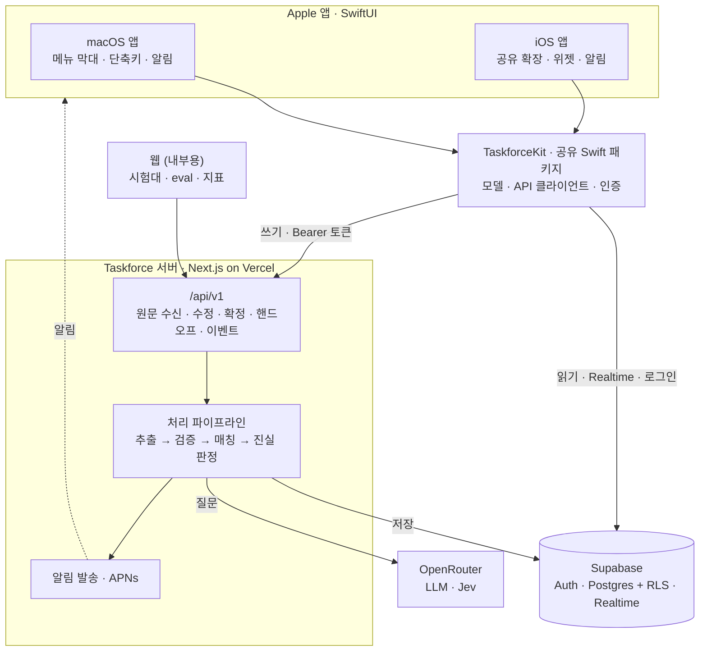

# 플랫폼 전략: iOS · macOS 네이티브

관련 문서: [PRD](PRD.md) · [아키텍처](ARCHITECTURE.md) · [바이브코딩 플랜](VIBE_CODING_PLAN.md)

## 결정

| 항목 | 결정 |
|---|---|
| 사용자용 앱 | **iOS + macOS 네이티브** (SwiftUI 멀티플랫폼, 코드 대부분 공유) |
| 웹 (Next.js) | **서버 API + 내부 도구.** 추출 엔진 시험, eval 결과, 지표 대시보드, 관리자 화면. 사용자용 화면은 만들지 않는다 |
| 서버·DB | 지금 그대로: Next.js(Vercel) API + Supabase(Postgres, Auth, pgvector) |
| 핵심 로직 위치 | **서버에만 둔다.** 추출·Jev 판정·진실 판정·랭킹을 앱에서 다시 구현하지 않는다 |
| 베타 배포 | TestFlight (iOS·macOS 모두) |

### 이유

- 가장 큰 위험(AI가 약속을 정확히 골라내는가)은 서버에서 풀리는 문제라 플랫폼과 무관하다. 엔진은 웹에서 빠르게 검증하고, 사용자가 매일 여는 화면은 처음부터 네이티브로 만든다.
- 원문을 넣는 수고를 줄이는 게 제품의 핵심인데, 공유 시트·메뉴 막대·단축키·위젯은 네이티브에서만 제대로 된다.
- 대상 사용자(창업자·컨설턴트)는 미팅 중에는 Mac, 이동 중에는 iPhone을 쓴다. 두 기기에서 같은 "지금 할 일"이 보여야 한다.

---

## 1. 플랫폼별 역할

### 공통 (iOS · macOS)

- 로그인, "지금 할 일", Action 상세(합의 범위 · 근거 인용 · 변경 이력), 확인 요청, AI에게 넘기기
- 사용자의 수정 · 삭제 · 확정 · 착수는 모두 서버 API로 보내 이벤트로 남긴다 (PRD 지표 1, 2)

### iOS: "이동 중에 받아보고, 바로 넘기기"

| 기능 | 역할 | 단계 |
|---|---|---|
| 공유 확장 (Share Extension) | 메일·메시지·메모·Safari 등 어느 앱에서든 "공유 → Taskforce"로 원문 전송 | MVP |
| 알림 | 확인 요청이 생겼을 때, 기한이 임박했을 때 | MVP |
| 위젯 · 잠금화면 위젯 | 앱을 열지 않아도 "지금 할 일" 1~3개 | 베타 후반 |
| App Intents (Siri · 단축어) | "오늘 할 일 뭐야?", 단축어로 원문 보내기 | 이후 |

### macOS: "미팅 중에 옆에 두기"

| 기능 | 역할 | 단계 |
|---|---|---|
| 메뉴 막대 앱 (MenuBarExtra) | 메뉴 막대에서 "지금 할 일"과 확인 요청을 바로 확인 | MVP |
| 전역 단축키 → 클립보드 보내기 | 회의록·메시지를 복사한 뒤 단축키 한 번으로 전송 | MVP |
| 공유 확장 · 서비스 메뉴 | 선택한 텍스트나 파일을 Taskforce로 보내기 | MVP |
| 드래그 앤 드롭 | 회의록 파일(.txt, .md, .pdf)을 창에 끌어다 놓기 | 베타 후반 |
| 알림 | iOS와 같음 | MVP |

### 웹 (내부용)

| 화면 | 용도 |
|---|---|
| 원문 붙여넣기 시험대 | 엔진 개발 중 결과를 바로 확인 (Phase 1~2) |
| eval 결과 | precision / recall / 보정 표 |
| 지표 대시보드 | PRD 6장의 세 지표 |
| 로그인 링크 콜백 | 이메일 링크 로그인 처리 |

---

## 2. 전체 구조



### 읽기와 쓰기의 경로를 나눈다

| 작업 | 경로 | 이유 |
|---|---|---|
| 읽기 (지금 할 일, 상세, 변경 이력) | 앱 → Supabase 직접 (RLS) | 빠르고 서버 코드가 필요 없음. Realtime으로 파이프라인 결과를 바로 반영 |
| 쓰기 (원문 전송, 수정, 삭제, 확정, 착수, 핸드오프) | 앱 → 서버 API | 모든 쓰기에서 ActionEvent·MetricEvent를 **빠짐없이** 남겨야 지표 1이 정확해짐 |

Phase 3에서 새 마이그레이션으로 `actions`, `claims`, `evidence`, `action_events` 테이블의 클라이언트 쓰기 권한을 막는다
(읽기 전용 RLS + 서버는 service role로 쓰기). 그래야 앱이 이벤트 없이 데이터를 고치는 경로가 사라진다.

---

## 3. 서버 API 규칙

앱이 호출해야 하는 서버 로직은 **Server Action이 아니라 Route Handler**(`src/app/api/v1/...`)로 만든다.
Server Action은 웹 폼 전용이라 Swift 앱에서 부를 수 없다.

- 인증: `Authorization: Bearer <Supabase access token>`. 웹은 쿠키 세션을 그대로 쓴다. 서버는 둘 다 받아 `requireUser()`로 확인한다.
- 요청·응답 스키마는 zod로 정의하고 `src/lib/api/contract.ts` 한 곳에 둔다. Swift 모델은 이 파일을 기준으로 맞춘다.
- 경로에 버전을 붙인다 (`/api/v1`). 앱은 사용자가 업데이트하지 않으면 옛 버전이 계속 돌기 때문에, 호환이 깨지는 변경은 `/api/v2`로 낸다.
- 원문 전송은 바로 `202 Accepted`와 `source_id`를 돌려주고, 처리 결과는 Realtime으로 전달한다.

초기 엔드포인트 (Phase 1~4에서 만들어 감):

| 메서드 · 경로 | 용도 | 단계 |
|---|---|---|
| `POST /api/v1/sources` | 원문 전송 (텍스트). 202 + `source_id`, 처리 상태는 `sources.processing_status` | 1 ✅ |
| `PATCH /api/v1/actions/:id` | 사용자 수정 (`user_edited` 이벤트) | 3 |
| `DELETE /api/v1/actions/:id` | 사용자 삭제 (`user_deleted` 이벤트, 실제로는 `dropped` 처리) | 3 |
| `POST /api/v1/actions/:id/confirm` | 확인 요청 확정 (`user_confirmed`) | 3 |
| `POST /api/v1/actions/:id/start` | 착수 (`action_started`) | 3 |
| `POST /api/v1/actions/:id/handoff` | AI 핸드오프 문서 생성 (`handoff_used`) | 4 |
| `POST /api/v1/metric-events` | `app_opened` 등 | 3 |
| `POST /api/v1/devices` | 알림용 기기 토큰 등록 | 3 |

---

## 4. 로그인

| 방식 | 웹 | iOS · macOS |
|---|---|---|
| Sign in with Apple | 이후 | **기본** (Supabase `signInWithIdToken`) |
| 이메일 6자리 코드 | 이후 | 보조 (Apple ID를 쓰기 싫은 사용자용) |
| 이메일 링크 | 지금 방식 유지 | 쓰지 않음 (앱으로 돌아오는 링크 처리가 번거로움) |

- 이메일 6자리 코드를 쓰려면 Supabase → Authentication → Email Templates의 Magic Link 템플릿에 `{{ .Token }}`을 넣어야 한다. 웹 링크 로그인과 함께 쓰려면 링크와 코드를 둘 다 넣는다.
- 공유 확장과 위젯은 앱 본체와 로그인 세션을 공유해야 하므로, 세션을 **App Group + 공유 Keychain 접근 그룹**에 저장한다.

---

## 5. 저장소 구조

같은 저장소에 Apple 앱을 둔다. 서버 API 계약과 앱을 한 PR에서 함께 바꿀 수 있어야 하기 때문이다.

```
taskforce-new/
  src/ ...                 Next.js (서버 API + 내부 웹)
  supabase/ ...            DB 스키마
  apple/
    project.yml            Xcode 프로젝트 정의 (XcodeGen). xcodeproj는 여기서 생성한다
    Taskforce.xcodeproj    iOS · macOS 멀티플랫폼 앱 (생성물)
    Config/                xcconfig: 번들 ID · App Group, Secrets.xcconfig(커밋 안 함)
    Taskforce/             공통 SwiftUI 화면
    TaskforceiOS/          iOS 전용 (위젯 등)
    TaskforceMac/          macOS 전용 (메뉴 막대, 단축키)
    ShareExtension/        공유 확장
    Packages/TaskforceKit/ 공유 Swift 패키지: 모델, API 클라이언트, 인증, 캐시
```

- Swift 코드는 SwiftUI + Swift Concurrency(async/await), Supabase는 공식 `supabase-swift` 패키지를 쓴다.
- `TaskforceKit`에는 화면이 없고, 단위 테스트가 가능한 코드만 둔다.
- Xcode 빌드는 Mac이 필요하다. 클라우드 세션(Claude Code on the web)에서는 Swift 코드를 작성할 수는 있지만 빌드·실행은 못 하므로, Apple 앱 작업은 **Mac의 Claude Code**에서 하는 것이 좋다.

---

## 6. 준비물 (사용자가 직접)

- [x] Apple Developer Program 가입 (연간 유료) — Team ID `U9DWQKQFMW`
- [x] 번들 ID 확정 (도메인 `taskforcelabs.dev` 기준). App Store에 올린 뒤에는 바꿀 수 없다.

  | 용도 | 값 |
  |---|---|
  | 앱 본체 (iOS · macOS 공통) | `dev.taskforcelabs.taskforce` |
  | 공유 확장 (Phase A2) | `dev.taskforcelabs.taskforce.share` |
  | App Group · 공유 Keychain 접근 그룹 | `group.dev.taskforcelabs.taskforce` |

  App ID와 App Group은 Xcode 자동 서명이 개발자 계정에 등록한다 (Phase A0에서 등록됨). 값은 `apple/Config/Base.xcconfig` 한 곳에 있다.
- [ ] Sign in with Apple 설정: Supabase → Authentication → Sign In / Providers → Apple을 켜고 **Client IDs**에 `dev.taskforcelabs.taskforce`를 넣는다.
  앱 안 로그인만 쓰면 Services ID · `.p8` 키는 필요 없다 (웹에 Apple 로그인을 붙일 때 추가).
- [ ] 푸시 알림용 APNs 키 발급 (Phase 3)
- [x] 최소 지원 OS: iOS 18 · macOS 15 (직전 메이저 버전까지)

---

## 7. 하지 않는 것 (지금은)

- **미팅 녹음·자동 받아쓰기**: 동의·녹음 관련 법적 문제가 크고, 이미 좋은 AI 회의록 도구가 많다. 그 도구들의 결과를 받는 연동(Phase 6)으로 해결한다.
- **기기 안에서 추출 (온디바이스 모델)**: 정확도 검증 전에 두 번째 엔진을 만들지 않는다.
- **오프라인 편집**: 읽기 캐시는 두되, 쓰기는 온라인일 때만 한다. 오프라인 쓰기는 이벤트 순서와 진실 판정을 복잡하게 만든다.
