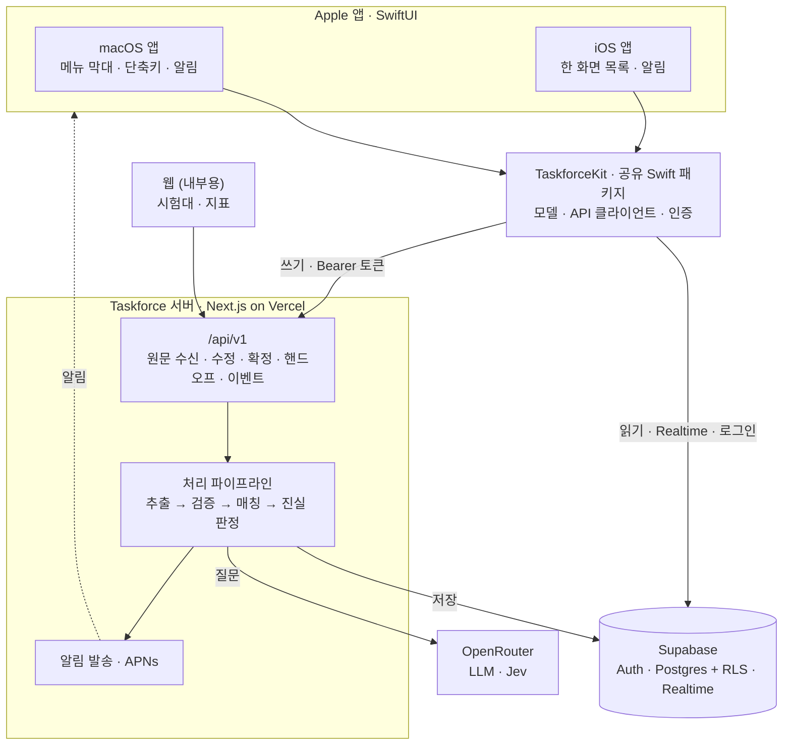

# 플랫폼 전략: iOS · macOS 네이티브

관련 문서: [PRD](PRD.md) · [아키텍처](ARCHITECTURE.md) · [바이브코딩 플랜](VIBE_CODING_PLAN.md)

## 결정

| 항목 | 결정 |
|---|---|
| 사용자용 앱 | **iOS + macOS 네이티브** (SwiftUI 멀티플랫폼, 코드 대부분 공유) |
| 웹 (Next.js) | **서버 API + 내부 도구.** 추출 엔진 시험대(`/lab`), 지표 대시보드(`/admin/metrics`). eval은 CLI(`npm run eval`)다. 사용자용 화면은 만들지 않는다 |
| 서버·DB | 지금 그대로: Next.js(Vercel) API + Supabase(Postgres, Auth, pgvector) |
| 핵심 로직 위치 | **서버에만 둔다.** 추출·Jev 판정·진실 판정·랭킹을 앱에서 다시 구현하지 않는다 |
| 베타 배포 | TestFlight (iOS·macOS 모두) |

### 이유

- 가장 큰 위험(AI가 약속을 정확히 골라내는가)은 서버에서 풀리는 문제라 플랫폼과 무관하다. 엔진은 웹에서 빠르게 검증하고, 사용자가 매일 여는 화면은 처음부터 네이티브로 만든다.
- 원문을 넣는 수고를 줄이는 게 제품의 핵심인데, 공유 시트·메뉴 막대·단축키·위젯은 네이티브에서만 제대로 된다.
- 대상 사용자(창업자·컨설턴트)는 미팅 중에는 Mac, 이동 중에는 iPhone을 쓴다. 두 기기에서 같은 "지금 할 일"이 보여야 한다.

---

## 1. 플랫폼별 역할

### 공통 (iOS · macOS)

- 로그인, "지금 할 일", 확인 요청, 근거 인용 펼치기(인용을 누르면 원문). AI에게 넘기기는 Mac 런처에만 있고, Action 상세 화면(합의 범위 · 변경 이력)은 아직 없다 ([남은 일](GO_LIVE.md#10-남은-일-go-live-조건-아님))
- 사용자의 수정 · 삭제 · 확정 · 착수는 모두 서버 API로 보내 이벤트로 남긴다 (PRD 지표 1, 2)

### iOS: 화면 한 장 (go live 모양, 2026-09-27 결정 — VIBE_CODING_PLAN.md Phase A1 대체)

| 기능 | 역할 | 단계 |
|---|---|---|
| 한 화면 | 위에 Review 카드(한 번에 하나, 확인 · 수정) + 아래 In Progress · To Do · Done Today 목록(상태 이름 To Do · In Progress · Done으로만 옮긴다: 상태 표시 누르기 · 밀기 · 길게 누르기. 삭제는 왼쪽 밀기 · 길게 누르기의 Delete, 5초 Undo). 처리방침이 바뀌면 목록 위에 한 줄(View · 닫기) | MVP |
| 계정 시트 | Connections(연결 · 연결 끊기), AI processing consent(동의 · 철회), Privacy Policy · Terms 링크, Sign out, Delete account(Apple로 다시 인증해 Sign in with Apple 토큰을 폐기한 뒤 삭제) | MVP |
| 알림 | 확인 요청이 생겼을 때, 기한이 임박했을 때 | MVP |
| 공유 확장 · 위젯 · App Intents | go live 뒤로 미룬다. 타깃이 아직 없다 ([PRD.md](PRD.md) "이후", [남은 일](GO_LIVE.md#10-남은-일-go-live-조건-아님)) | 이후 |

### macOS: 메뉴 막대 런처 (go live 모양, 2026-09-27 결정)

전역 단축키 **⌥Space**로 여는 메뉴 막대 팝업 하나가 전부다(별도 창 · Dock 앱이 아니다).

| 기능 | 역할 | 단계 |
|---|---|---|
| Search | "지금 할 일" · 지난 할 일을 찾기 | MVP |
| Ask | 물어보기(`POST /api/v1/ask`)를 팝업 안에서 바로 | MVP |
| Hand off | 선택한 할 일을 AI에게 넘기기(핸드오프 마크다운) | MVP |
| Send as source | 클립보드 · 선택한 텍스트를 원문으로 전송 | MVP |
| ⌘K | 그 밖의 명령(연결, 계정, 설정 등) 팔레트 | MVP |
| 알림 | iOS와 같음 | MVP |
| 처리방침 변경 안내 | 처리방침이 바뀌면 빈 입력창 맨 위에 한 줄(↩ View · ⌘⌫ Dismiss) | MVP |

### 웹 (내부용)

| 화면 | 용도 |
|---|---|
| 원문 붙여넣기 시험대 (`/lab`) | 엔진 개발 중 결과를 바로 확인 (Phase 1~2) |
| 지표 대시보드 (`/admin/metrics`) | PRD 6장 지표 5개 + 연결 · 2단계 연동 요청 수. `ADMIN_EMAILS`에 있는 사용자만 |
| 로그인 링크 콜백 | 이메일 링크 로그인 처리 |

eval은 화면이 없다. `npm run eval`(CLI)로 돌리고 결과는 `evals/results/`에 남는다.

---

## 2. 전체 구조


```mermaid
flowchart TB
    subgraph APPLE["Apple 앱 · SwiftUI"]
        direction LR
        IOS["iOS 앱<br/>한 화면 목록 · 알림"]
        MAC["macOS 앱<br/>메뉴 막대 · 단축키 · 알림"]
    end
    KIT["TaskforceKit · 공유 Swift 패키지<br/>모델 · API 클라이언트 · 인증"]
    WEB["웹 (내부용)<br/>시험대 · 지표"]

    subgraph SERVER["Taskforce 서버 · Next.js on Vercel"]
        direction LR
        API["/api/v1<br/>원문 수신 · 수정 · 확정 · 핸드오프 · 이벤트"]
        PIPE["처리 파이프라인<br/>추출 → 검증 → 매칭 → 진실 판정"]
        PUSH["알림 발송 · APNs"]
        API --> PIPE --> PUSH
    end

    OR["OpenRouter<br/>LLM · Jev"]
    SB[("Supabase<br/>Auth · Postgres + RLS · Realtime")]

    IOS & MAC --> KIT
    KIT -- "쓰기 · Bearer 토큰" --> API
    KIT -- "읽기 · Realtime · 로그인" --> SB
    WEB --> API
    PIPE -- 질문 --> OR
    PIPE -- 저장 --> SB
    PUSH -. 알림 .-> APPLE
```

### 읽기와 쓰기의 경로를 나눈다

| 작업 | 경로 | 이유 |
|---|---|---|
| 지금 할 일 순서 · 확인 요청 | 앱 → `GET /api/v1/now` | 순서 계산(랭킹)은 서버에만 둔다. Realtime(`actions`)은 "바뀜" 신호로만 쓰고 `/now`를 다시 부른다 |
| 읽기 (할 일 상세 · 근거 · 원문, 연결, 오늘 끝낸 할 일) | 앱 → Supabase 직접 (RLS) | 빠르고 서버 코드가 필요 없음 |
| 쓰기 (원문 전송, 수정, 삭제, 확정, 착수, 핸드오프) | 앱 → 서버 API | 모든 쓰기에서 ActionEvent·MetricEvent를 **빠짐없이** 남겨야 지표 1이 정확해짐 |

Phase 3에서 새 마이그레이션으로 `actions`, `claims`, `evidence`, `action_events` 테이블의 클라이언트 쓰기 권한을 막는다
(읽기 전용 RLS + 서버는 service role로 쓰기). 그래야 앱이 이벤트 없이 데이터를 고치는 경로가 사라진다.

---

## 3. 서버 API 규칙

앱이 호출해야 하는 서버 로직은 **Server Action이 아니라 Route Handler**(`src/app/api/v1/...`)로 만든다.
Server Action은 웹 폼 전용이라 Swift 앱에서 부를 수 없다.

- 인증: `Authorization: Bearer <Supabase access token>`. 웹은 쿠키 세션을 그대로 쓴다. 서버는 둘 다 받아 `authenticateRequest()`(`src/lib/api/auth.ts`)로 확인한다(쿠키로 인증하는 쓰기는 같은 출처만 받는다, CSRF). `requireUser()`(`src/lib/auth.ts`)는 서버 화면용이다. proxy의 확인만 믿지 않는다.
- 요청·응답 스키마는 zod로 정의하고 `src/lib/api/contract.ts` 한 곳에 둔다. Swift 모델은 이 파일을 기준으로 맞춘다.
- 경로에 버전을 붙인다 (`/api/v1`). 앱은 사용자가 업데이트하지 않으면 옛 버전이 계속 돌기 때문에, 호환이 깨지는 변경은 `/api/v2`로 낸다.
- 원문 전송은 바로 `202 Accepted`와 `source_id`를 돌려주고, 처리 결과는 Realtime으로 전달한다.

초기 엔드포인트 (Phase 1~4에서 만들어 감):

| 메서드 · 경로 | 용도 | 단계 |
|---|---|---|
| `POST /api/v1/sources` | 원문 전송 (텍스트 + 관련자 `participants`). 202 + `source_id`, 처리 상태는 `sources.processing_status` | 1 ✅ |
| `GET` · `PUT /api/v1/profile` | 원문 속 사용자 정보: 기본 이름 · 별칭 · 이메일 | 1 ✅ |
| `GET /api/v1/now` | "지금 할 일" 순서 + 확인 큐 + 이번 주 주간 질문(`weekly_check: { week_start } \| null`, 물을 때가 아니면 null) | 3 ✅ · A1 ✅ |
| `POST /api/v1/actions` | 직접 추가 (Mac 런처 · iPhone +) `{ title, due_date?, source_id?, quote? }` → 201 `{ action, status: "created" }`. 고른 구절이 그 원문에서 이미 Action의 근거면(누락 신고와 같은 확인) 그 Action을 그대로 200 `{ action, status: "already_tracked" }`(제목 · 기한은 반영하지 않고 횟수 제한에 세지 않는다). 값은 사용자 Claim, 확인 요청 없음, `user_created` 이벤트(지표 4). `source_id` · `quote`는 함께 보내고 구절은 원문에 실제로 있어야 한다(근거 `created`). 없거나 남의 원문 404, 할 일 DB 항목 · 원문에 없는 구절 400, 사용자별 10분에 30번을 넘으면 429. 외부 AI 처리에 동의했으면 매칭용 임베딩을 만든다 (못 만들었으면 다음 원문 처리가 매칭 전에 채운다) | go live · 서버 ✅ |
| `PATCH /api/v1/actions/:id` | 사용자 수정 (`user_edited` 이벤트). 동시 수정이 겹치면 409 `conflict` | 3 ✅ |
| `DELETE /api/v1/actions/:id` | 사용자 삭제 (`user_deleted` 이벤트, 실제로는 `dropped` 처리) | 3 ✅ |
| `POST /api/v1/actions/:id/confirm` | 확인 요청 확정 (`user_confirmed`) | 3 ✅ |
| `POST /api/v1/actions/:id/start` | 착수 (`user_started` 이벤트 + `action_started` 지표) | 3 ✅ |
| `POST /api/v1/actions/:id/progress` | 작업 상태 `{ state: to_do \| in_progress \| done }` → 200 `{ action }`. 할 일 = 열림 + 착수 전, 진행 중 = 열림 + 착수, 완료 = done. 완료에서 돌아오면 다시 열고(PATCH status open과 같은 `user_edited`), 진행 중은 착수(`/start`와 같은 `user_started` + `action_started`), 할 일은 착수를 되돌린다(`user_unstarted`, 첫 착수 이벤트 · 지표는 남는다). 완료는 PATCH status done과 같고 착수 시각은 그대로 둔다. 상태와 착수 시각은 한 트랜잭션(`set_action_progress`)으로 바뀌고, 이미 그 상태면 쓰지 않고 그대로 돌려준다. 잘못된 본문 400, 없거나 남의 것 · 취소된 Action 404, 동시 수정이 계속 겹치면 409 | 서버 ✅ |
| `POST /api/v1/actions/:id/handoff` | AI에게 넘기기: 합의된 내용 · 불확실한 것 · 근거 원문(인용 앞뒤 줄 포함)을 묶은 마크다운. 서버가 `handoff_used` 지표를 남긴다 | 4 ✅ |
| `POST /api/v1/sources/:id/missing` | 빠진 할 일 신고 `{ quote }` (원문에 실제로 있는 구절). 동기 처리 → `{ status: created \| already_tracked, action, stage }`. 새 Action이면 `user_reported_missing` 이벤트(지표 4)와 놓친 단계(`processing_failed` · `not_extracted` · `judge_rejected` · `merge_absorbed`)를 남긴다. 이 원문의 같은 구절이 이미 근거인 Action(끝냈거나 지운 것도)이면 모델을 부르지 않고 `already_tracked`. 다른 사람 담당 Action과는 합치지 않고, 확신이 낮은 병합은 새 Action으로 만든다. 할 일 DB 항목 · 원문에 없는 구절은 400, 사용자별 10분에 10번을 넘으면 429 | A1 ✅ |
| `POST /api/v1/weekly-check` | 주간 질문 응답 `{ week_start, answer: yes \| no \| skipped }` → 204 (지표 5). 이번 주 · 바로 전 주만 받고 같은 주는 덮어쓴다(`answered_at` 갱신). 월요일에 지난주 카드에 답하면 이번 주 답으로 본다. 주간 질문이 꺼져 있으면 400 | A1 ✅ |
| `POST /api/v1/metric-events` | 앱이 직접 남기는 지표 (`app_opened`). `action_started` · `handoff_used`는 해당 API가 서버에서 남긴다 | 3 ✅ |
| `POST` · `DELETE /api/v1/devices` | 알림용 기기 토큰 등록 · 해제 (로그아웃 때 DELETE). 토큰은 마지막 로그인 계정에 속하고, 사용자당 10대 | 3 ✅ |
| `POST /api/v1/ask` | 물어보기 `{ question }`(500자까지) → `{ answer, unknown, citations }`. 내 할 일 · 근거 원문에서 찾아 답하고, 인용은 원문과 기계로 대조해 원문에서 잘라 낸 구절만 남긴다. 남는 인용이 없으면 답하지 않고 "모른다"(`unknown: true`). 외부 AI 처리 동의 전 409, 사용자별 10분에 20번을 넘으면 429. 질문 · 답은 로그에 남기지 않는다 | go live ✅ |
| `POST` · `DELETE /api/v1/consent` | 외부 AI 처리 동의 `{ ai_processing: true }` · 철회 → 204. `profiles.ai_consent_at`에 시각을 적거나 비운다. 동의 전에는 원문을 외부 AI로 보내지 않고, 그런 요청(원문 보내기 · 빠진 할 일 신고 · 물어보기 · 연결 시작 · 연결 마치기 · 동기화)은 409 | go live ✅ |
| `GET /api/v1/legal` | 처리방침 변경 안내 → `{ privacy: { current, upcoming, notice } }`(판마다 `version` · `effective_date` · `url: { ko, en }`, `notice`는 `kind: updated \| upcoming`을 더한 판 또는 null). 판 · 시행일은 `src/lib/legal/policy.ts` 한 곳. 시행 예정 판이 있으면 모든 계정에(그 판의 버전 주소로), 없으면 현재 판 시행일 전에 가입한 계정에만 시행 뒤 30일 동안 안내한다. 읽기만 한다: 앱은 열거나 닫은 판을 기기에 계정별로 적고, 계정마다 30분에 한 번 읽는다 | go live ✅ |
| `DELETE /api/v1/account` | 계정 삭제 (본문 선택 `{ apple_authorization_code? }`) → `{ deleted: true }`. 연동 토큰(Notion · Slack)과 Sign in with Apple 토큰을 서비스 쪽에서 동시에 폐기하고(20초 한도, 실패해도 계속) 사용자를 지운다. 사용자 테이블은 on delete cascade로 함께 지워지고, 이미 지워진 계정이면 성공으로 답한다 | go live ✅ |
| `POST /api/v1/connections/{provider}/start` | 연결 시작 → `{ url }`(서명된 `state`를 담은 권한 화면 주소). 경로의 `[id]` 자리가 서비스 이름이다. 모르는 서비스 404, 열지 않은 서비스 400, 동의 전 409, 10분에 10번을 넘으면 429. 권한 화면 뒤 `taskforce://connections/{provider}?handoff=…`로 돌아온다 | go live ✅ |
| `POST /api/v1/connections/{provider}/complete` | 연결 마치기 `{ handoff }` → `{ status }`. 연결을 시작한 사용자만 2분 안에 한 번 쓸 수 있고, 연결되면 응답 뒤(`after()`) 첫 동기화를 돌린다. handoff가 없거나 만료 · 재사용 · 남의 것이면 404, 동의 전 409, 토큰 교환 실패 502 | go live ✅ |
| `POST /api/v1/connections/sync` | 지금 동기화: 내 연결만 바로 돌린다 → `{ connections }`(연결마다 결과). 동의 전 409. 모든 연결이 동기화 중이거나 1분 안에 다시 부르면 429 | go live ✅ |
| `DELETE /api/v1/connections/:id` | 연결 끊기 → 204. UUID가 아니거나 없거나 남의 연결이면 404. 서비스 쪽 토큰 폐기(실패해도 계속) → (Slack이면) Slack에서 온 글자 지우기 → 연결 행 삭제(`disconnect_connection`). 할 일은 남는다 | go live ✅ |
| `GET /api/v1/connections/:id/data-sources` | Notion 연결에 공유된 데이터베이스와 역할(할 일 · 글 · 무시), 확인 전이면 제안값. 내부 도구(`/lab`)만 쓴다 | 내부 ✅ |
| `PUT /api/v1/connections/:id/data-sources/:dataSourceId` | 데이터베이스 역할 · 속성 매핑 확인 → `{ dataSource }`. 확인한 할 일 DB만 다음 동기화부터 구조화된 할 일로 읽는다. 할 일 DB인데 매핑이 없으면 400. 내부 도구(`/lab`)만 쓴다 | 내부 ✅ |
| `POST /api/v1/connection-requests` | 2단계 연동 "원해요" `{ provider }`(microsoft · zoom · github · linear · jira) → 204. `connection_requests` 표에 사용자 · 서비스마다 한 행(다시 눌러도 그대로) | go live ✅ |

알림(APNs)에는 할 일 제목을 싣지 않는다. 서버는 짧은 영어 문구(확인 요청 "Review", 기한 "Due today" · "Due tomorrow"와 건수)와 `action_id`만 보낸다. 알림 확장(Notification Service Extension)은 아직 없다. `mutable-content: 1`은 확장을 붙여 로그인 세션으로 제목을 채울 때를 위해 남긴다 ([남은 일](GO_LIVE.md#10-남은-일-go-live-조건-아님)).

---

## 4. 로그인

| 방식 | 웹 | iOS · macOS |
|---|---|---|
| Sign in with Apple | 이후 | **기본** (Supabase `signInWithIdToken`) |
| Sign in with Google | 쓰지 않음 | **기본** (Apple 아래 같은 크기, Google Sign-In SDK → Supabase `signInWithIdToken`, 로그인만). 2026-09-30 |
| 이메일 + 비밀번호 | 쓰지 않음 | App Store 심사 계정용만 (가입 화면 없음). 허용 목록(`review_accounts`) 밖 이메일 가입은 DB 훅이 막는다 (Supabase 대시보드에서 훅을 켠 경우) |
| 이메일 6자리 코드 | 이후 | 아직 없음 ([남은 일](GO_LIVE.md#10-남은-일-go-live-조건-아님)) |
| 이메일 링크 | 지금 방식 유지 | 쓰지 않음 (앱으로 돌아오는 링크 처리가 번거로움) |

- 이메일 6자리 코드를 붙이려면 Supabase → Authentication → Email Templates의 Magic Link 템플릿에 `{{ .Token }}`을 넣어야 한다. 웹 링크 로그인과 함께 쓰려면 링크와 코드를 둘 다 넣는다.
- 원문에서 "누가 나인가"는 원문 종류마다 단서가 다르다. 메일 · 캘린더는 주소(`participants`)로 확실히 찾고,
  받아쓰기 회의록은 이름 문자열뿐이라 프로필의 별칭과 코드의 오타 후보 탐지(한 글자 차이 → '확인 필요')를 쓴다.
  앱은 메일 · 캘린더 원문을 보낼 때 보낸 사람 · 받는 사람 · 참조 · 참석자를 함께 보낸다.
- 공유 확장과 위젯은 앱 본체와 로그인 세션을 공유해야 하므로, 세션을 **App Group + 공유 Keychain 접근 그룹**에 저장한다.

### Sign in with Google (2026-09-30)

로그인만 한다. Gmail · Calendar · Meet은 연결 화면의 서버 연동(프로젝트 A · B의 웹 클라이언트, 각자의 범위)으로 따로 받는다. 로그인에서는 Gmail · Calendar 범위를 묻지 않는다.

- 흐름: Google Sign-In SDK(`GoogleSignIn-iOS` 10, SPM, iOS · macOS) → `GIDSignIn.signIn(withPresenting:hint:additionalScopes:nonce:)` → ID 토큰 · 액세스 토큰 →
  `supabase.auth.signInWithIdToken(OpenIDConnectCredentials(provider: .google, idToken:, accessToken:, nonce:))` (Apple 로그인과 같은 호출, `SessionStore.signInWithGoogle`).
  - nonce: 앱이 만든 값의 SHA-256을 Google에 보내고(ID 토큰의 `nonce` 클레임), 원래 값을 Supabase에 보낸다(`SignInNonce`). Supabase Google 제공자의 **Skip nonce checks는 끈다**. SDK 9.0부터 nonce를 넘길 수 있다.
  - 범위: SDK 기본값 `openid` · `email` · `profile`만 요청한다. 추가 범위 없음.
  - **이미 허용한 범위가 붙을 수 있다:** Google Sign-In SDK는 늘 `include_granted_scopes=true`를 보내고, 로그인 클라이언트는 Calendar · Meet 연동 클라이언트(`Taskforce server`)와 같은 프로젝트 A에 있다. 그래서 Calendar · Meet 연결을 허용한 사용자의 **기기 Google 액세스 토큰에는 그 범위가 함께 붙을 수 있다.**
    앱은 이 액세스 토큰으로 Google API를 부르지 않는다. Supabase에는 ID 토큰과 함께 보내지만 Supabase는 ID 토큰의 `at_hash` 확인에만 쓰고 저장하지 않는다. 토큰은 이 기기의 Google SDK Keychain에만 있고 Taskforce 로그인이 풀리면 지운다. 받아들인 위험으로 기록한다. 기기에서 확인하는 법은 [런북](go-live/runbook.md) 5장 5번(`grantedScopes`).
- 앱 안(native)으로 하는 이유: Supabase 웹 OAuth(`/auth/v1/authorize?provider=google`)는 Google 동의 화면에 Supabase 프로젝트 도메인(`<ref>.supabase.co`)이 보이고, 인증받은 Google 브랜드(프로젝트 A)의 승인 도메인에 `supabase.co`를 넣어야 한다.
- 클라이언트: Google Cloud 프로젝트 A(`taskforce-510108`)의 **iOS 유형** 클라이언트 "Taskforce app sign-in (iOS · Mac)" 하나를 iPhone · Mac이 같이 쓴다(번들 `dev.taskforcelabs.taskforce`, Google 문서: macOS 앱도 iOS 유형). 비밀 값은 없다.
- 설정 키 (xcconfig → Info.plist): `GOOGLE_IOS_CLIENT_ID` → `GIDClientID`, `GOOGLE_IOS_URL_SCHEME`(클라이언트 ID를 점 단위로 뒤집은 값) → `CFBundleURLTypes`.
  - Release: `apple/Config/Release.xcconfig`에 커밋한다(앱에 그대로 들어가는 공개 식별자. 아카이브하는 Mac의 Secrets에 빠져도 TestFlight 빌드에서 버튼이 사라지지 않게).
  - Debug: `Secrets.xcconfig`(선택). 비우면(CI · 기여자) Google 버튼 · Mac 런처 행을 숨기고 나머지는 그대로다. scheme이 빠졌거나 클라이언트 ID와 맞지 않아도 숨긴다(SDK가 로그인 때 예외로 앱을 멈추므로, `GoogleSignInConfig`).
  - Mac: GTMAppAuth가 데이터 보호 Keychain에 Google 로그인을 저장해서 권한 파일에 `keychain-access-groups` = `$(AppIdentifierPrefix)dev.taskforcelabs.taskforce`를 둔다(Google 문서). Supabase 세션은 그대로 App Group 접근 그룹이다.
- 콜백: 보통 ASWebAuthenticationSession이 바로 받는다. 앱 밖에서 열리면 iPhone은 로그인 화면의 `onOpenURL`, Mac은 `MacAppDelegate.application(_:open:)`이 Google scheme만 SDK에 넘기고(`GoogleSignInFlow.handle`), `taskforce://` 연결 콜백은 전처럼 연결 화면이 받는다.
- 버튼: Google 브랜드 규칙의 Light 테마(흰 바탕 · #747775 테두리 · 표준 색 G)를 Apple 버튼과 같은 크기로 둔다(iOS 높이 48 · macOS 30, `TaskforceUI` `SignInWithGoogleButton`). Apple이 먼저다(App Store 4.8). SDK의 SwiftUI 버튼은 높이 40 고정 · 예전 디자인이라 쓰지 않았다. 글꼴은 규칙의 Google Sans 대신 시스템 글꼴이다.
- Supabase에 남는 것 (supabase/auth `parseGoogleIDToken`): `auth.users.email`, `raw_app_meta_data` = `{provider: "google", providers: ["google"]}`, `raw_user_meta_data`와 `auth.identities.identity_data` =
  `iss`(`https://accounts.google.com`) · `sub` · `provider_id`(= sub) · `name` · `full_name`(= name) · `picture` · `avatar_url`(= picture, 프로필 사진 주소) · `email` · `email_verified` · `phone_verified`(false), Workspace 계정이면 `custom_claims.hd`(도메인).
  Google 토큰은 Supabase에 저장되지 않는다(이 기기의 Google SDK Keychain에만 있고 Taskforce 로그인이 풀리면 지운다).
- 이름: **Google 로그인 직후** 처음 읽은 프로필의 이름이 비어 있으면 그 로그인이 준 이름(`full_name`)으로 채운다(`SessionStore.takeAccountNameFill` → `AccountStore`, `AccountNameFill`). 그 로그인의 사용자가 지금 로그인한 사용자일 때만 저장하고, 기회는 한 번뿐이다(이름이 이미 있어도 쓴다). 그래서 사용자가 이름을 지운 뒤 다른 기기에서 앱을 열어도 다시 채우지 않는다(그 기기에서 다시 Google로 로그인하면 채운다). 채우면 iPhone의 첫 이름 질문이 뜨지 않는다. Apple 로그인은 이름을 받지 않아(범위 `email`만) 전처럼 처음 한 번 묻는다. 서버도 프로필 이름이 없으면 계정 이름(`full_name` → `name` → 이메일 앞부분)을 쓴다(`accountDisplayName`).
- 로그아웃: Taskforce 로그인이 풀릴 때마다(Sign Out · 세션 만료 · 다른 곳에서 모두 로그아웃 · 계정 삭제, iPhone `RootView` · Mac `MacAppDelegate`의 로그인 상태 변화) 이 기기의 Google SDK 로그인도 지운다(권한은 남는다). 다음에 로그인한 다른 Taskforce 계정이 전 계정의 Google 토큰을 폐기하는 일이 없게.
- 계정 삭제: Apple 로그인이 붙은 계정만 Apple 재확인(토큰 폐기용 code)을 받는다. Google 로그인이 붙은 계정은 삭제한 뒤 앱이 `GIDSignIn.disconnect()`로 Google 권한을 폐기한다(기다리지 않고, 실패해도 삭제는 끝났다). 이 기기에 Google 토큰이 없으면(다른 기기에서만 Google로 로그인) 폐기하지 못한다: 사용자가 Google 계정 → 보안 → 서드파티 앱에서 지울 수 있다. 이메일(심사 계정)은 폐기할 것이 없다. 무엇을 할지는 **삭제 직전에 서버에서 새로 읽은 사용자**(`auth.user()`)의 identities · `app_metadata`로 정한다(`AccountDeletionPlan`): 세션의 사용자는 토큰을 받은 때의 것이라, Google로 가입한 뒤 다른 기기에서 Apple을 이었으면 빠져 있다. 새로 읽지 못하면 Apple 재확인을 받는다.
- 가입 훅: Before User Created 훅(`hook_before_user_created`)은 `provider = email`만 막는다. Google 가입은 통과한다(`tests/db/review-accounts.test.ts`).
- **계정 연결:** Supabase는 확인된 같은 이메일의 로그인을 한 계정으로 자동으로 잇는다(Apple 실제 주소 = Google 주소면 한 계정). Apple "나의 이메일 가리기"(`@privaterelay.appleid.com`)로 가입한 사용자가 나중에 Google로 로그인하면 이메일이 달라 **별도 계정**이 된다. 수동으로 잇는 화면은 지금 두지 않는다.
  **받아들인 위험:** 자동 연결은 "확인된 같은 이메일 = 같은 사람"을 믿는다. 그 이메일의 Google 계정(또는 Apple ID)을 가진 사람은 그 Taskforce 계정에 들어온다. Google · Apple 모두 확인한 주소만 "확인됨"으로 주므로 받아들인다(확인되지 않은 주소는 잇지 않는다). 연결하지 않으면 같은 사람이 로그인 방식마다 다른 계정을 갖게 된다.
- 계정 메뉴의 로그인 계정 줄은 가입 방식에 따라 "Apple ID" · "Google Account" · "Email"이다.

---

## 5. 저장소 구조

같은 저장소에 Apple 앱을 둔다. 서버 API 계약과 앱을 한 PR에서 함께 바꿀 수 있어야 하기 때문이다.

```
taskforce-new/
  src/ ...                 Next.js (서버 API + 내부 웹)
  supabase/ ...            DB 스키마
  apple/
    project.yml            Xcode 프로젝트 정의 (XcodeGen). xcodeproj는 여기서 생성한다
    Taskforce.xcodeproj    iOS · macOS 멀티플랫폼 앱 (생성물)
    Config/                xcconfig: 번들 ID · App Group, Secrets.xcconfig(커밋 안 함)
    Taskforce/             앱 타깃 하나 (iOS · macOS)
      Shared/              두 플랫폼 공용 화면 · 상태 (NowStore, AccountStore, 로그인, 연결 · 동의, 알림)
      iOS/                 iOS 전용 (한 화면, 계정 시트, New Task)
      Mac/                 macOS 전용 (메뉴 막대, ⌥Space 런처, 단축키, 설정)
    Packages/TaskforceKit/ 공유 Swift 패키지: TaskforceKit(모델, API 클라이언트, 인증, 순수 규칙) · TaskforceUI(토큰, 부품)
```

공유 확장 · 위젯 타깃은 아직 없다 (Phase A2 보류). 파일별 위치는 [피처맵](FEATURE_MAP.md) 3-5장.

- Swift 코드는 SwiftUI + Swift Concurrency(async/await), Supabase는 공식 `supabase-swift` 패키지를 쓴다.
- `TaskforceKit`에는 화면이 없고, 단위 테스트가 가능한 코드만 둔다.
- Xcode 빌드는 Mac이 필요하다. 클라우드 세션(Claude Code on the web)에서는 Swift 코드를 작성할 수는 있지만 빌드·실행은 못 하므로, Apple 앱 작업은 **Mac의 Claude Code**에서 하는 것이 좋다.

---

## 6. 준비물 (사용자가 직접)

- [x] Apple Developer Program 가입 (연간 유료) — Team ID `U9DWQKQFMW`
- [x] 번들 ID 확정 (도메인 `taskforcelabs.dev` 기준). App Store에 올린 뒤에는 바꿀 수 없다.

  | 용도 | 값 |
  |---|---|
  | 앱 본체 (iOS · macOS 공통) | `dev.taskforcelabs.taskforce` |
  | 공유 확장 (Phase A2) | `dev.taskforcelabs.taskforce.share` |
  | App Group · 공유 Keychain 접근 그룹 | `group.dev.taskforcelabs.taskforce` |

  App ID와 App Group은 Xcode 자동 서명이 개발자 계정에 등록한다 (Phase A0에서 등록됨). 값은 `apple/Config/Base.xcconfig` 한 곳에 있다.
- [ ] Sign in with Apple 설정: Supabase → Authentication → Sign In / Providers → Apple을 켜고 **Client IDs**에 `dev.taskforcelabs.taskforce`를 넣는다.
  앱 안 로그인만 쓰면 Services ID · `.p8` 키는 필요 없다 (웹에 Apple 로그인을 붙일 때 추가).
- [x] Sign in with Google 설정 (2026-09-30): Google Cloud 프로젝트 A에 iOS 클라이언트, Supabase → Google 제공자 켬(Client IDs = 그 iOS 클라이언트 ID, Skip nonce checks 끔). 순서는 [런북](go-live/runbook.md) 5장.
- [ ] 푸시 알림용 APNs 키 발급 (Phase 3)
- [x] 최소 지원 OS: iOS 18 · macOS 15 (직전 메이저 버전까지)

---

## 7. 하지 않는 것 (지금은)

- **미팅 녹음·자동 받아쓰기**: 동의·녹음 관련 법적 문제가 크고, 이미 좋은 AI 회의록 도구가 많다. 그 도구들의 결과를 받는 연동(Phase 6)으로 해결한다.
- **기기 안에서 추출 (온디바이스 모델)**: 정확도 검증 전에 두 번째 엔진을 만들지 않는다.
- **오프라인 편집**: 읽기 캐시는 두되, 쓰기는 온라인일 때만 한다. 오프라인 쓰기는 이벤트 순서와 진실 판정을 복잡하게 만든다.
